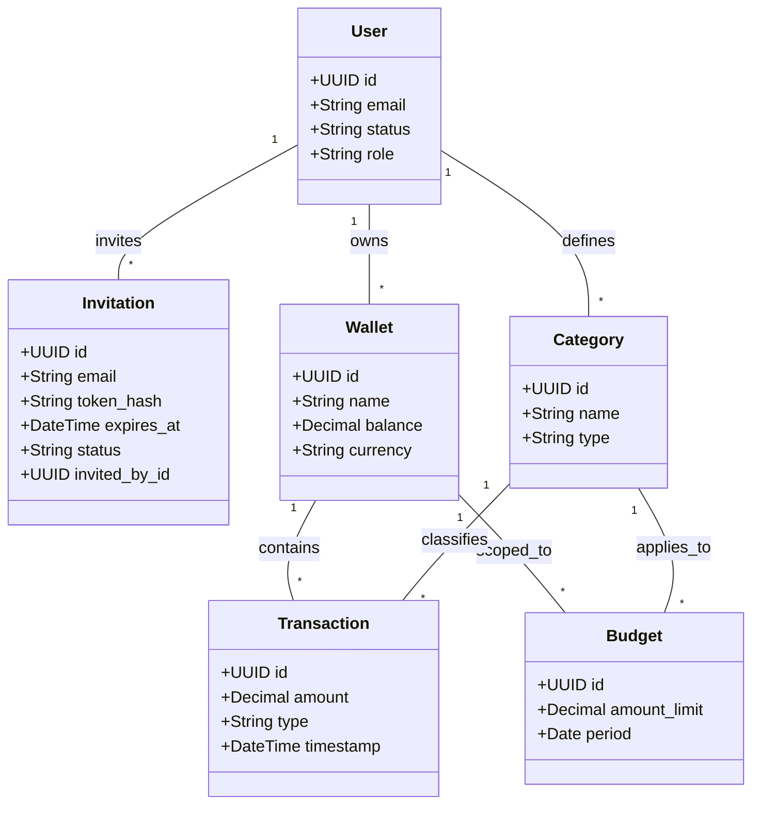
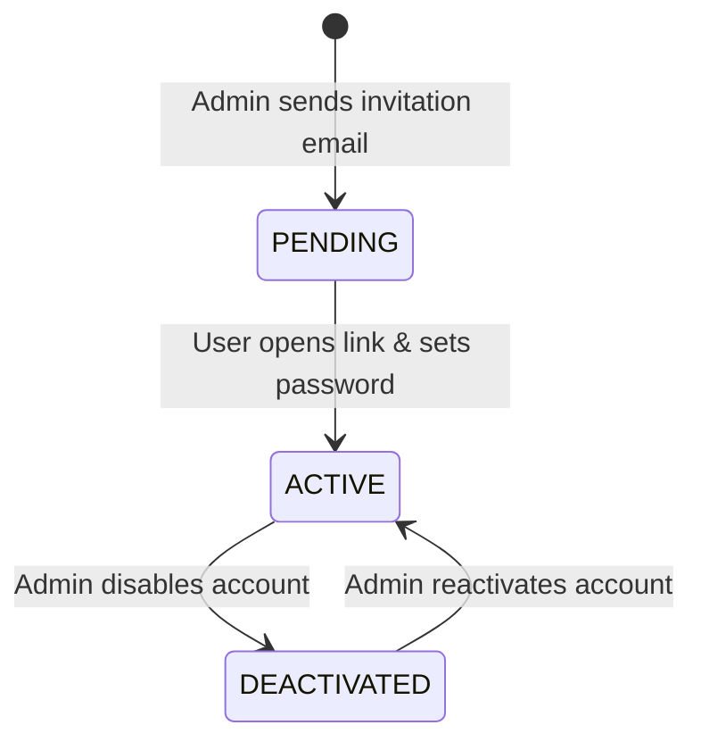
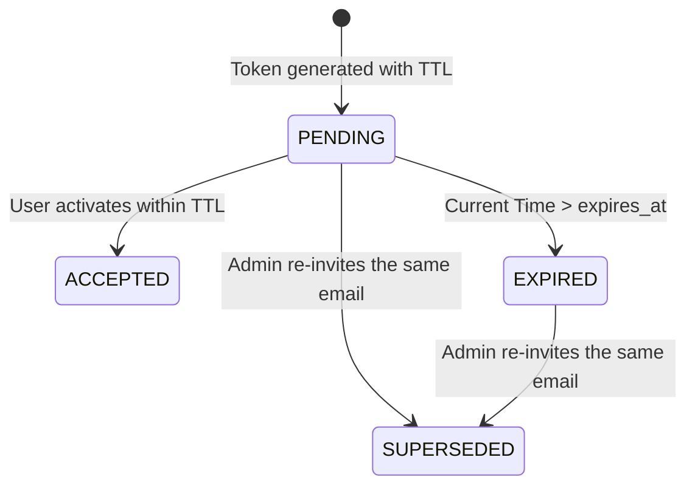
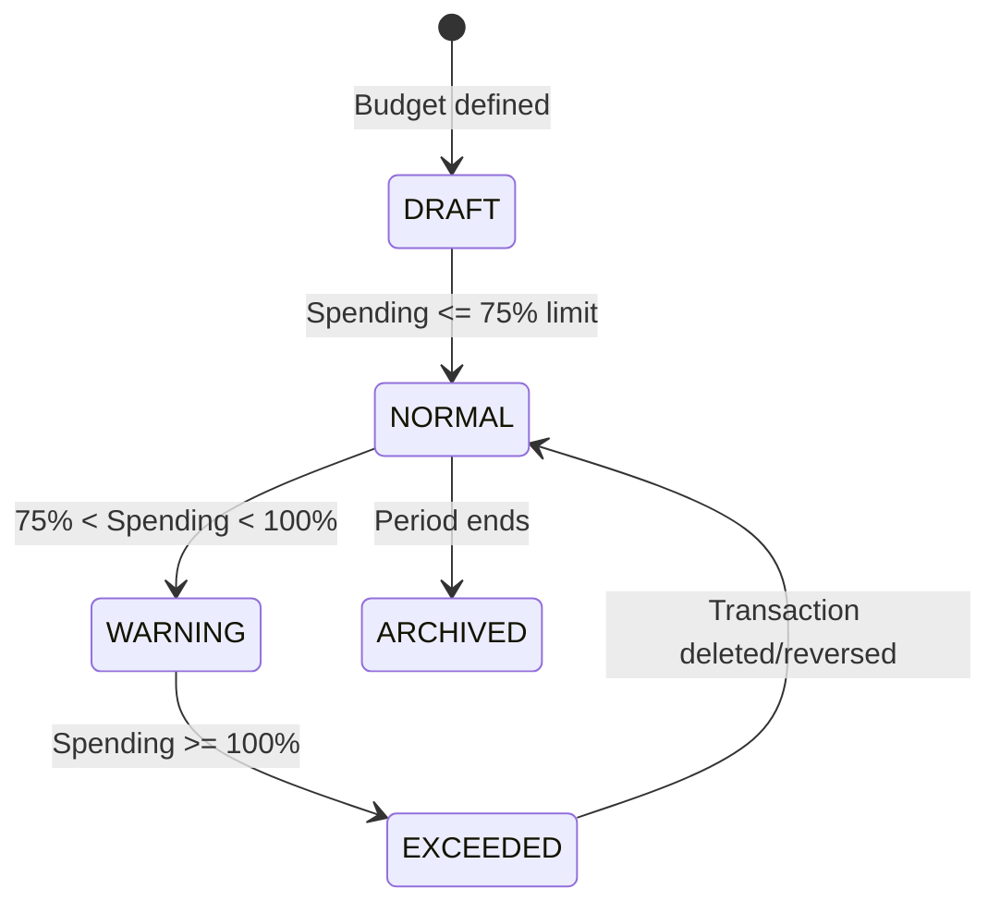
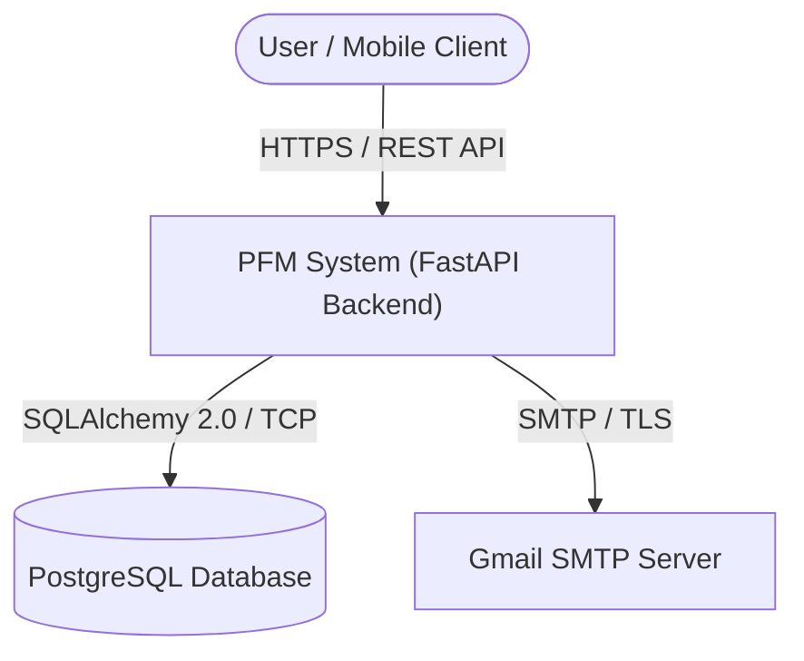
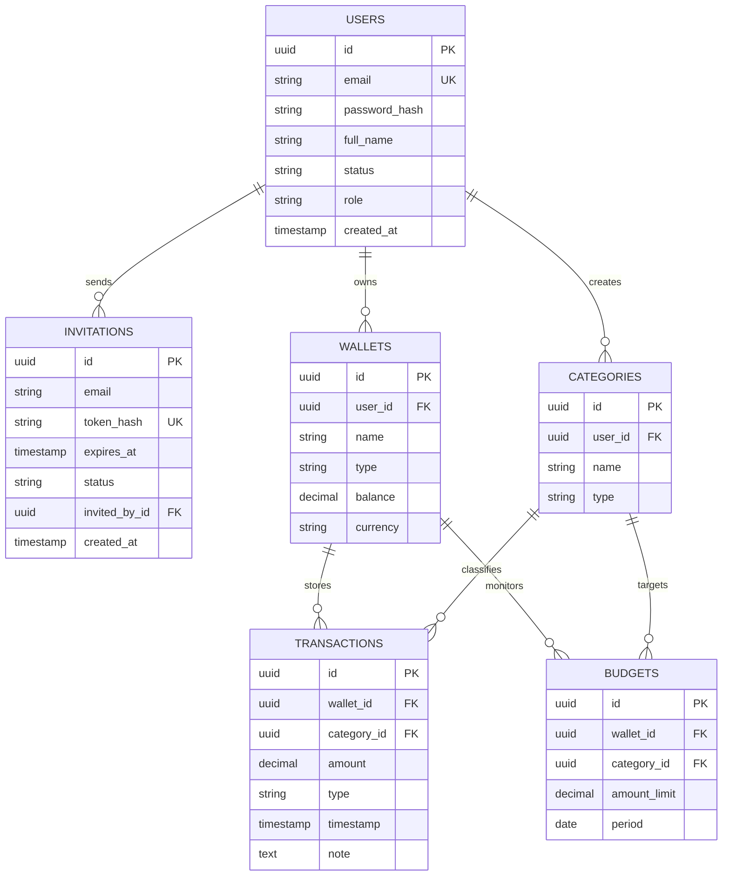
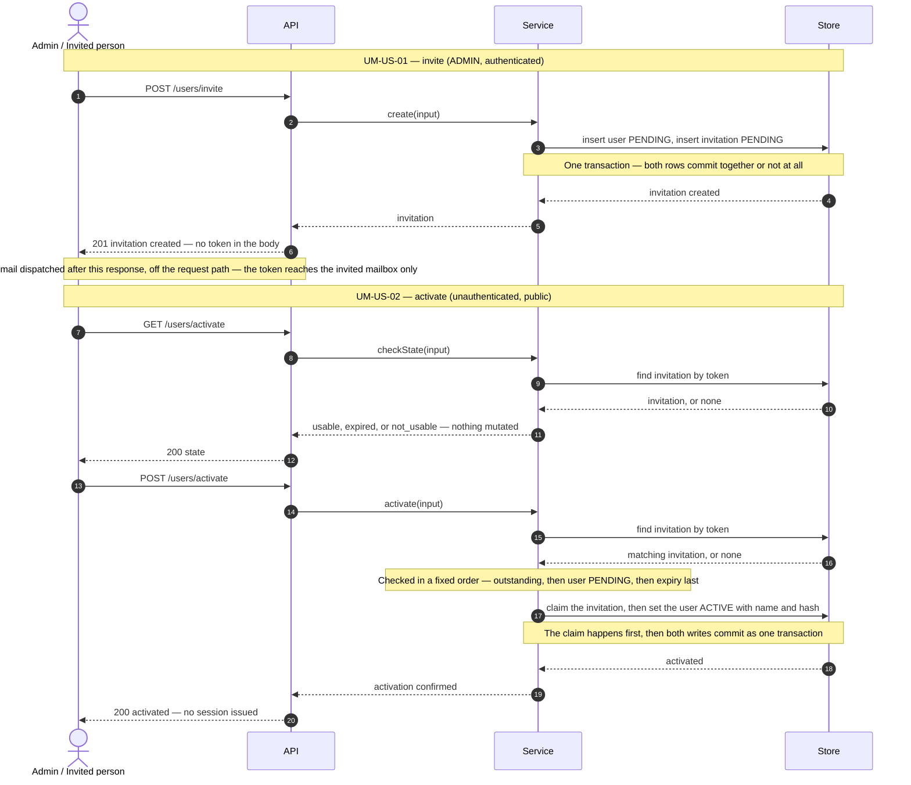

# Software Design Specification (SDS)
## Personal Finance Management (PFM) System
**Document Version:** 1.3.0  
**Status:** Approved for Implementation  
**Aligned to:** SRS v2.2.0 (see §1.6 Revision History)  

---

## Table of Contents
- [1. Introduction](#1-introduction)
  - [1.1 Purpose](#11-purpose)
  - [1.2 Scope](#12-scope)
  - [1.3 Assumptions and Constraints](#13-assumptions-and-constraints)
  - [1.4 Definitions and Acronyms](#14-definitions-and-acronyms)
  - [1.5 Related Documents](#15-related-documents)
    - [1.5.1 Story ID Map (SDS ↔ SRS)](#151-story-id-map-sds--srs)
  - [1.6 Revision History](#16-revision-history)
- [2. Technical Domain Model](#2-technical-domain-model)
  - [2.1 Domain Layer Traceability](#21-domain-layer-traceability)
  - [2.2 Domain Object](#22-domain-object)
  - [2.3 Domain Object Relationships](#23-domain-object-relationships)
  - [2.4 Domain Object State Transition Diagram](#24-domain-object-state-transition-diagram)
    - [2.4.1 User Account State](#241-user-account-state)
    - [2.4.2 Invitation State](#242-invitation-state)
    - [2.4.3 Budget Monitoring State](#243-budget-monitoring-state)
- [3. UI Design](#3-ui-design)
  - [3.1 UI/UX Principles](#31-uiux-principles)
  - [3.2 Wireframes - UI/UX](#32-wireframes---uiux)
- [4. Architecture Design](#4-architecture-design)
  - [4.1 System Context](#41-system-context)
  - [4.2 Logical View](#42-logical-view)
  - [4.3 Development View](#43-development-view)
  - [4.4 Process View](#44-process-view)
  - [4.5 Physical View](#45-physical-view)
  - [4.6 Key Scenarios](#46-key-scenarios)
  - [4.7 Architecture Principles](#47-architecture-principles)
- [5. Product Features and User Story Specification](#5-product-features-and-user-story-specification)
  - [5.1 System Security (SS)](#51-system-security-ss)
  - [5.2 User Management (UM)](#52-user-management-um)
  - [5.3 Wallet Management (WM)](#53-wallet-management-wm)
  - [5.4 Category Management (CM)](#54-category-management-cm)
  - [5.5 Budget Management (BM)](#55-budget-management-bm)
  - [5.6 Transaction Management (TM)](#56-transaction-management-tm)
  - [5.7 Financial Reporting (FR)](#57-financial-reporting-fr)
  - [5.8 Notification Management (NM)](#58-notification-management-nm)
  - [5.9 Dashboard (DB)](#59-dashboard-db)
  - [5.10 Data Configuration (DC)](#510-data-configuration-dc)
- [6. API Design](#6-api-design)
  - [6.1 API Design Standards](#61-api-design-standards)
  - [6.2 Data Transfer Objects (DTOs) and Domain Mapping](#62-data-transfer-objects-dtos-and-domain-mapping)
  - [6.3 API Index](#63-api-index)
  - [6.4 API Specification](#64-api-specification)
  - [6.5 API -\> User Story Traceability](#65-api---user-story-traceability)
  - [6.6 Error Response Catalog](#66-error-response-catalog)
- [7. Security Design](#7-security-design)
  - [7.1 User Authentication](#71-user-authentication)
  - [7.2 User Authorization](#72-user-authorization)
  - [7.3 Threat Modeling](#73-threat-modeling)
  - [7.4 Data Protection](#74-data-protection)
  - [7.5 Secret Management](#75-secret-management)
- [8. Non-Functional Requirements (NFR)](#8-non-functional-requirements-nfr)
  - [8.1 NFR Verification Matrix](#81-nfr-verification-matrix)
- [9. Design Decisions and Tradeoffs](#9-design-decisions-and-tradeoffs)
  - [9.1 Technology Stack Selection](#91-technology-stack-selection)
  - [9.2 Authentication Mechanism Selection](#92-authentication-mechanism-selection)
  - [9.3 API Style Selection](#93-api-style-selection)
  - [9.4 Data Configuration Strategy](#94-data-configuration-strategy)
- [10. Product Metrics](#10-product-metrics)
  - [10.1 Purpose](#101-purpose)
  - [10.2 Metric Categories](#102-metric-categories)
  - [10.3 Core Metrics](#103-core-metrics)
  - [10.4 Metric Measurement Scope](#104-metric-measurement-scope)
  - [10.5 Privacy and Ethical Consideration](#105-privacy-and-ethical-consideration)
  - [10.6 Technical Observability](#106-technical-observability)
- [11. Future Enhancements](#11-future-enhancements)
- [12. Appendix](#12-appendix)
  - [12.1 Naming Conventions](#121-naming-conventions)
  - [12.2 API Documentation Template](#122-api-documentation-template)
  - [12.3 Definition of Done for Coding Agents](#123-definition-of-done-for-coding-agents)
- [13. External Integrations](#13-external-integrations)

---

## 1. Introduction

### 1.1 Purpose
This Software Design Specification (SDS) translates the functional and non-functional requirements defined in the Personal Finance Management (PFM) SRS into a concrete technical architecture. It serves as the primary technical blueprint for software engineers, QA automation developers, and AI coding agents implementing the PFM application.

### 1.2 Scope
This document specifies the initial **Core Technology Stack** and system architecture required to deliver the primary user workflows (User Onboarding via Email Invitation, System Security, Wallet Management, Category Management, Budget Tracking, and Transaction Logging), while providing a clean extension architecture for future additions (AI Assistant, Stock Investments, and External Integrations).

### 1.3 Assumptions and Constraints

#### 1.3.1 Assumptions
1. **Manual Entry Focus:** Financial transactions are manually logged via the React Native mobile application or web client in early releases.
2. **Email Verification:** Account creation is strictly controlled via an Email Invitation + Token + TTL mechanism to prevent non-existent emails from registering.
3. **Monolithic Backend Core:** The core backend is constructed as a clean, layered FastAPI modular monolith.

#### 1.3.2 Constraints
1. **Precision:** All monetary amounts must be stored and calculated using arbitrary-precision decimal formats (`DECIMAL(15, 2)`).
2. **Mobile Target:** Mobile experiences are developed cross-platform using React Native with Expo.

### 1.4 Definitions and Acronyms
* **PFM:** Personal Finance Management
* **SDS:** Software Design Specification
* **SRS:** Software Requirements Specification
* **TTL:** Time-To-Live (token expiration period)
* **JWT:** JSON Web Token
* **DTO:** Data Transfer Object
* **ORM:** Object-Relational Mapping (SQLAlchemy 2.0)
* **DAO:** Data Access Object / Repository Pattern

### 1.5 Related Documents
* Personal Finance Management System Requirements Specification (SRS) v2.2.0 — **the authoritative requirements baseline.** Where this SDS and the SRS disagree, the SRS wins and this document is corrected. SRS §1.5 (added v2.2.0) is the conceptual domain model this document's §2 realises technically — see §2's own note.
* `constitution.md` — project rules with stable IDs (AR/API/NC/VL/SEC/LA/PF/TST/DOD/ENV) derived from this document.
* `specs/<NNN>-<epic>/{spec,plan,test_cases}.md` — the working artifacts. Per-story design detail, error catalogues, and the decisions behind any deviation live there, never in this document.
* §1.6 Revision History below is the audit trail of every alignment edit applied to this document.

#### 1.5.1 Story ID Map (SDS ↔ SRS)

This SDS numbers stories by functional area; the SRS numbers them by feature. They
refer to the same stories. Always cite both.

| SDS code | SRS id | Story | MVP |
| :--- | :--- | :--- | :-: |
| SS-US-01 | US-02-01 | Login | ✔ |
| SS-US-02 | US-02-02 | Logout | ✔ |
| UM-US-01 | US-01-01 | Invite a user via email (ADMIN) | ✔ |
| UM-US-02 | US-01-02 | Activate user account | ✔ |
| UM-US-03 | US-01-03 | List users (ADMIN) | ✔ |
| UM-US-04 | — | View a user profile | SDS-only |
| UM-US-05 | — | Update a user | SDS-only |
| WM-US-01…05 | US-03-01…03 | Wallet management | ✔ (partial) |
| CM-US-01…05 | US-04-01 | Category management | ✔ (partial) |
| BM-US-01…05 | US-05-01 | Budget management | ✔ (partial) |
| TM-US-01…05 | US-06-01…03 | Transaction management | ✔ (partial) |
| FR-US-01…02 | US-07-01 | Financial reporting | ✔ (partial) |
| NM-US-01…03 | US-08-01 | Notifications | ✔ (partial) |
| DB-US-01 | Feature-09 | Overview dashboard | ✔ |
| DC-US-01…02 | — | Data configuration | SDS-only |

### 1.6 Revision History

| Version | Change |
| :--- | :--- |
| 1.0.0 | Initial design specification. |
| **1.1.0** | **Aligned to SRS v2.0.0.** User status `PENDING_INVITATION` → `PENDING` (§2.4.1, §5.1.1, §6.4.1, §7.1.2). `EXPIRED` removed from the user state machine and moved to a new invitation state machine (§2.4.1, §2.4.2) because SRS US-01-02 requires an expired token to leave the account `PENDING`. NFR matrix renumbered to the SRS §3 scheme, resolving an id collision where SDS `NFR-02` meant Security while SRS `NFR-02` means Availability (§8.1). Story ID map added (§1.5.1). SRS feature references annotated on §5 headings. Backend package layout corrected to the real repository structure (§4.3.2). |
| **1.2.0** | **Aligned to the implemented and verified UM-US-01, and to UM-US-02's approved design.** Every change below is this document catching up to code that exists or to a design decision recorded in `specs/001-user-onboarding/plan.md` — none of it is new design. **Domain:** `InvitationToken` renamed `Invitation`; its `token` column replaced by `token_hash` (SHA-256 hex, unique) with `invited_by_id` FK and `created_at` added, in §2.2, the §2.3 class diagram and the §4.3.3 ERD, plus notes on email normalisation, nullable credential columns, and UUID-as-text (§4.3.3). **Invitation state:** §2.4.2 now says explicitly that `EXPIRED` is a derived read-state and names the fixed order of evaluation when a token fails several conditions at once. **Stories:** §5.2.2's acceptance criteria extended to cover check ordering, atomicity, the no-session rule, and the state check; its role annotation corrected from `GUEST/USER` to unauthenticated. **API:** `UM-API-04` (`GET /users/activate`) registered in §6.3 and §6.5 and specified in a new §6.4.3; §6.4.1's response corrected to the six fields actually returned; §6.4.2's UUID token example replaced, since a UUIDv4's ~122 bits fall under NFR-04's 128-bit floor; DTO registry (§6.2.1) renamed to the implemented `ActivateRequest` and completed with `InvitationRead`, `ActivationResult`, `TokenStateRead`, `UserRead`; §6.6 expanded from one example into the full nine-code catalogue with status codes. **Security:** §7.1.5 gained the 72-byte bcrypt ceiling and reject-not-truncate rule, and names bcrypt as the MVP choice; §7.1.8 lists the four public endpoints by method; §7.3's DoS row records that rate limiting is specified but deferred, and its Spoofing row corrected to bcrypt. **Other:** §4.4.1's sequence diagram redrawn to show the repository layer, token hashing, the commit boundary and post-commit mail dispatch; §8.1 gained the missing UXR-02/03/04 rows; §12.1's endpoint-naming rule reconciled with the verb segments API-05 requires. Audit trail is this table — the former pointer to an untracked process-documents directory was removed. |
| **1.3.0** | **§4.4.1's sequence diagram redrawn to the `constitution.md` `DG` group** adopted this session: four lanes only (`UI → API → Service → Store`), no SQL or repository lane, no parameter lists, every request answered with an HTTP status. v1.2.0's diagram — while itself an improvement over v1.0.0's sketch — had reintroduced a `Repo`/`DB` lane and query-shaped labels (`INSERT x2`, `UPDATE x2, same flush`, `SELECT`), which is exactly what `DG-01`/`DG-04` now forbid. No design fact changes: the same commit boundary, the same fixed check order, the same post-commit mail dispatch — only how they are drawn. |

---

## 2. Technical Domain Model

This is the technical realisation — DB columns, SQLAlchemy types, DTOs — of `SRS.md` §1.5's
**conceptual** domain model (added v2.2.0), which describes the same seven entities in business
language with no technical detail. **Known gap, not yet closed here:** `SRS.md` §1.5 draws
`User receives Notification`, inferred from the `NM-US-*` stories in §5.8 below; this section's own
§2.3 class diagram and the §4.3.3 ERD have never drawn that relationship, even though **Notification**
is a full domain entity in §2.1's table. Left as-is for now rather than fixed in this pass, so it does
not get lost: the next alignment of this document should add it to both places.

### 2.1 Domain Layer Traceability

| Business Entity | Database Table | SQLAlchemy Entity | Pydantic Schema DTO |
| :--- | :--- | :--- | :--- |
| **User** | `users` | `UserModel` | `UserRead` |
| **Invitation** | `invitations` | `InvitationModel` | `InviteCreate`, `InvitationRead`, `ActivateRequest`, `ActivationResult`, `TokenStateRead` |
| **Wallet** | `wallets` | `WalletModel` | `WalletRead`, `WalletCreate` |
| **Category** | `categories` | `CategoryModel` | `CategoryRead`, `CategoryCreate` |
| **Budget** | `budgets` | `BudgetModel` | `BudgetRead`, `BudgetCreate` |
| **Transaction** | `transactions` | `TransactionModel` | `TransactionRead`, `TransactionCreate` |
| **Notification** | `notifications` | `NotificationModel` | `NotificationRead` |

### 2.2 Domain Object

* **User:** Represents the application account owner (`id`, `email`, `password_hash`, `full_name`, `status`, `role`, `created_at`). An invited account exists with `password_hash` and `full_name` both null until activation sets them.
* **Invitation:** Tracks email invitations (`id`, `email`, `token_hash`, `expires_at`, `status`, `invited_by_id`, `created_at`). One row per invitation *attempt*, so the history of attempts survives and an expired attempt leaves the account untouched. **Only the SHA-256 hash of the token is stored** (`token_hash`) — the raw token exists solely in the delivered email, and activation finds the row by hashing what the user presents (§7.4, constitution SEC-03). `invited_by_id` records which ADMIN issued it.
* **Wallet:** Financial container holding funds (`id`, `user_id`, `name`, `type`, `balance`, `currency`).
* **Category:** Classification for monetary activities (`id`, `user_id`, `name`, `type`, `icon`).
* **Budget:** Spending constraint attached to a wallet and category (`id`, `wallet_id`, `category_id`, `amount_limit`, `period`).
* **Transaction:** Ledger entry representing monetary movement (`id`, `wallet_id`, `category_id`, `amount`, `type`, `timestamp`, `note`).
* **Notification:** In-app alert generated by system events or budget threshold breaches.

### 2.3 Domain Object Relationships



### 2.4 Domain Object State Transition Diagram

#### 2.4.1 User Account State

Aligned to SRS §6 US-01-01/US-01-02, which name the invited state `PENDING` and
require that an expired token leave the account *unchanged*: "the account status
remains `PENDING`". Token expiry is therefore a property of the **invitation**,
not of the user — see §2.4.2.



#### 2.4.2 Invitation State

An expired or superseded invitation never alters the user's own status. Re-inviting
a `PENDING` address supersedes the outstanding invitation and issues a new token
with a fresh TTL.



`EXPIRED` is **derived** from `expires_at` on every read, never written by a
background job — there is no sweeper in the MVP.

Read the diagram accordingly: `PENDING → EXPIRED` and `EXPIRED → SUPERSEDED` describe how a *reader*
sees the row, not writes anyone performs. The stored `status` of an expired invitation is still
`PENDING`; re-inviting the address updates that same `PENDING` row to `SUPERSEDED`, which is why
expiry is no obstacle to re-inviting. `ACCEPTED` and `SUPERSEDED` are the only two values ever
written after insertion.

When a token fails more than one condition — say it is `ACCEPTED` *and* past `expires_at`, which is
the normal state of any used invitation a day later — the reported reason is decided by a fixed order
of evaluation, with expiry checked **last** (§5.2.2). So `expired` is only ever reported for a token
that would otherwise have worked.

#### 2.4.3 Budget Monitoring State



---

## 3. UI Design

### 3.1 UI/UX Principles
1. **Low-Friction Logging (< 10 seconds):** Logging an expense requires no more than 3 user taps on mobile interfaces.
2. **At-a-Glance Financial Clarity:** Visual indicators use distinct color tokens (🟢 Green: Healthy, 🟡 Yellow: Warning, 🔴 Red: Overbudget).
3. **Mobile-First Responsive Design:** Built using React Native Expo components optimized for iOS and Android touch interactions.

### 3.2 Wireframes - UI/UX

#### Mobile Dashboard & Quick Entry Wireframe
```text
+------------------------------------+
|  [PFM]  Hi, Jane!      [Notifications]
|  Total Net Balance: $12,450.00     |
+------------------------------------+
|  MY WALLETS                        |
|  [ Checking: $10,000 ] [ Cash: $450]
+------------------------------------+
|  BUDGET HEALTH (THIS MONTH)        |
|  Food: [========---] 80% (Warning) |
|  Rent: [==========-] 90%           |
+------------------------------------+
|  RECENT TRANSACTIONS               |
|  - Grocery Store     -$85.50 (Exp) |
|  - Salary Payment  +$3,500.00 (Inc)|
+------------------------------------+
|      [ + LOG TRANSACTION ]         |
+------------------------------------+
```

---

## 4. Architecture Design

### 4.1 System Context



### 4.2 Logical View

```
+--------------------------------------------------------------------------+
|                              LOGICAL VIEW                                |
+--------------------------------------------------------------------------+
|  +------------------------+  +--------------------+  +-----------------+ |
|  | User Management (UM)   |  | System Security(SS)|  | Wallet (WM)     | |
|  +------------------------+  +--------------------+  +-----------------+ |
|  | Category (CM)          |  | Budget (BM)        |  | Transaction(TM) | |
|  +------------------------+  +--------------------+  +-----------------+ |
|  | Financial Reporting(FR)|  | Notifications (NM) |  | Dashboard (DB)  | |
+--------------------------------------------------------------------------+
```

### 4.3 Development View

#### 4.3.1 Frontend Architecture (React Native / Expo)
* **Framework:** React Native via Expo (SDK 50+).
* **Navigation:** React Navigation / Expo Router.
* **State & HTTP:** React Hook Form + Axios with interceptors for JWT injection.
* **Storage:** `expo-secure-store` for hardware-encrypted JWT storage.
* **Deep Linking:** `Expo Linking` to capture activation URLs (`app://activate?token=XYZ`).

#### 4.3.2 Backend Architecture (FastAPI Service Layer)
Uses a **3-Layer Modular Monolith Architecture**. The layer names below are
normative (constitution AR-01…AR-03); the concrete paths reflect the actual
repository, where the backend is rooted at `backend/` and the importable package
is `app/` rather than `src/`:

```text
backend/
├── app/
│   ├── api/v1/          # FastAPI Routers (Controllers/Endpoints)
│   ├── services/        # Business logic & Domain rules
│   ├── repositories/    # Database queries (SQLAlchemy 2.0 ORM)
│   ├── models/          # SQLAlchemy database models
│   ├── schemas/         # Pydantic v2 DTO request/response contracts
│   ├── core/            # Security, JWT, clock, config (pydantic-settings), errors
│   └── main.py          # FastAPI application factory + entry point
├── migrations/          # Alembic revisions
└── tests/               # pytest: unit/ and integration/
```

#### 4.3.3 Data Design

##### Relational Database ER Diagram


**Notes on the onboarding tables** (aligned to the implemented schema in v1.2.0):

* `users.email` carries the unique index and is stored **normalised** — trimmed and case-folded — so
  one mailbox maps to exactly one account. `invitations.email` is denormalised for audit history and
  is indexed but deliberately **not** unique: an address may be invited many times.
* `invitations.token_hash` is the SHA-256 hex digest of the token, `char(64)`, unique. The raw token
  is never persisted (§7.4, constitution SEC-03).
* `users.password_hash` and `users.full_name` are nullable, because an invited account exists before
  anyone has set either.
* `id` columns are UUIDs held as 36-character text rather than a native UUID type, so one schema runs
  on both SQLite (local) and PostgreSQL (deployment) — see §4.5 and constitution ENV-03.

### 4.4 Process View

#### 4.4.1 Sequence Diagrams

##### User Invitation & Activation Sequence

Aligned in v1.3.0 to `constitution.md`'s `DG` group: four lanes only (`UI → API → Service → Store`),
no SQL, no parameter lists, every request answered with an HTTP status. Per-story detail, including
every refusal branch and the fixed check order, lives in that story's `plan.md`; this diagram is the
system-level shape, not the full contract.



### 4.5 Physical View
* **Mobile Client:** Expo Native App running on iOS/Android.
* **Backend Application:** FastAPI service running inside a Docker container (deployed on PaaS e.g., Railway/Render/Fly.io).
* **Database:** PostgreSQL instance with automated Alembic migrations.

### 4.6 Key Scenarios

| Scenario ID | Feature Area | User Story | Description |
| :--- | :--- | :--- | :--- |
| **S-UM-01** | User Management | UM-US-01 Invite User | Admin invites family member via email |
| **S-UM-02** | User Management | UM-US-02 Activate User | User clicks email link and sets password |
| **S-SS-01** | System Security | SS-US-01 Login | User logs in and receives JWT |
| **S-WM-01** | Wallet Management | WM-US-01 Create Wallet | User establishes a checking/cash account |
| **S-TM-01** | Transaction Mgmt | TM-US-01 Create Transaction | User records an expense; balance updates |

### 4.7 Architecture Principles
1. **API-First Design:** OpenAPI schemas are auto-generated from FastAPI Pydantic models.
2. **Secure by Default:** All protected endpoints require a valid JWT `Authorization: Bearer <token>` header.
3. **Transactional Integrity:** Monetary modifications execute inside explicit SQLAlchemy transaction blocks.

---

## 5. Product Features and User Story Specification

### 5.1 System Security (SS) — *SRS §6 Feature-02*

#### 5.1.1 SS-US-01: Login
* **Goal:** Authenticate active users and return a JWT access token.
* **Acceptance Criteria:**
  1. Validates email and password against stored database hashes.
  2. Rejects authentication if user status is `PENDING` (SRS §6 US-02-01: "Reject login for PENDING (unactivated) user").
  3. Returns a signed JWT token upon success.

#### 5.1.2 SS-US-02: Logout (All)
* **Goal:** Invalidate local tokens and terminate user session context.

---

### 5.2 User Management (UM) — *SRS §6 Feature-01*

#### 5.2.1 UM-US-01: Invite a User via Email (ADMIN)
* **Goal:** Send an activation link with a secure token and TTL to a target email address.
* **Acceptance Criteria:**
  1. Validates email format, then normalises the address (trimmed, case-folded) before any uniqueness comparison, so one mailbox maps to exactly one account.
  2. Refuses the address if it belongs to an `ACTIVE` account, and likewise if it belongs to a `DEACTIVATED` one — an invitation must not silently resurrect withdrawn access. A `PENDING` address is **re-invitable**: the outstanding invitation is marked `SUPERSEDED` and a fresh token issued, which is the recovery path when a link expired or never arrived.
  3. Generates a secure random token (`secrets.token_urlsafe(32)` — 256 bits) with a 24-hour TTL, and persists only its hash.
  4. Writes the `users` row and the `invitations` row in **one** transaction; neither may exist without the other.
  5. Dispatches an email via Gmail SMTP **after** the commit and off the request path, so a rolled-back token is never advertised and NFR-01's 300 ms p95 holds against SMTP's 1–3 s.
  6. Returns the new account's id, email, status and token expiry — and never the token, which reaches the invited mailbox alone.
  7. ADMIN only. An unauthenticated caller is refused before the payload is examined.

#### 5.2.2 UM-US-02: Activate a User Account (GUEST — unauthenticated)
* **Goal:** Allow an invited user to set their full name and password to activate their account.
* **Acceptance Criteria:**
  1. Validates that the presented token matches an invitation, that the invitation is still outstanding, that its user is `PENDING`, and — **checked last** — that `expires_at > CURRENT_TIMESTAMP`. The order fixes which refusal is reported when more than one condition fails.
  2. Hashes password using `bcrypt` (§7.1.5) after enforcing the password policy.
  3. Updates user state to `ACTIVE`, records the full name, and invalidates the activation token — both writes in one transaction, so a usable token never survives a successful activation.
  4. Issues **no** session. The client directs the activated person to log in (SS-US-01).
  5. Exposes a read-only companion (`UM-API-04`) reporting a token's state without consuming it, so a client can warn about an expired link before asking for a password (UXR-04).
* **Note:** reactivating a `DEACTIVATED` account is **not** this story — an old invitation link must not restore withdrawn access. That is §5.2.5 UM-US-05.

#### 5.2.3 UM-US-03: List Users (ADMIN)
* **Goal:** Display a list of all invited and active accounts.

#### 5.2.4 UM-US-04: View a User Profile (All)
* **Goal:** Retrieve logged-in user profile metadata.

#### 5.2.5 UM-US-05: Update a User (ADMIN)
* **Goal:** Modify user permissions or deactivate accounts.

---

### 5.3 Wallet Management (WM) — *SRS §6 Feature-03*

#### 5.3.1 WM-US-01: Create a Wallet (USER)
* **Goal:** Establish monetary containers (e.g., Checking, Cash, Credit Card).
* **Acceptance Criteria:** Requires name, type, currency code, and initial balance.

#### 5.3.2 WM-US-02: List Wallets (USER)
* **Goal:** Display all wallets owned by the logged-in user.

#### 5.3.3 WM-US-03: View a Wallet (USER)
* **Goal:** View detailed balance and history for a specific wallet.

#### 5.3.4 WM-US-04: Update a Wallet (USER)
* **Goal:** Rename or update configuration for a wallet.

#### 5.3.5 WM-US-05: Delete a Wallet (USER)
* **Goal:** Soft-delete or archive an unused wallet container.

---

### 5.4 Category Management (CM) — *SRS §6 Feature-04*

#### 5.4.1 CM-US-01: Create a Category (USER)
* **Goal:** Define custom categories for classifying income and expense transactions.

#### 5.4.2 CM-US-02: List Categories (USER)
* **Goal:** Retrieve all system and user-defined transaction categories.

#### 5.4.3 CM-US-03: View a Category (USER)
* **Goal:** View details and category metadata.

#### 5.4.4 CM-US-04: Update a Category (USER)
* **Goal:** Modify category name, type, or icon.

#### 5.4.5 CM-US-05: Delete a Category (USER)
* **Goal:** Remove an unused transaction category.

---

### 5.5 Budget Management (BM) — *SRS §6 Feature-05*

#### 5.5.1 BM-US-01: Create a Budget for a Wallet (USER)
* **Goal:** Assign a spending limit to a category and wallet over a monthly period.

#### 5.5.2 BM-US-02: List Budgets (USER)
* **Goal:** View active budgets and current progress percentages.

#### 5.5.3 BM-US-03: View Budget Status & Alerts (USER)
* **Goal:** Display visual warning indicators when spending exceeds threshold limits (75%, 100%).

#### 5.5.4 BM-US-04: Update a Budget (USER)
* **Goal:** Adjust spending caps for an active budget.

#### 5.5.5 BM-US-05: Delete a Budget (USER)
* **Goal:** Remove an active budget tracker.

---

### 5.6 Transaction Management (TM) — *SRS §6 Feature-06*

#### 5.6.1 TM-US-01: Create a Transaction for a Wallet (USER)
* **Goal:** Log an income or expense transaction and atomically update wallet balances.

#### 5.6.2 TM-US-02: List Transactions (USER)
* **Goal:** Query and filter logged transactions by wallet, category, or date range.

#### 5.6.3 TM-US-03: View a Transaction (USER)
* **Goal:** View detailed information for a single transaction item.

#### 5.6.4 TM-US-04: Update a Transaction (USER)
* **Goal:** Edit transaction details and automatically recalculate wallet balances.

#### 5.6.5 TM-US-05: Delete a Transaction (USER)
* **Goal:** Remove a transaction and reverse its impact on wallet balance.

---

### 5.7 Financial Reporting (FR) — *SRS §6 Feature-07*

#### 5.7.1 FR-US-01: View Summary Report (USER)
* **Goal:** Display monthly income, total expenses, net savings, and top spending categories.

#### 5.7.2 FR-US-02: View Category Expense Report (USER)
* **Goal:** Display category-wise expense breakdown charts.

---

### 5.8 Notification Management (NM) — *SRS §6 Feature-08*

#### 5.8.1 NM-US-01: List Notifications (USER)
* **Goal:** View system alerts, invitation notifications, and budget warning triggers.

#### 5.8.2 NM-US-02: View a Notification (USER)
* **Goal:** Read detailed notification contents.

#### 5.8.3 NM-US-03: Toggle/Mark Notification as Read (USER)
* **Goal:** Update notification read status.

---

### 5.9 Dashboard (DB) — *SRS §6 Feature-09*

#### 5.9.1 DB-US-01: View Overview Dashboard Widgets (USER)
* **Goal:** Display aggregated summary widgets (total balance, budget health bars, recent activity).

---

### 5.10 Data Configuration (DC) — *no SRS feature; SDS-only*

#### 5.10.1 DC-US-01: Config Values for Currency & Exchange Rates (ADMIN)
* **Goal:** Configure system-wide default currency and exchange rate constants.

#### 5.10.2 DC-US-02: Config Values for Invitation Token TTL (ADMIN)
* **Goal:** Configure expiration duration parameters for onboarding invitations.

---

## 6. API Design

### 6.1 API Design Standards
* **Protocol:** HTTPS RESTful API
* **Base Route:** `/api/v1`
* **Format:** JSON Request & Response bodies
* **Authentication Header:** `Authorization: Bearer <JWT_ACCESS_TOKEN>`

### 6.2 Data Transfer Objects (DTOs) and Domain Mapping

#### 6.2.1 DTO Registry

Onboarding DTOs use the names the code uses (aligned v1.2.0 — v1.0.0 called the activation request
`ActivateUser` in §2.1 and `UserActivate` here, neither of which was ever implemented):

* **`InviteCreate`**: `{ "email": "string" }`
* **`InvitationRead`**: `{ "id": "UUID", "email": "string", "status": "PENDING", "token_expires_at": "datetime", "created_at": "datetime", "message": "string" }` — six fields, and **no token**.
* **`ActivateRequest`**: `{ "token": "string", "full_name": "string", "password": "string" }`
* **`ActivationResult`**: `{ "status": "SUCCESS", "message": "string" }` — no session, no token.
* **`TokenStateRead`**: `{ "state": "usable" | "expired" | "not_usable" }`
* **`UserRead`**: `{ "id": "UUID", "email": "string", "full_name": "string", "status": "string", "created_at": "datetime" }` — never `password_hash`.
* **`WalletCreate`**: `{ "name": "string", "type": "string", "currency": "string", "initial_balance": 0.00 }`
* **`TransactionCreate`**: `{ "wallet_id": "UUID", "category_id": "UUID", "amount": 0.00, "type": "EXPENSE", "note": "string" }`

### 6.3 API Index

| ID | Method | Endpoint | Description |
| :--- | :--- | :--- | :--- |
| **SS-API-01** | `POST` | `/api/v1/auth/login` | Authenticate user and issue JWT |
| **UM-API-01** | `POST` | `/api/v1/users/invite` | Send email invitation |
| **UM-API-02** | `POST` | `/api/v1/users/activate` | Activate account with token |
| **UM-API-03** | `GET` | `/api/v1/users` | List all users |
| **UM-API-04** | `GET` | `/api/v1/users/activate` | Report a token's state without consuming it |
| **WM-API-01** | `POST` | `/api/v1/wallets` | Create a new wallet |
| **WM-API-02** | `GET` | `/api/v1/wallets` | List user wallets |
| **TM-API-01** | `POST` | `/api/v1/transactions` | Record a transaction |

---

### 6.4 API Specification

#### 6.4.1 UM-API-01: Send Email Invitation
* **Endpoint:** `POST /api/v1/users/invite`
* **Request Payload:**
```json
{
  "email": "family.member@gmail.com"
}
```
* **Auth:** ADMIN bearer token required.
* **Success Response (`201 Created`):**
```json
{
  "id": "e3a89047-bf1b-4f81-8b38-8c114fef6f82",
  "email": "family.member@gmail.com",
  "status": "PENDING",
  "token_expires_at": "2026-08-01T09:15:00+00:00",
  "created_at": "2026-07-31T09:15:00+00:00",
  "message": "Invitation sent successfully"
}
```
* **Errors:** `401 NOT_AUTHENTICATED` · `403 FORBIDDEN` · `409 USER_EMAIL_ALREADY_ACTIVE` · `409 USER_EMAIL_DEACTIVATED` · `422 VALIDATION_ERROR` · `502 EMAIL_DELIVERY_FAILED`.
* **Note:** the invitation token appears nowhere in this response. It reaches the invited mailbox and nowhere else. Timestamps are always offset-aware.

#### 6.4.2 UM-API-02: Activate User Account
* **Endpoint:** `POST /api/v1/users/activate`
* **Auth:** none — public (§7.1.8). An invited person has no account yet, so requiring authentication would make activation impossible.
* **Request Payload:**
```json
{
  "token": "kR8t-2yQm5vB1nX7cZ0pLdSfWhJgTaUeQiYoKbNrMxE",
  "full_name": "Jane Doe",
  "password": "StrongPassword123!"
}
```
* **Success Response (`200 OK`):**
```json
{
  "status": "SUCCESS",
  "message": "Account activated successfully. You may now log in."
}
```
* **Errors:** `400 INVITATION_TOKEN_EXPIRED` · `400 INVITATION_TOKEN_INVALID` · `422 VALIDATION_ERROR`.
* **Notes:** the token is an opaque high-entropy string (`secrets.token_urlsafe(32)`, 256 bits), **not** a UUID — a UUIDv4 carries only ~122 bits and would fall under NFR-04's 128-bit floor. Success issues **no** session; the client directs the person to log in (SS-API-01). Every refusal other than expiry returns the same `INVITATION_TOKEN_INVALID`, so an unrecognised token cannot be told from one already used, superseded, or belonging to a user who is no longer `PENDING`.

#### 6.4.3 UM-API-04: Report Invitation Token State
* **Endpoint:** `GET /api/v1/users/activate?token=<token>`
* **Auth:** none — public (§7.1.8).
* **Purpose:** lets a client tell a person their link has expired *before* asking them to type a password (UXR-04). Strictly read-only: it never consumes, supersedes, or otherwise alters the invitation.
* **Success Response (`200 OK`):**
```json
{
  "state": "usable"
}
```
* **`state`** is one of `usable`, `expired`, `not_usable`. `not_usable` collapses every non-expiry reason — never issued, already used, superseded, or user no longer `PENDING` — and continues to do so once such a token also passes its TTL. `expired` is reported **only** for a token that is otherwise usable, which is why the checks run in a fixed order: outstanding state, then user state, then expiry last.
* **Known exposure:** the token travels in the query string, so a web server's access log records it. Accepted as a bounded exemption — the token is single-use and 24-hour-lived, and the same value already appears in the URL of the emailed activation link. Operators behind a proxy should strip the query string for this path.

---

### 6.5 API -> User Story Traceability

| API Endpoint | Feature Area | User Story Code |
| :--- | :--- | :--- |
| `POST /api/v1/auth/login` | System Security | SS-US-01 |
| `POST /api/v1/users/invite` | User Management | UM-US-01 |
| `POST /api/v1/users/activate` | User Management | UM-US-02 |
| `GET /api/v1/users/activate` | User Management | UM-US-02 |
| `GET /api/v1/users` | User Management | UM-US-03 |
| `POST /api/v1/wallets` | Wallet Management | WM-US-01 |
| `POST /api/v1/transactions` | Transaction Management | TM-US-01 |

### 6.6 Error Response Catalog

Standard JSON Error Structure — **flat**, never nested under an `"error"` key, and used for
validation failures as well as domain errors:
```json
{
  "error_code": "INVITATION_TOKEN_EXPIRED",
  "message": "The provided invitation link has expired. Please request a new invitation.",
  "details": {}
}
```

Every code the onboarding and security features can emit (catalogued in v1.2.0; previously this
section carried only the example above). Codes are `UPPER_SNAKE_CASE` with a resource prefix, and
each story's `plan.md` catalogues the subset that story emits.

| Error code | HTTP | Meaning |
| :--- | :-: | :--- |
| `VALIDATION_ERROR` | 422 | Payload failed schema validation — malformed email, weak or over-long password, blank or over-long full name. All field errors are returned together in `details.fields`. |
| `NOT_AUTHENTICATED` | 401 | Credentials absent, malformed, invalid, or expired. Evaluated before the payload. |
| `FORBIDDEN` | 403 | Authenticated, but the role is insufficient — a non-ADMIN attempting an ADMIN action. |
| `USER_EMAIL_ALREADY_ACTIVE` | 409 | The address already belongs to an `ACTIVE` account. Deliberately discloses existence: an ADMIN inviting a colleague needs to know why it failed (documented exemption to §7.3's enumeration concern). |
| `USER_EMAIL_DEACTIVATED` | 409 | The address belongs to a `DEACTIVATED` account. Refused rather than silently resurrecting withdrawn access; reactivation is UM-US-05. *Designed, not yet implemented — currently emitted as `USER_EMAIL_ALREADY_ACTIVE`.* |
| `EMAIL_DELIVERY_FAILED` | 502 | Mail dispatch was attempted inline and could not complete. A delivery failure never reports success. |
| `INVITATION_TOKEN_EXPIRED` | 400 | The token matches an outstanding invitation whose user is still `PENDING`, and it is past its TTL. The only refusal reason named specifically. |
| `INVITATION_TOKEN_INVALID` | 400 | Every other refusal: unrecognised, already accepted, superseded, or the user is no longer `PENDING` — including when such a token is also expired. One code so these cases stay indistinguishable. |
| `INTERNAL_ERROR` | 500 | Unexpected server error. Never carries internal detail. |

`400` rather than `404` for a bad token is deliberate: a `404` would itself be a distinguishable
"no such token" answer, which is exactly the disclosure `INVITATION_TOKEN_INVALID` exists to prevent.

---

## 7. Security Design

### 7.1 User Authentication

#### 7.1.1 Objective
Ensure only verified, authenticated users can access financial data, while completely preventing unverified/fake registration attempts.

#### 7.1.2 Identity Model
User identity is bound to a verified email address with status tracking (`PENDING`, `ACTIVE`, `DEACTIVATED`). Invitation lifecycle state is tracked separately on the invitation record (§2.4.2).

#### 7.1.3 Authentication Mechanism
JWT-based Bearer token authentication signed via HMAC-SHA256 (`HS256`).

#### 7.1.4 Authentication Input
Email and Password.

#### 7.1.5 Password Policy
Minimum 8 characters containing at least one uppercase letter, one digit, and one special character.
**Capped at 72 bytes UTF-8**, and a longer password is *rejected*, never truncated — bcrypt silently
ignores anything past 72 bytes, so a truncating implementation would let a shorter password unlock the
same account (constitution VL-04).

Hashed with **`bcrypt`** in the MVP, called directly rather than through `passlib`. `argon2` remains a
sanctioned alternative; the choice is isolated behind `core/security.py`'s `hash_password` /
`verify_password`, so swapping it touches one module. Invitation tokens are *not* password-hashed —
they are already 256 bits of uniform randomness, so they use plain SHA-256 (§7.4, SEC-03); a slow KDF
would add latency on every activation and buy nothing.

#### 7.1.6 Session Management
Short-lived access tokens (60 minutes).

#### 7.1.7 Authentication Controls
Endpoints check user context and reject tokens belonging to non-active user accounts.

#### 7.1.8 Public vs Protected Endpoints
* **Public** — exactly these four, listed by method so the set is unambiguous (constitution API-08):
  * `POST /api/v1/auth/login`
  * `POST /api/v1/users/activate` — the one unauthenticated **write** in the system
  * `GET /api/v1/users/activate` — the token state check (`UM-API-04`)
  * `GET /health` — liveness probe
* **Protected:** All other endpoints require `Authorization: Bearer <token>`, declared as an
  `HTTPBearer` security scheme so generated documentation adds the `Bearer ` prefix itself.
* Adding a public route is a design decision, recorded in the story's `plan.md` before it ships.

#### 7.1.9 CSRF Protection
Stateless JWT Authorization headers mitigate cross-site request forgery attacks.

#### 7.1.10 Audit Logging
Critical actions (invitations, activations, logins) append entries to structured logs.

### 7.2 User Authorization
Ownership-based access control: Service queries append `WHERE user_id = :authenticated_user_id`.

### 7.3 Threat Modeling (STRIDE Evaluation)

| Threat Category | Risk Scenario | Mitigation Strategy |
| :--- | :--- | :--- |
| **Spoofing** | Attacker impersonates a user | Secure password hashing (`bcrypt`, §7.1.5) + signed JWT tokens |
| **Tampering** | Modifying transaction amounts in transit | TLS 1.3 encryption for all endpoint interactions |
| **Repudiation** | User denies performing transaction | Structured audit logs recording timestamps and user context |
| **Information Leak** | Viewing another user's balance | Strict user ownership filter on data repository layer |
| **Denial of Service** | Spamming the invitation API, or brute-forcing the public token state check | Rate limiting middleware (`slowapi`) on the invite and activate endpoints — **specified, not yet implemented.** Deferred as an explicit task in each story's `plan.md` (UM-US-01 T-13, UM-US-02 T-08) because no acceptance criterion requires it. The unauthenticated `GET /users/activate` is the stronger case of the two, since it answers a yes/no question about a secret. |
| **Elevation of Privilege** | Normal user accessing admin endpoints | Role checks on user management routes |

### 7.4 Data Protection
* **In Transit:** TLS 1.3 enforced over HTTPS.
* **At Rest:** Database disk encryption + encrypted token store (`expo-secure-store`) on mobile devices.

### 7.5 Secret Management
Environment variables managed via `pydantic-settings` loaded from isolated `.env` files.

---

## 8. Non-Functional Requirements (NFR)

### 8.1 NFR Verification Matrix

IDs match `SRS.md` §3 exactly, so a citation such as "NFR-04" means the same thing
in both documents. UXR rows match SRS §4.

| ID | Attribute | Specification Metric | Verification Method |
| :--- | :--- | :--- | :--- |
| **NFR-01** | Performance | API latency < 300ms (p95) on primary read/write operations | `pytest` + `httpx` benchmark testing |
| **NFR-02** | Availability | 99.0% uptime excluding scheduled maintenance | Uptime monitoring on the deployed environment |
| **NFR-03** | Scalability | Controller / Service / Data layers remain separable | Design review against constitution AR-01…AR-03 |
| **NFR-04** | Security & Token Enforcement | 0 unhashed passwords in DB; invitation tokens ≥128 bits entropy; TTL strictly enforced | Code review + DB audit; token entropy and TTL-boundary tests |
| **NFR-05** | Data Integrity & Monetary Precision | `DECIMAL(15,2)` throughout; balance updates inside ACID transactions | Atomic DB transaction tests; schema inspection |
| **NFR-06** | Privacy | Every query on user-owned data is scoped by `user_id` | Repository code review + cross-user access tests |
| **UXR-01** | Low-Friction Entry | Transaction entry in < 3 taps | UI/UX stopwatch validation testing |
| **UXR-02** | At-a-Glance Clarity | Budget health conveyed by colour token (green / yellow / red) without reading figures | Design review against §3.1; component-level UI tests |
| **UXR-03** | Immediate Balance Feedback | Wallet totals and budget bars update without a manual refresh | UI integration test asserting post-submit state |
| **UXR-04** | Clear Onboarding Guidance | Activation is a single-page Name + Password form, and an unusable link is explained before the form is filled in | `UM-API-04` state check plus the activation screen's rendering test |

---

## 9. Design Decisions and Tradeoffs

### 9.1 Technology Stack Selection

#### 9.1.1 Frontend
* **Selection:** React Native (via Expo).
* **Tradeoff:** Enables single cross-platform JavaScript/TypeScript codebase for iOS and Android, sacrificing native UI widget performance.

#### 9.1.2 Backend
* **Selection:** Python 3.11+ with FastAPI & SQLAlchemy 2.0.
* **Tradeoff:** High developer productivity, auto-generated OpenAPI documentation, and async capabilities, with slightly lower computational performance compared to Go or Rust.

### 9.2 Authentication Mechanism Selection
* **Selection:** Email Invitation Token + JWT.
* **Tradeoff:** Prevents open self-registration and non-existent emails, adding the small operational requirement of managing SMTP mail dispatch.

### 9.3 API Style Selection
* **Selection:** RESTful JSON via HTTP.
* **Tradeoff:** Standardized toolchain compatibility and client caching support vs GraphQL's custom query fetching.

### 9.4 Data Configuration Strategy
* **Selection:** Pydantic environment configurations (`pydantic-settings`).
* **Tradeoff:** Strong runtime type safety and secret validation vs dynamic database-driven application config.

---

## 10. Product Metrics

### 10.1 Purpose
Define key quality metrics to evaluate user adoption, system stability, and application reliability over time.

### 10.2 Metric Categories
1. **Adoption & Engagement Metrics**
2. **Operational Quality Metrics**
3. **Financial Behavior Metrics**

### 10.3 Core Metrics
* **Active Invites Conversion Rate:** % of sent invitations activated within 24 hours.
* **Transaction Logging Volume:** Average monthly transactions logged per active user.
* **Failed API Request Rate:** % of transactions resulting in 5xx internal server errors.

### 10.4 Metric Measurement Scope
MVP metrics track active user counts, invitation conversions, and core system error rates.

### 10.5 Privacy and Ethical Consideration
Analytics logging uses pseudonymized identifiers; raw private financial descriptions are excluded from tracking tools.

### 10.6 Technical Observability
Structured JSON logs (`structlog`) capture system metrics, request latencies, and transaction error traces.

---

## 11. Future Enhancements

* **Phase 2 - AI Financial Assistant (Chatbot):** Integrate `fastapi-users`, Redis task queues (`arq` / `Celery`), and LLM endpoints to answer natural language queries (e.g., "How much did we spend on food last month?").
* **Phase 3 - Investment & Asset Holdings:** Support tracking stocks, crypto, and real estate assets (`Asset`, `Holding`, `InvestmentPortfolio`).
* **External Integrations:** Automated bank transaction sync feeds (Plaid / Salt Edge) and receipt scanning (OCR engines).

---

## 12. Appendix

### 12.1 Naming Conventions
* **Database Tables:** Lowercase snake_case, pluralized (e.g., `users`, `wallets`, `transactions`).
* **Python Classes:** PascalCase (e.g., `TransactionService`, `WalletRepository`).
* **API Endpoints:** Lowercase, hyphenated, plural resource nouns (e.g., `/api/v1/users`,
  `/api/v1/wallets`). A **verb** segment is permitted only for an explicit business state
  transition, which is preferred over a generic status update — hence `/users/invite` and
  `/users/activate` rather than `PATCH /users/{id}` carrying a `status` field (constitution
  API-05, NC-03).

### 12.2 API Documentation Template
FastAPI automatically generates live interactive documentation accessible at `/docs` (Swagger UI) and `/redoc` (ReDoc) based on Pydantic schemas.

### 12.3 Definition of Done for Coding Agents
1. Code follows 3-tier layering (`router` -> `service` -> `repository`).
2. New database models include Alembic migration scripts.
3. Automated unit tests written with `pytest` pass with > 80% coverage.
4. API routes match OpenAPI specification schemas.

---

## 13. External Integrations

* **Gmail SMTP:** Interfaced via Python `smtplib` using an App Password for sending activation emails during MVP.
* **Future Mail Services:** Architecture supports switching to transactional providers (SendGrid, Postmark, or AWS SES) via abstraction services.