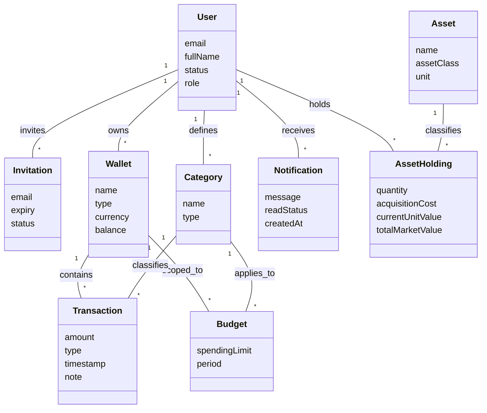

# 📋 Software Requirements Specification (SRS)
## System: Personal & Family Finance Management (PFM)
**Document Version:** 2.3.0  
**Status:** Approved for Development  
**Revision History:** see [§8](#8-revision-history)  

---

## Table of Contents
1. [Introduction](#1-introduction--personal-finance-management)
   - 1.1 [Purpose](#11-purpose)
   - 1.2 [Scope](#12-scope)
   - 1.3 [Assumptions and Constraints](#13-assumptions-and-constraints)
   - 1.4 [Definitions and Acronyms](#14-definitions-and-acronyms)
   - 1.5 [Conceptual Domain Model](#15-conceptual-domain-model)
2. [Functional Requirements (FR)](#2-functional-requirements-fr)
3. [Non-Functional Requirements (NFR)](#3-non-functional-requirements-nfr)
4. [User Experience Requirements (UXR)](#4-user-experience-requirements-uxr)
5. [Business Flows (BF)](#5-business-flows-bf)
6. [Features and User Story Specification](#6-features-and-user-stories-us)
   - [Feature-01: User Management & Onboarding](#feature-01-user-management--onboarding)
   - [Feature-02: System Security](#feature-02-system-security)
   - [Feature-03: Wallet Management](#feature-03-wallet-management)
   - [Feature-04: Category Management](#feature-04-category-management)
   - [Feature-05: Budget Management](#feature-05-budget-management)
   - [Feature-06: Transaction Management](#feature-06-transaction-management)
   - [Feature-07: Financial Reporting](#feature-07-financial-reporting)
   - [Feature-08: Notification Handling](#feature-08-notification-handling)
   - [Feature-09: Data Overview Dashboard](#feature-09-data-overview-dashboard)
   - [Feature-10: AI Financial Assistant (Phase 2 Placeholder)](#feature-10-ai-financial-assistant-chatbot-phase-2-placeholder)
   - [Feature-11: Asset & Investment Holdings Tracking](#feature-11-asset--investment-holdings-tracking)
7. [Feature-Level Release Roadmap](#7-feature-level-release-roadmap)
8. [Revision History](#8-revision-history)

---

## 1. Introduction – Personal Finance Management

### 1.1 Purpose
This document defines the Software Requirements Specification (SRS) for the Personal & Family Finance Management (PFM) application. The purpose of this SRS is to:
* Define the functional, non-functional, user experience, and business flow requirements for the product.
* Serve as an authoritative requirements baseline for development, testing, and stakeholder alignment.
* Establish a clear MVP scope focusing on invitation-based user onboarding, low-friction expense logging, and overspending prevention, while reserving clear paths for future extensions (AI Assistant & Asset Holdings).

### 1.2 Scope
PFM is a web and mobile software system designed to help individual users and families record, track, and optimize their daily finances.
The PFM system supports users in:
1. **Secure Onboarding:** Inviting users via email token validation to ensure real account creation.
2. **Account Organization:** Managing wallets representing cash, bank accounts, and credit lines.
3. **Transaction Logging:** Quickly recording income and expense events.
4. **Budget Controls:** Setting monthly category caps with visual thresholds to prevent overspending.
5. **Asset & Holdings Tracking:** Tracking personal holdings across various asset classes (e.g., gold, stocks, real estate, commodities, foreign currencies) to calculate comprehensive net worth.
6. **Reporting & Insights:** Reviewing financial summaries, category trends, and asset allocation.

### 1.3 Assumptions and Constraints

#### Assumptions
* Users manually log transactions, asset purchases, or receive invitations from account administrators/family owners.
* Financial entries use standard decimal precision.
* Initial deployment utilizes a secure monolithic web application with API integration capabilities.

#### Constraints
* **Verified Accounts Only:** Open self-registration without email verification is disabled to prevent non-existent emails in the database.
* **MVP Focus:** Direct open-banking live feeds and automated stock exchange ticker feeds are deferred to future releases; asset values can be manually updated or batch-refreshed.

### 1.4 Definitions and Acronyms
* **PFM:** Personal Finance Management
* **MVP:** Minimum Viable Product
* **TTL:** Time-To-Live (expiration duration for invitation tokens)
* **FR:** Functional Requirement
* **NFR:** Non-Functional Requirement
* **UXR:** User Experience Requirement
* **BF:** Business Flow
* **US:** User Story

### 1.5 Conceptual Domain Model

This is the **business-language** view of the entities every requirement below refers to — what each
thing is and how it relates to the others, with no database column, data type, or API shape attached
to it. That technical realisation is `SDS.md` §2 (Technical Domain Model), which this section
deliberately does not duplicate: read §1.5 for *what the business means* by "a Wallet" or "a Budget,"
and `SDS.md` §2.1–§2.4 for how each is stored, keyed, and state-machined.

Every entity here is one the SRS already requires through an FR or a Feature story — nothing is
introduced that the requirements below don't already need. The first seven entities match `SDS.md`
§2.1's domain-layer traceability table exactly, so the two documents describe one model, not two.
`Asset` and `AssetHolding` are not yet in `SDS.md`'s registry — carried into that document's own model
the next time it is aligned, the same treatment already given the `User receives Notification`
relationship noted below.

The domain consists of nine key entities:
* **User** — The person the system knows: an account holder, invited by another User with the ADMIN role, who owns Wallets, Categories, Asset Holdings, sets Budgets, logs Transactions, and receives Notifications (FR-01, FR-02).
* **Invitation** — A single email invitation attempt, distinct from the User it may create — its own history survives independently of whether the invited person ever activates (FR-01; SRS §6 US-01-01/US-01-02).
* **Wallet** — A named store of liquid money a User holds — cash, a bank account, a credit line — that Transactions move money into or out of (FR-03).
* **Category** — A label a User defines to classify money movement as one kind of income or expense, e.g. "Groceries" or "Salary" (FR-04).
* **Budget** — A spending limit a User sets for one Category within one Wallet, over a monthly period, that Transactions are measured against (FR-05).
* **Transaction** — A single recorded movement of money, in or out, against one Wallet and one Category, at a point in time (FR-06).
* **Notification** — A message the system raises for a User about something that happened — a budget exceeded, an invitation sent, a wallet running low — that the User can read and mark read (FR-08).
* **Asset** — A classification or reference type for non-liquid or investment holdings (e.g. Gold, Stocks, Real Estate, Commodities, Crypto, Foreign Currencies).
* **AssetHolding** — A specific quantity of an Asset held by a User in an account or portfolio, tracking quantity, total acquisition cost, current estimated unit value, and calculated current market value (FR-10).

**Relationships:**



| Relationship | Cardinality | Meaning |
| :-- | :-- | :-- |
| User invites Invitation | one User → many Invitations | A User with the ADMIN role can send any number of invitations over time (FR-01) |
| User owns Wallet | one User → many Wallets | A User may hold several Wallets — cash, bank, credit (FR-03) |
| User defines Category | one User → many Categories | Categories belong to the User who created them, not to a shared list (FR-04) |
| User receives Notification | one User → many Notifications | Every Notification is raised for exactly one User (FR-08) |
| User holds AssetHolding | one User → many AssetHoldings | A User tracks their personal holdings across golds, stocks, real estate, etc. (FR-10) |
| Wallet contains Transaction | one Wallet → many Transactions | Every Transaction moves money into or out of exactly one Wallet (FR-06) |
| Wallet scoped_to Budget | one Wallet → many Budgets | A spending limit is set against one Wallet at a time (FR-05) |
| Category classifies Transaction | one Category → many Transactions | Every Transaction is tagged with exactly one Category (FR-06) |
| Category applies_to Budget | one Category → many Budgets | A Budget's limit applies to spending in one Category (FR-05) |
| Asset classifies AssetHolding | one Asset → many AssetHoldings | An Asset type (e.g. SJC Gold, AAPL Stock) categorizes an AssetHolding (FR-10) |

**One relationship completes a gap in `SDS.md`.** `SDS.md` §2.1 and §2.2 both list **Notification** as
a full domain entity — with its own table, model, and DTO — but its §2.3 class diagram never draws a
relationship for it, and neither does the §4.3.3 ERD. "User receives Notification" above is derived
from the User-scoped `NM-US-01`/`NM-US-02`/`NM-US-03` stories (`SDS.md` §5.8: *list* notifications,
*view a* notification, *mark* one read — each phrased for the signed-in User's own notifications), not
invented independently of them. Carried into `SDS.md`'s own class diagram and ERD the next time that
document is aligned, so the two stop disagreeing about whether the relationship exists.

**Out of scope for this model:** Feature 10 (`SRS.md` §6, the Phase 2 AI Assistant placeholder)
introduces its own entities — a chatbot query object — that belong to a future baseline, not this
one. `SDS.md` names it nowhere either. It is not modelled here for the same reason `SDS.md` §11 keeps
it as a prose bullet rather than a domain object: nothing in the current MVP requires it to exist yet.
Feature-11 (Asset & Investment Holdings Tracking) is in scope for this model — its
`Asset`/`AssetHolding` entities are modelled above.

**Lifecycle, not shape.** How a User or an Invitation *changes state* over time — `PENDING` →
`ACTIVE` → `DEACTIVATED`, or an Invitation's own `PENDING` → `ACCEPTED` / `EXPIRED` / `SUPERSEDED` —
is already fully specified in `SDS.md` §2.4's state diagrams and is not repeated here; this section
answers *what exists and how the pieces connect*, not *what state each piece can be in*.

---

## 2. Functional Requirements (FR)

* **FR-01: User Onboarding & Management**  
  The System shall allow authorized users to invite new users via email. The System shall generate a secure token with a TTL (Time-To-Live) and dispatch an activation email via Gmail SMTP. Non-activated (`PENDING`) accounts shall not be permitted to log in until activated.

  An account holds exactly one of three statuses: **`PENDING`** (invited, no credentials set, cannot log in), **`ACTIVE`** (activated and usable), and **`DEACTIVATED`** (access withdrawn by an administrator). An invitation may not be used to move an account out of `DEACTIVATED` — restoring withdrawn access is an administrative act, not an onboarding one. Token expiry never changes an account's status: an expired invitation leaves its account `PENDING` and re-invitable.

* **FR-02: Security & Access Control**  
  The System shall authenticate users via secure credentials (email/password), enforce JWT-based sessions, and restrict data access so users can only view data they own or are granted access to.

* **FR-03: Wallet Management**  
  The System shall allow Users to create and manage multiple Wallets (e.g., Cash, Checking, Credit Card). Each wallet tracks name, type, currency, and current real-time balance.

* **FR-04: Category Management**  
  The System shall support user-defined Categories classified as either `INCOME` or `EXPENSE` (e.g., Groceries, Rent, Salary, Utilities).

* **FR-05: Budget Tracking & Overspending Alerts**  
  The System shall allow Users to define spending caps (`Budget`) per Category and Wallet for a monthly timeframe. The System shall track spending against this limit and trigger visual warnings when thresholds (75%, 100%) are reached.

* **FR-06: Transaction Management**  
  The System shall allow Users to log income and expense Transactions against a designated Wallet and Category. The System shall automatically recalculate and persist wallet balances atomically.

* **FR-07: Financial Reporting**  
  The System shall aggregate income and expense transactions to generate monthly summaries, net savings trends (`Income - Expenses`), and top category spending rankings.

* **FR-08: Notifications & Alerts**  
  The System shall generate notifications when budgets are exceeded, invitations are sent, or low wallet balances occur.

* **FR-09: Data Overview Dashboard**  
  The System shall display an executive summary widget showing total net worth (liquid wallet balances + asset holding valuations), recent transactions, active budget progress bars, and alerts.

* **FR-10: Asset & Investment Holdings Tracking**  
  The System shall allow Users to record and manage personal holdings across physical and financial asset classes (e.g., Gold, Stocks, Real Estate, Commodities, Foreign Currencies). Each holding tracks asset type, quantity held, unit of measurement, total acquisition cost, and current estimated unit valuation to calculate overall market value.

---

## 3. Non-Functional Requirements (NFR)

* **NFR-01: Performance**  
  API responses for primary read/write operations (logging transactions, fetching wallet balances) shall complete in under **300ms** (p95).

* **NFR-02: Availability**  
  The System shall maintain **99.0%** availability during standard operation, excluding scheduled maintenance windows.

* **NFR-03: Scalability**  
  The system architecture shall maintain modular separation between Controller, Service, and Data layers to support future scaling to microservices or serverless functions.

* **NFR-04: Security & Token Enforcement**  
  All user passwords shall be stored using strong one-way hashing (`bcrypt` or `Argon2`). Invitation tokens must contain at least 128 bits of entropy and strictly expire after their configured TTL (e.g., 24 hours).

* **NFR-05: Data Integrity & Monetary Precision**  
  All monetary attributes and asset valuations must be stored using arbitrary-precision decimal representations (`DECIMAL(15,2)`). Balance updates must execute inside ACID-compliant database transaction blocks.

* **NFR-06: Privacy**  
  Personal financial and asset records shall be isolated using strict contextual user authorization (`user_id` context checks on all queries).

---

## 4. User Experience Requirements (UXR)

* **UXR-01: Low-Friction Entry (< 10 Seconds)**  
  Logging a new expense transaction or updating an asset holding valuation shall require no more than 3 user taps/clicks on mobile or web interfaces.

* **UXR-02: At-a-Glance Financial Clarity**  
  Dashboard widgets must use strong visual hierarchy and color tokens (🟢 Green = Healthy, 🟡 Yellow = Warning, 🔴 Red = Budget Exceeded) to convey financial health instantly without reading raw data tables.

* **UXR-03: Immediate Balance Feedback**  
  Submitting a transaction or updating an asset quantity/unit price must immediately reflect in updated net worth totals and progress bars without requiring a manual page refresh.

* **UXR-04: Clear Onboarding Guidance**  
  First-time invited users clicking an activation link must be guided through a simple 1-page setup form (Name & Password), then directed to the **login screen** to sign in with the credentials they have just set. Where the link is no longer usable, the System must say so *before* the person fills the form in, rather than after.

---

## 5. Business Flows (BF)

### BF-01: End-to-End User Journey (Invitation to Expense Logging & Asset Tracking)
```
[Admin Invites Email] ──► [System Sends Gmail + Token] ──► [User Clicks Link & Activates]
                                                                  │
                                                                  ▼
[Views Dashboard] ◄── [Tracks Asset Holdings] ◄── [Logs Expense Transaction] ◄── [Sets Monthly Budget Cap]
```
1. Admin inputs a family member's email address.
2. System generates an invitation token with a 24-hour TTL and dispatches a Gmail invitation link.
3. Invited User clicks the link, sets their full name and password, transitioning status from `PENDING` to `ACTIVE`.
4. User logs in, creates/configures a **Wallet** (e.g., "Main Checking") and a **Category** (e.g., "Dining Out").
5. User sets a **Budget** cap (e.g., $200/month for Dining Out).
6. User logs a daily expense ($25 at a restaurant).
7. User registers physical/financial **Asset Holdings** (e.g., 2 Taels of SJC Gold, 100 shares of AAPL Stock).
8. System updates net worth calculations combining liquid wallet balances and total asset market value.
9. User reviews the summary dashboard.

### BF-02: Supporting BF – User Invitation & Activation
1. Admin navigates to User Management and submits an email.
2. System checks the address against existing accounts. An `ACTIVE` or `DEACTIVATED` account blocks the invitation; a `PENDING` one does **not** — that address is re-invited (step 3a). Otherwise the System creates a user with `status = PENDING`.
3. System sends an activation email containing a token with a TTL.
   * **3a. Re-invitation.** Where the address was already `PENDING`, no second account is created: the outstanding invitation is superseded, a new token with a fresh TTL is issued, and the previously sent link stops working immediately.
4. User accesses the activation endpoint with the token. The System can also be asked whether a token is still usable, without consuming it, so the User is told about an expired link before being asked for a password (UXR-04).
5. System verifies that the token matches an outstanding invitation belonging to a `PENDING` user, and that `NOW() < token_expires_at`.
6. User submits their full name and password; the password is hashed, the name is stored, status transitions to `ACTIVE`, and the token is invalidated — all in one transaction, so a usable token never survives a successful activation.
7. User is directed to the login screen. Activation itself grants no session (US-02-01 owns authentication).

### BF-03: Supporting BF – Asset Holding Management
1. User selects an Asset Class (e.g., Gold, Stock, Real Estate, Foreign Currency).
2. User enters holding details: quantity held, unit of measure, unit acquisition cost, and current estimated market value per unit.
3. System calculates total holding valuation (`quantity * current_unit_value`) and incorporates it into the user's Net Worth profile.
4. User updates unit prices periodically to reflect market changes.

### BF-04: Supporting BF – Wallet & Budget Setup
1. User creates one or more wallets with initial balances.
2. User defines spending categories.
3. User attaches monthly budget limits to category/wallet combinations.

### BF-05: Supporting BF – Transaction & Overspending Alert
1. User inputs a new expense transaction.
2. System updates wallet balance atomically.
3. System checks budget limit for the category.
4. If spent amount exceeds 75% or 100% of budget limit, system creates an alert notification.

---

## 6. Features and User Stories (US)

---

### Feature-01: User Management & Onboarding

#### US-01-01: Invite a User via Email [MVP]
* **As an** Admin / Account Owner  
* **I want to** invite a user by entering their email address  
* **So that** only real, verified people receive an invitation link to create an account.

```gherkin
Feature: Invite a User

  Background:
    Given an authenticated Admin is on the "User Management" screen

  Scenario: Successfully send an email invitation
    When the Admin enters email "family.member@gmail.com"
    And the Admin clicks "Send Invitation"
    Then the System creates a User record with status "PENDING"
    And the System generates a token with a 24-hour TTL
    And the System dispatches an activation email via Gmail SMTP
    And the System displays message "Invitation sent successfully"

  Scenario: Reject invitation for duplicate active email
    Given an existing ACTIVE User with email "family.member@gmail.com"
    When the Admin enters email "family.member@gmail.com"
    And the Admin clicks "Send Invitation"
    Then the System does not create a new User
    And the System displays error "An account with this email already exists"

  Scenario: Reject invitation for invalid email format
    When the Admin enters email "invalid-email-format"
    And the Admin clicks "Send Invitation"
    Then the System displays validation error "Please enter a valid email address"
```

#### US-01-02: Activate User Account [MVP]
* **As an** Invited User  
* **I want to** click the activation link from my email and set my password  
* **So that** I can activate my account and log in safely.

```gherkin
Feature: Activate User Account

  Scenario: Successfully activate account within TTL
    Given an invited User has an outstanding invitation token with status "PENDING"
    And the token expiration time is in the future
    When the User accesses the activation link with that token
    And the User enters full name "Jane Doe"
    And the User enters password "SecurePassword123!"
    And the User clicks "Activate Account"
    Then the System hashes the password using a secure algorithm
    And the System updates User status to "ACTIVE"
    And the System invalidates that token
    And the System redirects the User to the Login screen with message "Account activated successfully"

  Scenario: Reject activation when token is expired
    Given an invited User has an invitation token
    And the token expiration time has passed
    When the User accesses the activation link with that token
    Then the System displays error "Invitation link has expired. Please request a new invitation."
    And the account status remains "PENDING"
```

#### US-01-03: View List of Users [MVP]
* **As an** Admin  
* **I want to** view a list of all invited and active users  
* **So that** I can track who has completed onboarding.

```gherkin
Feature: List Users

  Scenario: Display user onboarding statuses
    Given an authenticated Admin is on the "User Management" screen
    When the Admin views the user table
    Then the System presents a list containing user email, full name, status ("PENDING" or "ACTIVE"), and creation date
```

---

### Feature-02: System Security

#### US-02-01: Login [MVP]
* **As an** Activated User  
* **I want to** log in with my email and password  
* **So that** I can access my private financial dashboard.

```gherkin
Feature: User Login

  Scenario: Login successfully with active account
    Given an ACTIVE user exists with email "jane@gmail.com" and password "SecurePassword123!"
    When the User enters email "jane@gmail.com"
    And the User enters password "SecurePassword123!"
    And the User clicks "Login"
    Then the System authenticates the user
    And the System issues a signed JWT token
    And the User is redirected to the Dashboard

  Scenario: Reject login for PENDING (unactivated) user
    Given a PENDING user exists with email "pending@gmail.com"
    When the User enters email "pending@gmail.com" and correct password
    And the User clicks "Login"
    Then the System denies access
    And the System displays error "Your account is not activated. Please check your email invitation."
```

#### US-02-02: Logout [MVP]
* **As an** Authenticated User  
* **I want to** log out of the system  
* **So that** my session is terminated securely.

---

### Feature-03: Wallet Management

#### US-03-01: Create a Wallet [MVP]
* **As an** Authenticated User  
* **I want to** create a new wallet with an initial balance  
* **So that** I can track spending across cash, bank, or card accounts.

```gherkin
Feature: Create Wallet

  Scenario: Create a wallet successfully
    Given the User is logged in
    When the User enters wallet name "Main Checking"
    And the User selects wallet type "BANK"
    And the User enters currency "USD"
    And the User enters initial balance 1000.00
    And the User clicks "Save Wallet"
    Then the System creates a new wallet for the user
    And the wallet balance is set to 1000.00
```

#### US-03-02: View List of Wallets [MVP]
#### US-03-03: Update a Wallet

---

### Feature-04: Category Management

#### US-04-01: Create a Category [MVP]
* **As an** Authenticated User  
* **I want to** create custom categories for income and expenses  
* **So that** I can organize my financial transactions.

```gherkin
Feature: Create Category

  Scenario: Create an expense category
    Given the User is logged in
    When the User enters category name "Groceries"
    And the User selects category type "EXPENSE"
    And the User clicks "Save Category"
    Then the System saves the category under the user's account
```

---

### Feature-05: Budget Management

#### US-05-01: Create a Budget for a Wallet [MVP]
* **As an** Authenticated User  
* **I want to** set a monthly spending cap on a category  
* **So that** I am alerted before overspending.

```gherkin
Feature: Create Budget

  Scenario: Set a monthly category budget cap
    Given the User is logged in
    And the User has an existing category "Dining Out"
    When the User sets a monthly limit of 200.00 for "Dining Out"
    And the User clicks "Save Budget"
    Then the System creates an active budget monitoring spending against 200.00
```

---

### Feature-06: Transaction Management

#### US-06-01: Create a Transaction for a Wallet [MVP]
```gherkin
Feature: Create Transaction

  Background:
    Given the User is logged in
    And the User has a wallet named "Main Checking" with balance 1000.00

  Scenario: Create an expense transaction successfully
    When the User selects transaction type "EXPENSE"
    And the User enters amount 50.00
    And the User selects category "Groceries"
    And the User selects wallet "Main Checking"
    And the User clicks "Save Transaction"
    Then the System records the transaction
    And the balance for "Main Checking" decreases to 950.00
    And the System shows message "Transaction created successfully"

  Scenario: Reject expense exceeding available balance (MVP Rule)
    When the User selects transaction type "EXPENSE"
    And the User enters amount 1500.00
    And the User selects wallet "Main Checking"
    And the User clicks "Save Transaction"
    Then the System rejects the transaction
    And the balance for "Main Checking" remains 1000.00
    And the System shows error "Insufficient balance"
```

#### US-06-02: View List of Transactions [MVP]
#### US-06-03: Update/Delete a Transaction

---

### Feature-07: Financial Reporting

#### US-07-01: View Summary Report [MVP]
* **As an** Authenticated User  
* **I want to** view a monthly income vs. expense summary report  
* **So that** I can understand my savings rate and top spending categories.

---

### Feature-08: Notification Handling

#### US-08-01: View List of Notifications [MVP]
* **As an** Authenticated User  
* **I want to** see alerts when my budgets reach warning limits  
* **So that** I can stop spending in overbudget categories.

---

### Feature-09: Data Overview Dashboard [MVP]
* **As an** Authenticated User  
* **I want to** view an executive dashboard displaying total balances, budget status bars, and recent activity  
* **So that** I can assess my financial health at a glance.

---

### Feature-10: AI Financial Assistant / Chatbot `[Phase 2 Placeholder]`
* **US-10-01: Query Monthly Insights via Natural Language:** User asks the chatbot questions like "How much did we spend on dining out last month?" and receives an instant breakdown.
* **US-10-02: Automated Overspending Recommendations:** Chatbot provides suggestions based on historical spending profiles.

---

### Feature-11: Asset & Investment Holdings Tracking

#### US-11-01: Track Physical and Financial Assets (Golds, Stocks, Real Estate, Commodities)
* **As an** Authenticated User  
* **I want to** record and update my asset holdings across various asset classes (e.g. Gold taels, Stock shares, Real Estate properties)  
* **So that** I have a clear record of non-liquid wealth and personal asset inventory alongside my cash wallets.

```gherkin
Feature: Track Asset Holdings

  Scenario: Create a new Gold asset holding
    Given the User is logged in
    When the User enters asset name "SJC Gold 9999"
    And the User selects asset class "GOLD"
    And the User enters quantity 2.5
    And the User enters unit of measurement "Tael"
    And the User enters purchase unit cost 80000000.00
    And the User enters current unit value 85000000.00
    And the User clicks "Save Asset Holding"
    Then the System records the asset holding with total valuation 212500000.00

  Scenario: Record Stock holdings
    Given the User is logged in
    When the User enters asset name "AAPL"
    And the User selects asset class "STOCK"
    And the User enters quantity 100
    And the User enters current unit value 220.00
    And the User clicks "Save Asset Holding"
    Then the System calculates the holding value as 22000.00
```

#### US-11-02: Track Asset Valuation & Net Worth Contribution
* **As an** Authenticated User  
* **I want to** view my total asset holding valuations and their breakdown by asset class  
* **So that** I can monitor my complete personal net worth distribution across liquid and illiquid wealth.

```gherkin
Feature: Asset Valuation & Net Worth Summary

  Scenario: View Net Worth breakdown
    Given the User has wallets with total liquid balance 50000.00
    And the User has gold holdings valued at 200000.00
    And the User has stock holdings valued at 100000.00
    When the User views the Net Worth Summary on the Dashboard or Asset screen
    Then the System displays total Net Worth as 350000.00
    And the System shows asset allocation proportions (Liquid 14.3%, Gold 57.1%, Stocks 28.6%)
```

#### US-11-03: Goal Milestones `[Phase 3 Placeholder]`
* Set long-term target amounts (e.g., Emergency Fund) and track percentage progress over time.

---

## 7. Feature-Level Release Roadmap

| No. | Feature Area | MVP (Phase 1) | Phase 2 (AI Assistant) | Phase 3 (Advanced) |
| :-: | :--- | :-: | :-: | :-: |
| 1 | **User Onboarding (Invite/Activate/List)** | ✔ | - | - |
| 2 | **System Security & Auth** | ✔ | - | - |
| 3 | **Wallet Management** | ✔ | Insights | - |
| 4 | **Category Management** | ✔ | Auto-categorization | - |
| 5 | **Budget Management & Alerts** | ✔ | Predictive caps | - |
| 6 | **Transaction Management** | ✔ | Voice/Chat entry | Bank Sync |
| 7 | **Financial Reporting** | ✔ | Natural language reports | - |
| 8 | **Notification Handling** | ✔ | Smart push alerts | - |
| 9 | **Overview Dashboard** | ✔ | AI Widget | - |
| 10 | **AI Financial Assistant (Chatbot)** | - | ✔ | - |
| 11 | **Asset & Investment Holdings (Gold, Stocks, Real Estate)** | - | Portfolio Insights | Automated Market Ticker Sync |
| 12 | **Financial Goals & Savings Milestones** | - | - | ✔ |

---

## 8. Revision History

| Version | Change |
| :--- | :--- |
| 2.0.0 | Approved baseline. |
| 2.1.0 | Alignment pass — corrected UXR-04 redirect target, US-01-02 token format description, BF-02 steps, and FR-01 status vocabulary. |
| 2.2.0 | Added §1.5 Conceptual Domain Model defining User, Invitation, Wallet, Category, Budget, Transaction, Notification. |
| **2.3.0** | **Refined Feature-11 into Asset & Investment Holdings Tracking**, promoted from a Phase-3 placeholder to a specified feature. Added `Asset` and `AssetHolding` entities to the Conceptual Domain Model (§1.5), added `FR-10`, updated `FR-09`'s net worth calculation, added business flow `BF-03`, and specified `US-11-01`/`US-11-02` with Gherkin. `US-11-03` (Goal Milestones) carries over unchanged as a Phase-3 placeholder, renumbered from the prior `US-11-02`. Roadmap (§7) row 11 updated and split into rows 11–12 to keep both threads visible. |