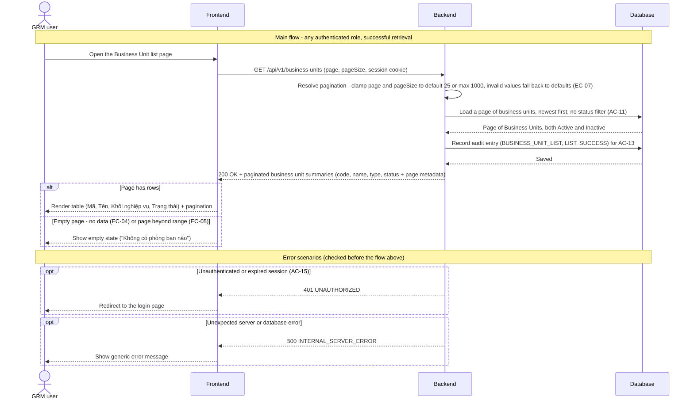

## BU-US-02: List Business Units

> **Jira Story:** [GBX03-14](https://globee-software-ecommerce.atlassian.net/browse/GBX03-14)

### Gaps & Decisions (Resolved)

Code/architecture decisions settled during design; spec-level findings were folded into the spec.

| ID | Area | Decision | Status |
|----|------|----------|--------|
| A1 | Code | List audit uses event `BUSINESS_UNIT_LIST` (actionType `LIST`), kept distinct from the single-record View (BU-US-04). | ✅ Resolved |
| R1 | Architecture | The business-units route is relocated under `/app/business-units` (constitution §V) — BU-US-01's page + `_components` move with it and `middleware.ts` is trimmed (Open tasks T-R1/T-R2). | ✅ Resolved |

---

### Architecture

**Package layout** (additions/relocations only — existing BU-US-01 classes reused)

```text
backend/src/main/java/com/globee/grm/
├── constant/
│   └── AuditEventType.java                      # update: add BUSINESS_UNIT_LIST
├── controller/
│   └── BusinessUnitController.java              # add GET /api/v1/business-units (list)
├── service/
│   └── BusinessUnitService.java                 # add list(page, pageSize): clamp, query, map, audit
├── repository/
│   └── BusinessUnitRepository.java              # reuse inherited findAll(Pageable) — no change
└── dto/
    ├── PageResponse.java                         # NEW generic { content, page, pageSize, totalElements, totalPages }
    └── BusinessUnitSummaryResponse.java          # NEW { code, name, type, status }

backend/src/main/resources/db/migration/
└── V5__index_business_units_created_at.sql       # NEW index on created_at (backs default sort; PF-01)

frontend/
├── app/app/business-units/                       # RELOCATED from app/business-units/ → URL /app/business-units
│   ├── page.tsx
│   └── _components/BusinessUnitsPageClient.tsx    # real paginated table (replaces SHELL_ROWS)
├── middleware.ts                                  # drop standalone /business-units prefix (covered by /app)
├── types/businessUnit.ts                          # add BusinessUnitSummary + PageResponse<T>
└── lib/
    └── businessUnitApi.ts                         # add listBusinessUnits(page, pageSize)
```

**Domain objects**

| Entity | Table | Key Fields | Notes |
|--------|-------|------------|-------|
| `BusinessUnit` | `business_units` | `code`, `name`, `unit_type`, `status`, `created_at` | Read-only for this US. Listed regardless of `status` (AC-11 / BR-07). Sorted by `created_at DESC`. Projected to a narrow summary DTO (PF-02) — no entity graph serialized. |
| `BusinessUnitStatus` | — | `ACTIVE`, `INACTIVE` | Enum; serialized as display label `"Active"`/`"Inactive"` (NC-05), rendered `"Hoạt động"`/`"Không hoạt động"` in the UI. |
| `ActivityLog` | `activity_logs` | `event_type`, `action_type`, `result_status` | One `BUSINESS_UNIT_LIST` / `LIST` / `SUCCESS` row per successful retrieval, incl. each page (AC-13, FR-18). Written via `AuditService`. |

**Business rules enforced in service layer**

| Rule | Source | Enforcement |
|------|--------|-------------|
| Any authenticated role may list; no role restriction | AC-14, FR-14 | No `@PreAuthorize`; authentication already enforced by `anyRequest().authenticated()` in `SecurityConfig` |
| Unauthenticated request denied | AC-15, FR-19 | Spring Security → `401 UNAUTHORIZED` (custom entry point) |
| Both Active and Inactive returned; no status filter | AC-11, BR-07 | `findAll(Pageable)` — no status predicate |
| Only Code, Name, Type, Status exposed | AC-10, FR-15 | `BusinessUnitSummaryResponse` projection (PF-02) |
| Paginated results with total-count metadata | AC-12, FR-17 | `Pageable` + `PageResponse` (API-06) |
| Page size default 25 / max 1000; invalid page/size never rejected | A2, EC-07 | `list()` clamps `page<0→0`, `pageSize<1→25`, `pageSize>1000→1000`; unparseable → default (returns `200`, no `400`) |
| Empty set / page beyond range → empty page, not error | EC-04, EC-05 | Return empty `content` with `200` |
| View audit recorded on every success | AC-13, FR-18 | `AuditService.log(BUSINESS_UNIT_LIST, …, "LIST", true)` |

**Sequence diagram — List Business Units**



**Error flows**

| Scenario | HTTP | Error Code |
|----------|------|------------|
| Unauthenticated / expired session | 401 | `UNAUTHORIZED` |
| Unexpected server error | 500 | `INTERNAL_SERVER_ERROR` |

No `403` (no role restriction — AC-14) and no CSRF (safe `GET`).

**Constitution notes**

| Rule | Status | Note |
|------|--------|------|
| AR-01: Service owns business rules | Required | Clamp, query, projection, and audit orchestration in `BusinessUnitService.list()` |
| AR-02: Thin controller | Required | Controller binds `page`/`pageSize`, delegates, wraps in `ApiResponse` |
| AR-03: Repository isolation | Required | Inherited `findAll(Pageable)` only — no business logic |
| AR-05: Transactional atomicity | N/A | Read-only; `list()` not `@Transactional`. `AuditService.log()` runs in its own tx |
| AC-02: Backend authorization | Required (exempt) | Endpoint is all-roles (AC-14): authenticated-only, **no** `@PreAuthorize`. Documented exemption to the usual role-check rule |
| API-02: Response envelope | Required | `ApiResponse<PageResponse<BusinessUnitSummaryResponse>>` |
| API-06 / PF-05: Pagination | Required | `page`/`pageSize`, default 25, max 1000, total-count metadata |
| PF-01: Indexed queries | Required | New index on `created_at` (default sort column) — migration V5 |
| PF-02: Narrow projection | Required | 4-field summary DTO; no entity graph |
| LA-02: Read audit | Required (spec-stricter) | LA-02 makes read audit optional when all roles can access, but AC-13/FR-18 mandate it — implemented on every retrieval |
| LA-05: Audit line format | Required | Audit event `BUSINESS_UNIT_LIST` (actionType `LIST`, result `SUCCESS`), consistent with the existing `BUSINESS_UNIT_CREATE` enum value |
| NC-04: Element IDs | Required | See table below |
| NC-05: Enum serialization | Required | Status as `"Active"`/`"Inactive"`; UI renders Vietnamese |
| §V: Route under `/app/*` | Required | Route relocated to `/app/business-units` (R1) |

**Element IDs**

| Element | ID | Status | File |
|---------|----|--------|------|
| Table container | `table-business-units` | **Missing** | `app/app/business-units/_components/BusinessUnitsPageClient.tsx` |
| Row edit button (disabled) | `btn-edit-business-unit-{code}` | **Missing** | same |
| Pagination — previous | `btn-page-prev` | **Missing** | same |
| Pagination — next | `btn-page-next` | **Missing** | same |
| Pagination — page number | `btn-page-{n}` | **Missing** | same |
| Empty-state message | `message-empty` | **Missing** | same |
| Mobile table | `m-table-business-units` | **Missing** | same |

**Open tasks**

| ID | Task | File |
|----|------|------|
| T16 | Generic `PageResponse<T>` envelope (content + page/pageSize/totalElements/totalPages) | `backend/.../dto/PageResponse.java` |
| T17 | `BusinessUnitSummaryResponse` record `{ code, name, type, status }` | `backend/.../dto/BusinessUnitSummaryResponse.java` |
| T18 | Add `BUSINESS_UNIT_LIST` to `AuditEventType` | `backend/.../constant/AuditEventType.java` |
| T19 | Index on `created_at` (backs default sort) | `backend/.../db/migration/V5__index_business_units_created_at.sql` |
| T20 | `BusinessUnitService.list(page, pageSize)`: clamp params, `Pageable` sort `createdAt DESC`, map to summary DTO, write `BUSINESS_UNIT_LIST` audit | `backend/.../service/BusinessUnitService.java` |
| T21 | `BusinessUnitController` `GET /api/v1/business-units` → `ApiResponse<PageResponse<…>>` | `backend/.../controller/BusinessUnitController.java` |
| T22 | Frontend types: `BusinessUnitSummary`, `PageResponse<T>` | `frontend/types/businessUnit.ts` |
| T23 | `listBusinessUnits(page, pageSize)` API client | `frontend/lib/businessUnitApi.ts` |
| T24 | Replace `SHELL_ROWS` with real paginated table: data fetch, loading, empty state (EC-04), Vietnamese status badge, ADMIN-only add button, ADMIN-only **disabled** edit button; remove non-admin access-denied banner (AC-14); filter/import/export stay disabled shell | `frontend/app/app/business-units/_components/BusinessUnitsPageClient.tsx` |
| T-R1 | Relocate `app/business-units/` → `app/app/business-units/` (moves BU-US-01 page + `_components`); update internal links/redirects | `frontend/app/app/business-units/` |
| T-R2 | Trim `middleware.ts` (drop `/business-units` prefix + matcher entry; `/app` already covers it); update E2E route paths | `frontend/middleware.ts` |
| T25 | Backend integration tests (Testcontainers): AC-10 fields-only, AC-11 active+inactive, AC-12 pagination + metadata, AC-13 audit row, AC-14 each role `200`, AC-15 unauthenticated `401`, EC-04 empty, EC-05 page-beyond-range, EC-07 invalid page/size clamped | `backend/.../BusinessUnitListIntegrationTest.java` |
| T26 | Playwright E2E: list renders 4 columns, pagination navigates, empty state, non-ADMIN can view, edit button disabled | `specs/002-business-unit/test_002-business-unit.spec.ts` |
