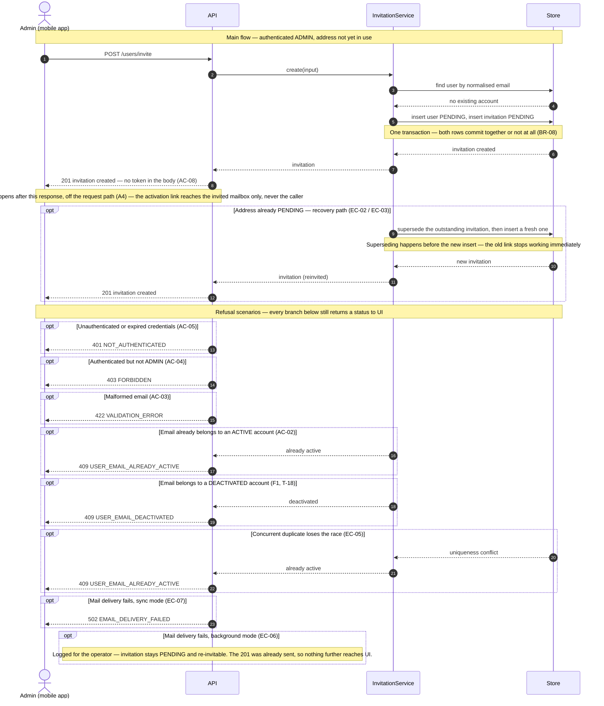
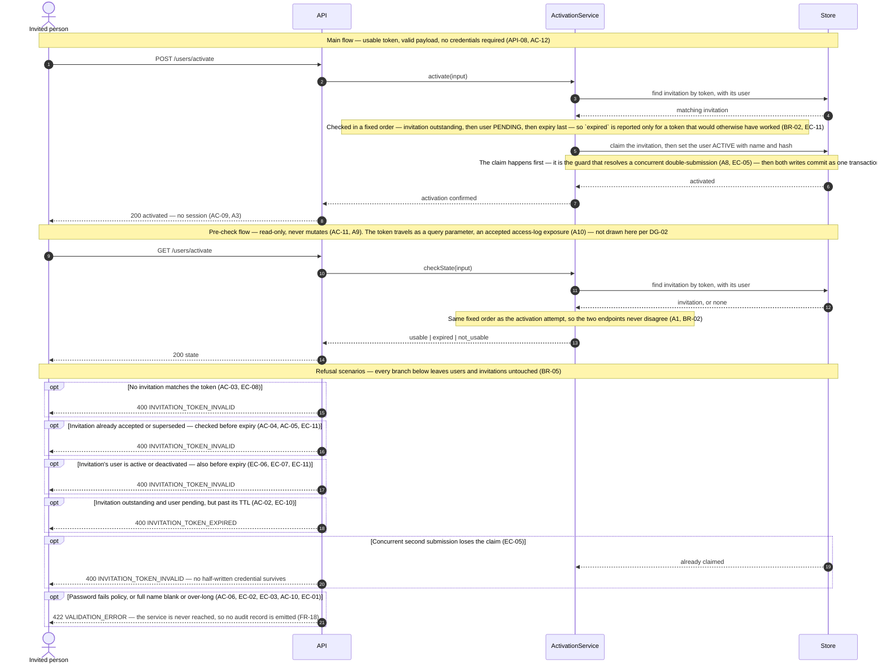

# Technical Plan: User Management & Onboarding (UM)

> **Feature:** SRS §6 Feature-01 · SDS §5.2 (UM)
> **Spec:** [spec.md](spec.md)
> **Stories in this file:** UM-US-01 *(implemented, verified — plus F1's `T-18`, added and verified during UM-US-02's implementation)* · UM-US-02 *(implemented, verified — `120 passed`, 98% coverage)* · UM-US-03 *(pending)*

---

## UM-US-01: Invite a User via Email

### Gaps & Decisions (Resolved)

Code and architecture decisions settled during design. Spec-level findings were folded back into `spec.md` before this step closed.

| ID | Area | Decision | Status |
|----|------|----------|--------|
| A1 | Architecture | Inviting writes **two** rows — a `users` row (`PENDING`) and an `invitations` row — inside one transaction (SDS §4.3.3 ERD, spec BR-08). Neither may exist without the other. | ✅ Resolved |
| A2 | Security | Only `sha256(token)` is persisted, in `invitations.token_hash`. The raw token exists solely in the email body. Began as a deviation from SDS §4.3.3's plain `token UK`; behaviour under every AC is identical, and **SDS §2.2/§2.3/§4.3.3 were aligned to `token_hash` at v1.2.0**, so it is no longer a deviation (constitution SEC-03). | ✅ Resolved |
| A3 | Code | Re-invite (EC-02/EC-03) marks the outstanding invitation `SUPERSEDED` and inserts a new one, rather than mutating the existing row. Preserves invitation history, which is the reason the entity exists. | ✅ Resolved |
| A4 | Architecture | Mail dispatch runs **off the request path** via `BackgroundTasks` so FR-19 / NFR-01's 300 ms p95 holds; Gmail SMTP costs 1–3 s. An `EMAIL_SEND_MODE=sync` setting forces inline delivery so a misconfiguration surfaces as `502` (spec FR-20, EC-07) — intended for first-time Gmail wiring, not production. | ✅ Resolved |
| A5 | Code | Expiry is computed as `clock.utcnow() + INVITATION_TTL_HOURS`, and `EXPIRED` is **derived** on read by comparing `expires_at`. No status sweeper exists (SDS §2.4.2, spec BR-04). All time reads go through the clock seam (`CLAUDE.md` §4 — never `datetime.now()`; SQLite returns naive datetimes, so `clock.ensure_aware()` runs before every comparison and every serialisation). | ✅ Resolved |
| A6 | Code | Endpoint is `POST /api/v1/users/invite` per SDS §6.3, **not** `/users/invitations`. The spike used the latter; SDS wins. | ✅ Resolved |
| A7 | Architecture | `users.email` carries the unique index and is stored normalised (trimmed, lower-cased). `invitations.email` is denormalised for audit history and is **not** unique. Uniqueness lives on the account, not the attempt (spec FR-03, BR-01, FR-18). | ✅ Resolved |
| A8 | Code | Role check is a dedicated `require_admin` dependency layered on `get_current_user`, so AC-05 (401) is evaluated strictly before AC-04 (403). Order matters: an unauthenticated caller must never receive a role error that reveals the endpoint exists. | ✅ Resolved |
| A9 | Code | Audit events (FR-17, AC-09) are emitted through a small `audit` helper writing structured log lines. **No** `activity_logs` table this round — SDS §7.1.10 and §10.6 specify structured logs, not a queryable store, and no story requires reading them back. Revisit if an audit-retrieval story appears. | ✅ Resolved |
| A10 | Security | The `create-admin` CLI closes the invite-only bootstrap cycle (spec Assumptions). It writes an `ACTIVE` `ADMIN` directly and is the only path to the first account. Not an HTTP surface, so it does not widen constitution API-08. | ✅ Resolved |
| G1 | Dependency | AC-04/AC-05 require authentication, which is **SS-US-01 (epic 002)**. The `get_current_user` / `require_admin` dependencies are *designed* here and *delivered* by that story. UM-US-01 cannot reach its Deploy step before login exists. | ✅ Resolved (sequencing) |
| A11 | Dependency | **G1 narrowed at the Implement step.** JWT *verification* ships with UM-US-01 — `core/security.py` (`encode_jwt`/`decode_jwt`) and `core/deps.py` (`get_current_user`, `require_admin`, T-15). The login *endpoint* `POST /api/v1/auth/login` does **not**, and remains SS-US-01's to deliver. Rationale: AC-04 and AC-05 need only a caller's identity and role to be *established*, not *issued*, so blocking on an unspecified story would have left the whole feature unimplementable — `specs/002-system-security/` does not exist. AC-04/AC-05 are therefore fully satisfied and TC-11/TC-12/TC-13 are green rather than blocked. A dev-only `mint-token` CLI command stands in for login so Swagger and Postman have a credential; it is not an HTTP surface and does not widen constitution API-08's public-endpoint list. | ✅ Resolved |
| F1 | Finding | **`DEACTIVATED` is not covered by any AC or EC.** Spec BR-02 says "*Only* an `ACTIVE` account blocks a new invitation", which read literally makes a `DEACTIVATED` address re-invitable — silently resurrecting a disabled account. **Ruled (at UM-US-02's design step):** the block is confirmed — a `DEACTIVATED` address stays refused, exactly as the shipped code already refuses it — but the response should carry its own code, `409 USER_EMAIL_DEACTIVATED`, instead of the misleading `USER_EMAIL_ALREADY_ACTIVE`. Reactivation itself remains out of scope (SDS §5.2.5 UM-US-05). This is a precision fix to the error code, not a behaviour change or a spec edit — UM-US-01's `spec.md` AC/EC/FR/BR text is untouched. **Implemented and verified as T-18.** `UserEmailDeactivatedError` (409 `USER_EMAIL_DEACTIVATED`) exists in `core/errors.py`, and `invitation_service.create_invitation()` branches on `ACTIVE` vs `DEACTIVATED` distinctly. One real bug surfaced while wiring it in: a leftover blanket "not PENDING" check ran *before* the new branch and unconditionally raised `USER_EMAIL_ALREADY_ACTIVE`, so the new branch was dead code — removed. Proven by `test_cases.md` TC-27, PASS. | ✅ Resolved and implemented |
| F2 | Finding | **`schemas/user.py` (`UserRead`) was removed.** The package layout below lists it, but nothing in UM-US-01 references it — it is UM-US-03's list-users DTO. Carrying unused, untested code to satisfy a design sketch contradicts the principle `core/config.py` states for settings ("*exist before a requirement asks for them* = speculation") and dragged coverage below DOD-03's 80%. It returns with UM-US-03. | ✅ Resolved |
| A12 | Operational | **`promote-admin` CLI command.** `create-admin` refuses when a row already exists for the address (`cli.py:39`) — which is exactly the state a real invited mailbox ends up in (`PENDING`, invited one or more times). Without a way to promote an existing row, an operator's own real email address can never become the ADMIN once it has been invited even once, and `create-admin` cannot help — it only creates from nothing. `promote-admin --email --password [--full-name]` requires the row to exist, sets `status=ACTIVE`, `role=ADMIN`, and a fresh `password_hash`. Overwriting the credential is deliberate: the operator running this owns the account and is choosing a new one, not recovering a lost one. A stranded `PENDING` invitation for the address needs no cleanup — once the user is `ACTIVE`, that invitation's token is refused by `activation_service` as "not usable" (UM-US-02 EC-06), the same generic outcome any other stale token gets. Not an HTTP surface; does not widen constitution API-08. | ✅ Resolved |
| A13 | Architecture | **`EMAIL_TRANSPORT` setting (`auto`\|`smtp`\|`outbox`) and `FileOutboxSender`.** Real Gmail SMTP works in this environment (verified by direct SMTP AUTH probe), but reading an activation link still requires access to whichever mailbox was invited — awkward when inviting a test address, or when there is no convenient mailbox to check. `FileOutboxSender` (`services/email/outbox.py`) writes each message as an `.eml` file to `settings.outbox_dir` (default `backend/var/outbox/`, gitignored — these files carry live, unexpired tokens exactly like `.env`) instead of sending it. `"outbox"` selects it explicitly; `"smtp"` forces real SMTP even without credentials, so a misconfiguration surfaces immediately rather than silently degrading; `"auto"` (default) keeps the pre-existing behaviour unchanged — real SMTP when configured, `RecordingEmailSender` otherwise. This is the only `EmailSender` that *persists*: `get_email_sender` (`core/deps.py`) already builds a fresh `RecordingEmailSender` per request, so that double cannot double as an outbox across requests. Nothing about `InvitationRead` changes — the invite response still carries no token (AC-08 intact). | ✅ Resolved |
| A14 | API | **`GET /api/v1/dev/outbox` — a new public-surface decision, recorded explicitly.** Lets an ADMIN read what `FileOutboxSender` (A13) wrote, including each message's activation link, without a real mailbox. Requires `AdminDep` — it does **not** widen constitution API-08's public-endpoint list, since it is authenticated exactly like `/users` list. **Refuses to exist in production**: `settings.environment == "production"` returns a plain `404`, not merely relying on the route never being called — an endpoint that can be reached is a bigger surface than one that cannot, and this one exists solely to compensate for a local-dev inconvenience (no mailbox to check). Does not touch `InvitationRead` or any existing response shape. | ✅ Resolved |

---

### Architecture

**Package layout** (additions only; foundation modules already exist and are reused). Rooted at `backend/app/` rather than SDS §4.3.2's original `src/` (constitution AR-08 records the deviation), and the SDS was corrected to match in v1.1.0.

```text
backend/app/
├── core/
│   ├── config.py                     # update: add JWT, invitation TTL, SMTP, activation URL settings
│   ├── errors.py                     # update: add UserEmailAlreadyActiveError, EmailDeliveryError,
│   │                                 #         NotAuthenticatedError, ForbiddenError
│   ├── clock.py                      # reuse as-is — utcnow() / ensure_aware()
│   ├── security.py                   # NEW  token generation + sha256 hashing (JWT arrives with SS-US-01)
│   ├── audit.py                      # NEW  structured audit emitter (A9)
│   └── deps.py                       # NEW  get_db, get_settings, get_email_sender,
│                                     #      get_current_user, require_admin  (G1: filled by SS-US-01)
├── models/
│   ├── __init__.py                   # NEW  imports models so Alembic autogenerate sees them
│   ├── user.py                       # NEW  UserModel  + UserStatus, UserRole
│   └── invitation.py                 # NEW  InvitationModel + InvitationStatus
├── schemas/
│   ├── user.py                       # NEW  UserRead
│   └── invitation.py                 # NEW  InviteCreate, InvitationRead
├── repositories/
│   ├── user_repo.py                  # NEW  normalize_email, get_by_email, add_pending_user
│   └── invitation_repo.py            # NEW  add, get_active_for_email, supersede_outstanding
├── services/
│   ├── invitation_service.py         # NEW  create_invitation() + send_invitation_email()
│   └── email/
│       ├── sender.py                 # NEW  EmailSender Protocol + EmailMessage
│       ├── smtp.py                   # NEW  GmailSmtpSender
│       └── templates.py              # NEW  build_invitation_email()
├── api/v1/
│   ├── router.py                     # NEW  aggregates v1 routers
│   └── users.py                      # NEW  POST /users/invite
├── cli.py                            # NEW  create-admin  (A10)
└── main.py                           # update: mount api_router under /api/v1

backend/migrations/versions/
└── <rev>_create_users_and_invitations.py   # NEW  both tables in one revision (DOD-02)

backend/tests/
├── conftest.py                       # NEW  in-memory DB, RecordingEmailSender, frozen clock
└── integration/test_um_us_01_invite.py     # NEW  written at the Implement step from test_cases.md
```

**Domain objects**

| Entity | Table | Key Fields | Notes |
|--------|-------|------------|-------|
| `UserModel` | `users` | `id` PK, `email` **UK**, `password_hash`, `full_name`, `status`, `role`, `created_at` | Created here as `PENDING` with `password_hash`/`full_name` **NULL** (spec FR-05, AC-07). `email` normalised before insert (A7). `id` is `String(36)` UUID text so the same schema runs on SQLite and PostgreSQL (constitution ENV-03). |
| `UserStatus` | — | `PENDING`, `ACTIVE`, `DEACTIVATED` | SDS §2.4.1 as aligned. Serialised as the literal (NC-05). Only `PENDING` is written by this story. |
| `UserRole` | — | `ADMIN`, `USER` | Invited accounts get `USER` (spec FR-06). `ADMIN` only via the bootstrap CLI. |
| `InvitationModel` | `invitations` | `id` PK, `email` (indexed, **not** unique), `token_hash` **UK**, `expires_at`, `status`, `invited_by_id` FK→`users.id`, `created_at` | One row per invitation *attempt*, so history survives (A3). `token_hash` is `String(64)` sha256 hex (A2). |
| `InvitationStatus` | — | `PENDING`, `ACCEPTED`, `EXPIRED`, `SUPERSEDED` | SDS §2.4.2. This story writes `PENDING` and `SUPERSEDED` only; `ACCEPTED` belongs to UM-US-02. `EXPIRED` is **derived**, never written (A5). |

**Business rules enforced in service layer**

| Rule | Source | Enforcement |
|------|--------|-------------|
| An authenticated ADMIN may submit an email address to invite | AC-01, FR-01 | `POST /api/v1/users/invite` accepting `InviteCreate`, guarded by `require_admin` (A6, A8) |
| Email format validated before anything else | AC-03, FR-02 | `InviteCreate.email: EmailStr` → `422` from the Pydantic layer, before the service runs (VL-01) |
| Invitation persisted as a record distinct from the account | FR-10, BR-08 | `invitations` table with its own lifecycle; `invitation_repo.add()` (A1) |
| Activation email dispatched to the invited address | AC-01, FR-12 | `send_invitation_email()` → `GmailSmtpSender`; body built by `build_invitation_email()` with the link from `activation_url_template` |
| Success response carries id, email, status, expiry and a confirmation message | AC-01, FR-16 | `InvitationRead` projection, `status_code=201` (API-07, PF-03) |
| Email normalised before comparison or insert | EC-01, FR-03 | `user_repo.normalize_email()` — single definition of "the same address" |
| ACTIVE email rejected | AC-02, FR-04, BR-02 | `create_invitation()` loads by normalised email; `status is ACTIVE` → `UserEmailAlreadyActiveError` (409) |
| DEACTIVATED email rejected, with its own code (F1, T-18) | BR-02 (amended reading) | `status is DEACTIVATED` → `UserEmailDeactivatedError` (409 `USER_EMAIL_DEACTIVATED`) — same block as ACTIVE, distinct code so the two cases are never conflated |
| PENDING email re-invited, not duplicated | EC-02, EC-03, FR-11, BR-03 | Existing `PENDING` user row is reused; `invitation_repo.supersede_outstanding()` then a fresh insert (A3) |
| Token ≥128-bit, unique | AC-06, FR-08, SEC-02 | `secrets.token_urlsafe(32)` → 256 bits; `token_hash` UK backstops uniqueness |
| TTL exactly 24h | AC-06, FR-09 | `clock.utcnow() + timedelta(hours=settings.invitation_ttl_hours)`, default 24 (A5) |
| Account created without credentials, role USER | AC-07, FR-05, FR-06, BR-05, BR-06 | `add_pending_user()` sets `status=PENDING`, `role=USER`, leaves `password_hash`/`full_name` NULL. A `PENDING` row has no hash, so it cannot authenticate (BR-06); `USER` role cannot invite (BR-05) |
| Inviting ADMIN recorded | FR-07 | `invitations.invited_by_id = current_user.id` |
| Both rows atomic | BR-08, AR-06 | Service flushes only; the **router** commits once. One request, one transaction |
| Token never returned | AC-08, BR-07, FR-13, SEC-03 | `InvitationRead` has no token field; only `token_hash` is persisted; audit omits the token |
| ADMIN-only | AC-04, FR-14 | `require_admin` dependency → `403` |
| Unauthenticated rejected first | AC-05, FR-15, A8 | `get_current_user` runs before `require_admin` → `401` takes precedence over `403` |
| Response inside 300 ms | FR-19, NFR-01 | SMTP dispatched via `BackgroundTasks` after commit (A4) |
| Delivery failure surfaced or logged, never silent | EC-06, EC-07, FR-20, FR-21 | `sync` mode raises `EmailDeliveryError` → `502`; background mode logs the exception and leaves the invitation re-invitable |
| Audit on success | AC-09, FR-17, LA-02, LA-04 | `audit.record()` with actor id, timestamp, invited email, outcome — no token (A9) |
| Concurrent duplicates collapse | EC-05, FR-18, VL-05 | Service-level check plus the `users.email` unique index; the loser's `IntegrityError` maps to `409` |

**Sequence diagram — Invite a User via Email**

Drawn to `constitution.md` DG-01…DG-07: four lanes only, no SQL, no parameter lists, every request
into `API` answered back to `UI` with a status code. Ordering facts that matter (commit-before-send,
supersede-before-insert) are stated in a `Note`, not encoded as a query.



**Error flows**

| Scenario | HTTP | Error Code |
|----------|------|------------|
| Malformed or missing email | 422 | `VALIDATION_ERROR` |
| Email exceeds maximum supported length (EC-04) | 422 | `VALIDATION_ERROR` |
| Email belongs to an ACTIVE account (AC-02, EC-01, EC-05) | 409 | `USER_EMAIL_ALREADY_ACTIVE` |
| Email belongs to a DEACTIVATED account (F1, T-18) | 409 | `USER_EMAIL_DEACTIVATED` |
| No or invalid bearer credentials (AC-05) | 401 | `NOT_AUTHENTICATED` |
| Authenticated, role is not ADMIN (AC-04) | 403 | `FORBIDDEN` |
| Mail delivery fails in `sync` mode (EC-07) | 502 | `EMAIL_DELIVERY_FAILED` |
| Unexpected server error | 500 | `INTERNAL_ERROR` |

All in the flat envelope `{"error_code", "message", "details"}` (SDS §6.6, API-02). No CSRF concern — stateless bearer auth (SDS §7.1.9).

**Constitution notes**

| Rule | Status | Note |
|------|--------|------|
| AR-01 Service owns business rules | Required | Normalisation, ACTIVE check, token generation, supersede, and both inserts live in `invitation_service.create_invitation()` |
| AR-02 Thin router | Required | Router binds the payload, resolves dependencies, calls the service, commits, schedules the background send, formats the response |
| AR-03 Repository isolation | Required | `user_repo` / `invitation_repo` hold queries only; no business rules |
| AR-05 No framework objects in services | Required | `BackgroundTasks` stays in the router; the service receives an `EmailSender` and plain values |
| AR-06 One transaction per request | Required | Service flushes; the router commits once, covering both inserts (BR-08) |
| API-01 Versioned plural path | Required | `POST /api/v1/users/invite` (A6) |
| API-02 Flat error envelope | Required | Already implemented in `main.py`, including the `RequestValidationError` handler, so a `422` carries the same envelope as a domain error |
| API-03 Status codes | Required | 201 create · 401 · 403 · 409 conflict · 422 validation · 502 upstream |
| API-04 Prefixed error codes | Required | `USER_EMAIL_ALREADY_ACTIVE`, `EMAIL_DELIVERY_FAILED` |
| API-05 No generic status endpoint | Required | `/users/invite` is an explicit business action |
| API-06 Pagination | **N/A** | Single-resource creation; no list in this story |
| API-07 Explicit response_model | Required | `response_model=InvitationRead`, `status_code=201` |
| API-08 Public endpoint list | Required | This route is **protected**; the public list is unchanged |
| NC-02 Naming | Required | `UserModel` / `InvitationModel`; `InviteCreate` / `InvitationRead` / `UserRead`; tables `users` / `invitations` |
| NC-04 Column naming | Required | snake_case; `invited_by_id` FK; `expires_at` / `created_at` |
| NC-05 Enum serialisation | Required | `"PENDING"`, `"USER"` as literals |
| NC-06 Concise service methods | Required | `InvitationService.create_invitation`, not `create_user_invitation` |
| VL-01 Pydantic is the source of truth | Required | `EmailStr` + max length on `InviteCreate` |
| VL-02 Errors grouped | Required | Handled by the existing `RequestValidationError` handler |
| VL-03 Email normalised | Required | `normalize_email()` before every comparison |
| VL-05 Two-level uniqueness | Required | Service check + `users.email` unique index (EC-05) |
| VL-04 Password policy | **N/A** | No password is set by this story (UM-US-02 owns it). The `create-admin` CLI does hash one, using `security.hash_password()` (bcrypt) — the same function UM-US-02 will use |
| VL-07 Decimal money | **N/A** | No monetary value in this story |
| SEC-02 Token entropy | Required | `secrets.token_urlsafe(32)` = 256 bits, over NFR-04's 128-bit floor |
| SEC-03 Hash at rest | Required | `token_hash` only (A2) |
| SEC-04 Single use | **N/A** | Consumption is UM-US-02; this story only issues |
| SEC-05 TTL enforced on read | **N/A** | No token is read here; enforced by UM-US-02 |
| SEC-06 JWT parameters | Required (exempt) | Consumed here, defined by SS-US-01 (G1) |
| SEC-07 Authz proven by test | Required | 401 and 403 each get a dedicated test case |
| SEC-08 Ownership filter | **N/A** | No user-owned data is queried |
| SEC-09 Secrets from .env | Required | SMTP credentials via `pydantic-settings`; `.env` gitignored |
| SEC-10 No enumeration | Required (exempt) | AC-02 **deliberately** discloses that an address is already active — an ADMIN needs to know. Documented exemption in `spec.md` |
| SEC-11 Rate limiting | Required (spec-stricter) | SDS §7.3 names `slowapi` on invite. Deferred to a follow-up task **T-13** with an explicit note, because no AC or EC requires it and adding middleware now would be unspecified scope |
| LA-01 No secrets in logs | Required | Audit records the invited email and actor id, never the token |
| LA-02 Audit five fields | Required | actor, timestamp, action, target email, result (A9) |
| LA-04 Invitation is auditable | Required | AC-09 / FR-17 |
| PF-01 300 ms p95 | Required | SMTP off the request path (A4) |
| PF-02 Indexed lookups | Required | `users.email` UK, `invitations.token_hash` UK, `invitations.email` indexed |
| PF-03 DTO projection | Required | `InvitationRead` — five fields, no ORM graph |
| TST-01/02 AC→TC coverage | Required | Every AC and EC mapped in `test_cases.md` before any test code |
| TST-07 SMTP mocked | Required | `RecordingEmailSender` by default; one opt-in `@pytest.mark.smtp` live test |
| DOD-02 Migration | Required | One Alembic revision creating both tables |
| DOD-03 Coverage > 80% | Required | Measured at the Implement step |

**Element IDs**

| Element | ID | Status | File |
|---------|----|--------|------|
| — | — | **N/A (mobile deferred)** | No UI exists this round. `mobile/` is a skeleton with no screens; element IDs are defined when UM-US-01's invite screen is built in a later round. |

**Open tasks**

| ID | Task | File | Status |
|----|------|------|--------|
| T-01 | `UserModel` + `UserStatus` + `UserRole` | `backend/app/models/user.py` | ✅ Done |
| T-02 | `InvitationModel` + `InvitationStatus` | `backend/app/models/invitation.py` | ✅ Done |
| T-03 | Alembic revision creating `users` and `invitations` with their indexes | `backend/migrations/versions/` | ✅ Done |
| T-04 | `security.py`: `generate_invitation_token()`, `hash_token()` | `backend/app/core/security.py` | ✅ Done |
| T-05 | `config.py`: `invitation_ttl_hours`, `activation_url_template`, SMTP block, `email_send_mode` | `backend/app/core/config.py` | ✅ Done |
| T-06 | `errors.py`: `UserEmailAlreadyActiveError` 409, `EmailDeliveryError` 502, `NotAuthenticatedError` 401, `ForbiddenError` 403 | `backend/app/core/errors.py` | ✅ Done |
| T-07 | `audit.py`: structured `record()` emitter (LA-02) | `backend/app/core/audit.py` | ✅ Done |
| T-08 | Repositories: `normalize_email`, `get_by_email`, `add_pending_user`, `add`, `get_active_for_email`, `supersede_outstanding` | `backend/app/repositories/{user_repo,invitation_repo}.py` | ✅ Done |
| T-09 | `EmailSender` Protocol, `GmailSmtpSender`, `build_invitation_email()` | `backend/app/services/email/` | ✅ Done |
| T-10 | `invitation_service.create_invitation()` + `send_invitation_email()` | `backend/app/services/invitation_service.py` | ✅ Done |
| T-11 | Schemas `InviteCreate`, `InvitationRead`, `UserRead` | `backend/app/schemas/` | ✅ Done |
| T-12 | `POST /api/v1/users/invite` router + mount `api_router` in `main.py` | `backend/app/api/v1/users.py`, `main.py` | ✅ Done |
| T-13 | **Deferred:** `slowapi` rate limiting on the invite route (SDS §7.3). No AC requires it; raise as its own story rather than smuggling it in | `backend/app/main.py` | Deferred (unchanged) |
| T-14 | `create-admin` CLI — bootstrap ADMIN (A10) | `backend/app/cli.py` | ✅ Done |
| T-15 | `deps.py`: `get_current_user`, `require_admin` — **blocked on SS-US-01** (G1) | `backend/app/core/deps.py` | ✅ Done — narrowed by A11: verification ships here, the issuing endpoint remains SS-US-01's |
| T-16 | Test fixtures: in-memory DB, `RecordingEmailSender`, frozen clock | `backend/tests/conftest.py` | ✅ Done |
| T-17 | Integration tests written from `test_cases.md` | `backend/tests/integration/test_um_us_01_invite.py` | ✅ Done |
| T-18 | **F1 amendment:** `UserEmailDeactivatedError` (409 `USER_EMAIL_DEACTIVATED`) in `errors.py`; `invitation_service.create_invitation()` branches on `DEACTIVATED` vs `ACTIVE` instead of a single "not PENDING" check; test from `test_cases.md` TC-27 | `backend/app/core/errors.py`, `backend/app/services/invitation_service.py` | ✅ Done — implemented during UM-US-02's build; one dead-code bug found and fixed, see F1's row above |
| T-19 | `promote-admin` CLI command (A12) | `backend/app/cli.py` | ✅ Done |
| T-20 | `EMAIL_TRANSPORT` setting + `FileOutboxSender` (A13); `get_email_sender` updated to select by transport | `backend/app/core/config.py`, `backend/app/services/email/outbox.py`, `backend/app/core/deps.py` | ✅ Done |
| T-21 | `GET /api/v1/dev/outbox` — ADMIN-only, 404 outside development (A14) | `backend/app/schemas/dev.py`, `backend/app/api/v1/dev.py`, mounted in `backend/app/api/v1/router.py` | ✅ Done |

---

## UM-US-02: Activate a User Account

> **IDs in this section are local to UM-US-02** (`A*`/`R*`/`G*`/`F*`/`T-NN`), matching `spec.md`'s convention. Only `TC-NN` in `test_cases.md` runs continuously across the epic.

### Gaps & Decisions (Resolved)

| ID | Area | Decision | Status |
|----|------|----------|--------|
| A1 | Security | **Token disclosure is collapsed to two negative outcomes — `expired` and `not_usable`** (spec BR-10, and the AC-03/AC-04/AC-05/AC-11/EC-06/EC-07/EC-09 reconciliation). `not_usable` covers unrecognised, already-used, superseded, and wrong-user-state uniformly, on both the activation attempt and the state check, so no response shape distinguishes among them. | ✅ Resolved |
| A2 | API | **`GET /api/v1/users/activate` (the state check) is in scope**, alongside `POST /api/v1/users/activate`. `constitution.md` API-08 listed the GET as public while SDS §6.3's endpoint index named only the POST. Ruled in the constitution's favour — the read serves UXR-04/AC-11/SC-08, and no AC or NFR requires withholding it. **SDS §6.3/§6.4.2/§6.5/§7.1.8 were aligned at v1.2.0** to register it as `UM-API-04`, so the two documents no longer disagree. Its query-string exposure of the raw token is A10. | ✅ Resolved |
| A3 | API | **No session is issued on activation** (spec AC-09, BR-07). `POST /api/v1/users/activate`'s success body matches SDS §6.4.2 exactly — `{"status": "SUCCESS", "message": "..."}` — there is no token field to omit; there was never one to add. | ✅ Resolved |
| A4 | Code | **Password composition (VL-04) is enforced by a Pydantic field validator** on `ActivateRequest`, the same pattern UM-US-01 used for `EmailStr` on `InviteCreate` (VL-01). A failing password is `422 VALIDATION_ERROR` — a payload problem, not a token-state problem, so it is never folded into `A1`'s collapsed outcomes. | ✅ Resolved |
| A5 | API | **Token-state refusals (`expired`, `not usable`) use `400`**, per constitution API-03 ("400 malformed or expired-token per SRS") — not `404` (would itself leak a distinguishable "not found" case, undoing A1) and not `409` (reserved for a conflict on an *identified* resource, which an unrecognised token is not). | ✅ Resolved |
| A6 | Code | **Activation reuses `invitation_repo.get_by_token_hash()`**, already present and uncovered — written for this story. No parallel lookup is added. | ✅ Resolved |
| A7 | Architecture | **`user_repo` gains `activate(db, user, full_name, password_hash)` and `invitation_repo` gains `mark_accepted(db, invitation)`** — one mutation function each, both taking `db` first, matching the signature every existing function in those modules already uses — rather than the service reaching into ORM instances directly. Keeps AR-03's line (repositories persist, services decide) as true for this story's writes as it already is for its one reused read. | ✅ Resolved |
| A8 | Architecture | **The two-row transition is one service call, flushed together; the router commits once** (AC-08, AR-06) — the same shape as UM-US-01's two-row *insert* (its A1), applied here to an *update*. **`mark_accepted()` runs first**, because its conditional `UPDATE … WHERE status='PENDING'` is the EC-05 mutex: claiming the token before hashing anything into the user row means the loser of a race has written nothing to undo. Rollback (`db/session.py` `get_db`) would cover the other order too, but relying on it would make correctness depend on an exception handler rather than on ordering. | ✅ Resolved |
| A9 | Code | **The GET state check never mutates and never calls `supersede_outstanding` or any write path** — `check_token_state()` is a pure read, structurally separate from `activate_account()`, so AC-11's "changes nothing" is enforced by there being no write call to make, not by discipline inside a shared function. | ✅ Resolved |
| A10 | Security | **The raw token travels in the GET's query string, and a web server's access log records query strings.** So `GET /api/v1/users/activate?token=…` writes the raw token to uvicorn's access log — and, downstream, to browser history and any `Referer` header. Spec FR-17 as first drafted said the token appears in **no** log entry, which this makes false by construction. **Ruled: keep the GET, narrow the guarantee.** FR-17 now covers *application logs and audit records* — the two things this code controls — and the access-log exposure is an accepted, documented exemption, bounded by the token being single-use (SEC-04) and 24-hour-lived (BR-04), and by the fact that the same token is already URL-borne in the activation link the email delivers. The alternatives were weighed and rejected: a `POST`-body pre-check would have kept the token out of every log but needed a constitution API-05/API-08 amendment to justify a POST for a read, and a header-borne token would have stopped the client from simply following a link, which is what UXR-04's one-page flow is. Operators deploying behind a proxy should strip the query string for this path. | ✅ Resolved |
| G1 | Dependency | **Proving a person can log in after activation needs SS-US-01**, which does not exist yet (same shape as UM-US-01's G1). This story verifies up to the account being `ACTIVE` with a stored hash — observable directly through the database — not through an actual login. SC-01's "usable account" claim is satisfied at that boundary. | ✅ Resolved (sequencing) |
| F1 | Finding | **Four of this story's ACs have no anchor in `SRS.md`.** SRS §6 US-01-02 carries exactly two Gherkin scenarios — successful activation and expiry. AC-04 (token reuse), AC-05 (superseded token), AC-06 (password policy) and AC-11 (the state pre-check) are each derived from `SDS.md`, `constitution.md`, or UXR-04 rather than from a baseline scenario. The SRS was aligned at v2.1.0 but **deliberately not extended** — correcting a baseline is alignment, adding scenarios to it is a requirements change, which is the user's to make. Recorded so the gap stays visible instead of being quietly filled by the spec. | ✅ Resolved *(recorded, not closed)* |
| F2 | Finding | **`spec.md` FR-18 could not be satisfied as written.** It required an audit record for *every* activation attempt, "successful or refused", while A4 places password and full-name validation in the Pydantic layer — so a `422` never reaches the service and emits nothing. Four choices existed: audit from the exception handler (puts business logging in `main.py`, against AR-01), move validation into the service (throws away VL-01 and A4's `422` shape), leave FR-18 knowingly unmet, or narrow it. **Ruled: narrow FR-18** to every attempt that reaches the service. Payload rejections are covered by the request log, which records method, path and status without a body — so the attempt is still traceable, just not as an audit event. `spec.md` FR-18 and `test_cases.md` were amended to match. | ✅ Resolved |

---

### Architecture

**Package layout** (additions/updates only — UM-US-01's foundation is reused as-is unless noted).

```text
backend/app/
├── core/
│   ├── errors.py                     # update: add InvitationTokenExpiredError, InvitationTokenInvalidError
│   │                                 #         (F1 amendment above also adds UserEmailDeactivatedError here)
│   ├── security.py                   # reuse — hash_password, hash_token, verify_password already exist
│   ├── clock.py                      # reuse — ensure_aware() for is_expired() comparisons
│   ├── audit.py                      # reuse — record() emitter
│   └── deps.py                       # reuse, unchanged — this route takes no auth dependency (API-08)
├── models/
│   ├── user.py                       # reuse — no column change; ACTIVE/full_name/password_hash written here for the first time
│   └── invitation.py                 # reuse — no column change; ACCEPTED written here for the first time; is_expired() reused
├── schemas/
│   └── activation.py                 # NEW  ActivateRequest, ActivationResult, TokenStateRead
├── repositories/
│   ├── user_repo.py                  # update: add activate(user, full_name, password_hash)
│   └── invitation_repo.py            # update: add mark_accepted(invitation); get_by_token_hash reused unchanged (A6)
├── services/
│   └── activation_service.py         # NEW  activate_account() + check_token_state()
└── api/v1/
    └── users.py                      # update: add POST /users/activate, GET /users/activate

backend/tests/
└── integration/test_um_us_02_activate.py   # NEW  written at the Implement step from test_cases.md
```

No Alembic migration this story: `ACTIVE`, `ACCEPTED` and every column touched already exist from UM-US-01's revision (DOD-02 is satisfied by there being no schema change to migrate).

**Domain objects**

| Entity | Table | Fields touched | Notes |
|--------|-------|-----------------|-------|
| `UserModel` | `users` | `status → ACTIVE`, `full_name`, `password_hash` | First story to write `ACTIVE` and the first to write a non-null `full_name`/`password_hash`. No new column (spec FR-10, FR-11, FR-12). |
| `InvitationModel` | `invitations` | `status → ACCEPTED` | First story to write `ACCEPTED`. `is_expired()` (already on the model) is the sole expiry check, reused as-is (A6, spec BR-03). |

**DTOs** (`app/schemas/activation.py`)

```python
class ActivateRequest(BaseModel):
    # NOT stripped and NOT normalised — spec EC-08 requires that a token
    # differing by so much as a leading space fails to match. `max_length`
    # bounds what gets hashed; 64 is generous for a 43-char token.
    token: str = Field(min_length=1, max_length=64)

    # Trimmed non-empty after validation (AC-10, EC-01), and bounded by the
    # column that already exists — `users.full_name` is String(255).
    full_name: str = Field(max_length=255)

    password: str   # VL-04 policy enforced by a field_validator (A4)

class ActivationResult(BaseModel):
    status: Literal["SUCCESS"]   # SDS §6.4.2 shape, verbatim
    message: str

class TokenStateRead(BaseModel):
    state: Literal["usable", "expired", "not_usable"]  # AC-11, spec BR-10/A1
```

`full_name` and `password` are never echoed back in `ActivationResult` (spec AC-07, FR-17) — there is no field for either. `ActivateRequest.token` is likewise absent from every response (spec AC-07).

Two field-level decisions are load-bearing and easy to undo by accident:

- **`token` must not be stripped.** No `str_strip_whitespace` may be set on this model's config, because it would apply to `token` as well and quietly make EC-08 false — a token with a trailing space would start matching. `full_name` is trimmed *explicitly*, in its own validator, precisely so that trimming stays opt-in per field rather than model-wide.
- **`full_name`'s `max_length=255` mirrors the column, and is not a new requirement.** `users.full_name` is `String(255)` (from UM-US-01's migration). SQLite does not enforce column length, so an over-long name passes locally and raises `DataError` → `500` on PostgreSQL (ENV-03 warns against exactly this class of divergence). Bounding the DTO turns an environment-dependent `500` into a deterministic `422`. It does **not** settle what the *policy* should be — that stays open, see `test_cases.md` QF-05.

**Business rules enforced in service layer**

| Rule | Source | Enforcement |
|------|--------|--------------|
| Locate the invitation by the token's hash | FR-02, A6 | `activation_service` computes `security.hash_token(raw_token)` then calls the reused `invitation_repo.get_by_token_hash()` |
| Unrecognised token refused generically | AC-03, FR-03, FR-22 | No row found → `InvitationTokenInvalidError` (A1, A5) |
| **Refusal checks run in one fixed order** | BR-02, EC-11, FR-22 | **① invitation `status is not PENDING` → `not_usable` ② `user.status is not PENDING` → `not_usable` ③ `invitation.is_expired()` → `expired`.** See the note below the table — this order is a correctness requirement, not a style choice |
| Already-accepted or superseded token refused generically | AC-04, AC-05, FR-05, FR-22 | Check ① — `invitation.status is not PENDING` → `InvitationTokenInvalidError` (same code as AC-03) |
| Token whose user is not PENDING refused generically | EC-06, EC-07, FR-06, FR-22 | Check ② — `user.status is not PENDING` → `InvitationTokenInvalidError` (same code again) |
| Expired token refused, named specifically | AC-02, FR-04, EC-10 | Check ③, **last** — `invitation.is_expired()` → `InvitationTokenExpiredError`. Reachable only for an invitation that is still outstanding and whose user is still `PENDING` |
| Password policy enforced before any write | AC-06, EC-02, EC-03, FR-07, FR-08, BR-09, VL-04 | `ActivateRequest` field validator: length 8–72 bytes UTF-8, ≥1 upper, ≥1 digit, ≥1 special char; a failure is `422` from the Pydantic layer, so the service never runs |
| Full name required, trimmed, bounded | AC-10, EC-01, EC-04, FR-09, P6 | Field validator strips, rejects empty/whitespace-only, and caps at the `String(255)` column width; non-ASCII passes through untouched (no case-folding, no transliteration) |
| Password hashed one-way | AC-07, FR-10, SEC-01 | `security.hash_password()` (bcrypt, reused from UM-US-01) |
| Invitation claimed first (single use) | AC-08, FR-13, FR-14, SEC-04, A7, A8 | `invitation_repo.mark_accepted(db, invitation)` — its conditional `UPDATE` is the mutex, so it runs **before** the user write |
| User set ACTIVE with name and hash | AC-01, FR-11, FR-12, A7 | `user_repo.activate(db, user, full_name, password_hash)`, in the same flush, after the claim succeeded |
| Both transitions atomic | AC-08, AR-06, A8 | Service flushes only; the **router** commits once, covering both updates |
| No session issued | AC-09, FR-16, BR-07, A3 | `ActivationResult` has no token field — structural guard, same technique as UM-US-01's `InvitationRead` |
| Credential never exposed | AC-07, FR-17, A10 | `ActivationResult` carries neither `password` nor `token`; audit call passes no password/token (audit's own forbidden-key guard would reject it if it tried). FR-17's scope is application logs and audit records — the access-log exposure of the GET's query string is A10's documented exemption |
| Audit on every attempt **that reaches the service** | FR-18 (narrowed), LA-02, LA-04, F2 | `audit.record()` called on the success path and on every refusal branch inside `activation_service`, result `SUCCESS`/`FAILURE`, target the affected user id — never the token. A `422` from the Pydantic layer emits **no** audit event, because the service never runs; the request log carries method, path and status for those. FR-18 was narrowed to match rather than pushing business logging into `main.py`'s exception handler (AR-01) |
| State check reports without mutating | AC-11, EC-09, A1, A9 | `check_token_state()` is a separate, read-only function — no call to `user_repo.activate` or `invitation_repo.mark_accepted` exists on that path. It applies checks ①②③ in the same order, so the two endpoints cannot disagree |
| No authentication required | AC-12, BR-08 | Router declares no `AdminDep`/`CurrentUserDep` on either route — API-08's one unauthenticated write, now joined by one unauthenticated read |
| Concurrent double-submission collapses to one success | EC-05, FR-20, A8 | `mark_accepted()`'s `UPDATE ... WHERE status = 'PENDING'` pattern (mirroring UM-US-01's `supersede_outstanding`) makes the second call affect zero rows; the service treats "zero rows changed" as "already consumed" and raises `InvitationTokenInvalidError`, not a second success. Because the claim precedes the user write (A8), the loser has written nothing — the rollback in `get_db` is a backstop, not the mechanism |

> **Why the check order is a correctness requirement (spec BR-02, EC-11).** The first draft of
> this table checked expiry *before* the outstanding-state check, reasoning that an
> expired-but-still-`PENDING` invitation should report `expired` rather than `not_usable`. That is
> true, and the reordering preserves it — but the two conditions are not mutually exclusive, and
> the old order broke the story's central guarantee whenever they overlapped. An `ACCEPTED`
> invitation is *also* expired 24 hours after it was issued, as is a `SUPERSEDED` one. Under the
> old order, submitting a used token the next day reported `INVITATION_TOKEN_EXPIRED`, while
> submitting it within the TTL reported `INVITATION_TOKEN_INVALID` — so spec AC-04, AC-05, FR-22
> and BR-10, all of which require every non-expiry refusal to be indistinguishable, were satisfied
> only inside the first 24 hours. Checking expiry **last** fixes it: `expired` becomes reachable
> only for a token that would otherwise have worked, which is exactly the narrow disclosure BR-10
> argued was safe, and every other reason collapses into one outcome no matter how much time has
> passed. The same order governs the GET state check, so the two endpoints cannot drift apart.

**Sequence diagram — Activate a User Account**

Drawn to `constitution.md` DG-01…DG-07. The fixed check order (BR-02, EC-11) and the
claim-before-write ordering (A8) are load-bearing facts, carried as `Note`s rather than as query
text, per DG-04.



**Error flows**

| Scenario | HTTP | Error Code |
|----------|------|------------|
| Token matches no invitation, already used, superseded, or user not PENDING — **regardless of whether it is also expired** (AC-03, AC-04, AC-05, EC-06, EC-07, EC-08, EC-11) | 400 | `INVITATION_TOKEN_INVALID` |
| Token's invitation is outstanding, its user is `PENDING`, and it is past its TTL (AC-02, EC-10) | 400 | `INVITATION_TOKEN_EXPIRED` |
| Password fails policy or exceeds 72 bytes; full name absent, blank, or over 255 characters (AC-06, AC-10, EC-01, EC-03) | 422 | `VALIDATION_ERROR` |
| Unexpected server error | 500 | `INTERNAL_ERROR` |

The two `400`s are the whole refusal vocabulary, and which one is emitted follows the fixed check
order above — never the other way round. A reader looking for "what does an expired *and* already
used token return" gets `INVITATION_TOKEN_INVALID` from row 1, by design.

All in the flat envelope `{"error_code", "message", "details"}` (SDS §6.6, API-02) — the existing handlers in `main.py` already cover `AppError` and `RequestValidationError`; no new wiring needed. No `401`/`403` on this route (A2, constitution API-08) and no CSRF concern (stateless, and this route issues no cookie).

**Constitution notes**

| Rule | Status | Note |
|------|--------|------|
| AR-01 Service owns business rules | Required | Token lookup, expiry check, outstanding/user-state checks, hashing, and both writes live in `activation_service` |
| AR-02 Thin router | Required | Router binds the payload, calls the service, commits, formats the response — no branching on business state |
| AR-03 Repository isolation | Required | `user_repo.activate()` / `invitation_repo.mark_accepted()` persist only; every business check (expiry, state) stays in the service |
| AR-05 No framework objects in services | Required | `activation_service` takes plain values (`raw_token`, `full_name`, `password`); no `Request`/`Response` |
| AR-06 One transaction per request | Required | Service flushes both updates; the router commits once (A8) |
| API-01 Versioned plural path | Required | `POST` / `GET /api/v1/users/activate` |
| API-02 Flat error envelope | Required | Reused from `main.py`, unchanged |
| API-03 Status codes | Required | `200` success/read · `400` expired or invalid token (per API-03's own wording) · `422` validation |
| API-04 Prefixed error codes | Required | `INVITATION_TOKEN_EXPIRED`, `INVITATION_TOKEN_INVALID` |
| API-05 No generic status endpoint | Required | `/users/activate` is an explicit action, not a generic `PATCH` |
| API-06 Pagination | N/A | Not a list endpoint |
| API-07 Explicit response_model | Required | `response_model=ActivationResult` (POST, 200) and `response_model=TokenStateRead` (GET, 200) |
| API-08 Public endpoint list | Required | Both routes added here are exactly the two additional public entries API-08 already names (A2) |
| NC-02 Naming | Required | `ActivateRequest` / `ActivationResult` / `TokenStateRead`; no new model or table |
| NC-05 Enum serialisation | Required | `"ACTIVE"`, `"ACCEPTED"` as literals; `state` values are lowercase, matching the DTO's `Literal`, not an existing NC-05 enum — noted as a deliberate departure since `state` is a computed response field, not a persisted enum column |
| VL-01 Pydantic is the source of truth | Required | `ActivateRequest` validators enforce VL-04, the full-name rule, and the `max_length` bounds on `token` and `full_name` before the service runs |
| VL-02 Errors grouped | Required | Reused `RequestValidationError` handler |
| VL-04 Password policy | **Required** *(first story to enforce it — N/A in UM-US-01)* | Length 8–72 bytes, ≥1 upper, ≥1 digit, ≥1 special char, enforced in `ActivateRequest` |
| SEC-01 One-way password hash | Required | `security.hash_password()` (bcrypt), reused |
| SEC-03 Hash at rest | Required (exempt, reused) | Token hashed exactly as UM-US-01 stored it; nothing new to decide |
| SEC-04 Single use | **Required** *(N/A in UM-US-01, which only issues)* | `mark_accepted()`'s conditional `UPDATE` is the enforcement point (EC-05) |
| SEC-05 TTL enforced on read | **Required** *(N/A in UM-US-01, which never reads a token)* | `is_expired()` checked on every activation attempt and every state check |
| SEC-06 JWT parameters | N/A | No JWT issued or consumed by this story |
| SEC-07 Authz proven by test | N/A | This route takes no authentication dependency (A2, API-08) |
| SEC-10 No enumeration | Required | The A1 collapsing **is** the enforcement — not an exemption this time, the opposite: it keeps every non-expiry refusal within SEC-10's default rather than needing one. The fixed check order (BR-02) is what makes it hold at all times rather than only inside the TTL |
| SEC-11 Rate limiting | Required (spec-stricter) | **Both activate routes are unauthenticated (API-08), and the GET answers a yes/no question about a secret** — a stricter case for limiting than UM-US-01's authenticated invite route, whose limiter is already deferred as its T-13. Deferred here too, as **T-08**, on the same grounds: no AC or EC requires it, and adding middleware now would be unspecified scope. Recorded rather than omitted, because "the invite endpoint is limited" would otherwise read as covering this story |
| LA-01 No secrets in logs | Required (exempt for the access log) | Audit and error paths never receive `password` or the raw `token` — only `token_hash`-derived lookups happen, and audit's own guard rejects a forbidden key defensively. **The exemption:** the GET carries the raw token in its query string, which the web server's access log records. Scope, rationale and the rejected alternatives are in A10 |
| LA-02 Audit five fields | Required | actor (the activated user id, or none for a refusal against no match), timestamp, action, target, result. Emitted for every attempt that reaches the service; a `422` rejected by Pydantic emits none (F2) |
| LA-04 Activation is auditable | Required | FR-18 |
| PF-01 300 ms p95 | Required | No I/O off the request path is needed here — no SMTP, no BackgroundTasks |
| PF-02 Indexed lookups | Required | `invitations.token_hash` UK already exists (UM-US-01); no new index needed |
| PF-03 DTO projection | Required | `ActivationResult` (2 fields) / `TokenStateRead` (1 field) |
| TST-01/02 AC→TC coverage | Required | Every AC and EC mapped in `test_cases.md` before any test code |
| TST-05 Boundaries | Required | EC-10 covers the exact-TTL boundary explicitly |
| DOD-02 Migration | N/A | No schema change — `ACTIVE`/`ACCEPTED` already exist as enum members |
| DOD-03 Coverage > 80% | Required | Measured at the Implement step |

**Element IDs**

| Element | ID | Status | File |
|---------|----|--------|------|
| — | — | **N/A (mobile deferred)** | No activation screen exists this round; `mobile/`'s invite screen (UM-US-01) has no successor yet. Element IDs are defined when the mobile round reaches this story. |

**Open tasks**

| ID | Task | File | Status |
|----|------|------|--------|
| T-01 | `schemas/activation.py`: `ActivateRequest` (VL-04 + full-name validators, `max_length` on `token` and `full_name`, **no model-wide `str_strip_whitespace`** — EC-08 depends on it), `ActivationResult`, `TokenStateRead` | `backend/app/schemas/activation.py` | ✅ Done |
| T-02 | `errors.py`: `InvitationTokenExpiredError` (400), `InvitationTokenInvalidError` (400) | `backend/app/core/errors.py` | ✅ Done |
| T-03 | `user_repo.py`: `activate(db, user, full_name, password_hash)` | `backend/app/repositories/user_repo.py` | ✅ Done |
| T-04 | `invitation_repo.py`: `mark_accepted(db, invitation)` — conditional `UPDATE ... WHERE status='PENDING'` returning `rowcount`, so the service can tell a claim from a loss (EC-05); `get_by_token_hash()` reused unchanged | `backend/app/repositories/invitation_repo.py` | ✅ Done |
| T-05 | `activation_service.py`: `activate_account()` + `check_token_state()`, both applying checks ①②③ **in that order** (BR-02, EC-11), and `activate_account()` calling `mark_accepted()` **before** `activate()` (A8) | `backend/app/services/activation_service.py` | ✅ Done |
| T-06 | `POST /api/v1/users/activate` + `GET /api/v1/users/activate` routers | `backend/app/api/v1/users.py` | ✅ Done |
| T-07 | Integration tests written from `test_cases.md` (TC-28 onward) | `backend/tests/integration/test_um_us_02_activate.py` | ✅ Done — TC-28…TC-56, 34 tests, one real LA-01 defect found and fixed while writing them (see `test_cases.md`'s Test Implementation Map) |
| T-08 | **Deferred:** `slowapi` rate limiting on both activate routes — the unauthenticated `GET` especially, since it answers a yes/no question about a secret (SEC-11, SDS §7.3). No AC or EC requires it; raise as its own story alongside UM-US-01's T-13 rather than smuggling either in | `backend/app/main.py` | Deferred (unchanged) |
| T-18 *(carried from UM-US-01)* | `UserEmailDeactivatedError` + `create_invitation()` DEACTIVATED branch (F1) | `backend/app/core/errors.py`, `backend/app/services/invitation_service.py` | ✅ Done — proven by `test_cases.md` TC-27 |
