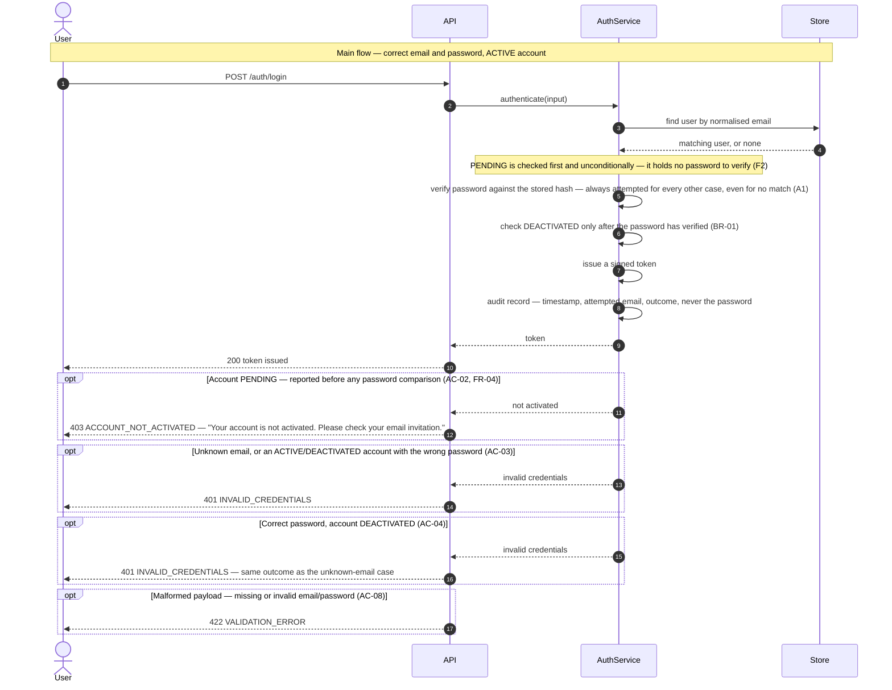

# Technical Plan: System Security (SS)

> **Feature:** SRS §6 Feature-02 · SDS §5.1 (SS)
> **Spec:** [spec.md](spec.md)
> **Stories in this file:** SS-US-01 *(implemented, verified — 14 tests, 100% coverage on new code)*

---

## SS-US-01: Login

### Gaps & Decisions (Resolved)

| ID | Area | Decision | Status |
|----|------|----------|--------|
| A1 | Security | **Password check precedes account-state check, but only for accounts that hold a password** (spec BR-01, FR-05). `PENDING` is checked *first and unconditionally* (FR-04) — its `password_hash` is `NULL`, so there is nothing to verify, and checking password-first there would make AC-02's SRS-mandated message unreachable (spec's own reconciling note after EC-03, added after a first draft got this wrong). For `ACTIVE`/`DEACTIVATED`/unknown-email, the service loads by normalised email and, if no row exists, still runs `security.verify_password()` against a **pre-computed dummy hash** rather than short-circuiting — so the two failure paths (unknown email vs known email/wrong password) take the same code shape and cost roughly the same wall-clock time. The dummy-hash step is not itself a spec requirement (neither SRS nor SDS names timing), but it is the cheapest way to keep AC-03's "indistinguishable" promise from leaking through a side channel the same AC already forbids in spirit. | ✅ Resolved |
| A2 | API | **Reuses `core/security.py` and `core/deps.py` wholesale — no new crypto.** `encode_jwt()`, `verify_password()` already exist, built by UM-US-01 (`plan.md` A11) precisely so this story would not need to reinvent them. This story adds the one thing that was missing: the endpoint that calls `encode_jwt()` after a real credential check, rather than the dev-only `mint-token` CLI standing in for it. | ✅ Resolved |
| A3 | Security | **`DEACTIVATED` login is folded into the generic refusal**, per spec AC-04/FR-07. Same shape as UM-US-02 EC-07's treatment of a `DEACTIVATED` user's invitation token. No new precedent — an existing one, reapplied. | ✅ Resolved |
| A4 | Code | **`get_current_user`/`require_admin` are untouched.** This story only adds what issues a token; nothing about verifying one changes. Confirmed by re-running the full UM-US-01/UM-US-02 suite unmodified once this story's code lands — a regression there would mean this assumption broke. | ✅ Resolved |
| A5 | Code | **The dummy-hash comparison (A1) uses a hash of a fixed placeholder string, computed once at import time**, not a fresh `bcrypt.gensalt()` per request — bcrypt's own cost factor already dominates the timing, so a per-request salt buys nothing and only adds needless work to every failed lookup. | ✅ Resolved |
| F1 | Finding | **Neither `SRS.md` nor `SDS.md` names what happens to a `DEACTIVATED` login attempt** — only `PENDING` is named (spec Assumptions). A3's ruling is derived from constitution SEC-10 and UM-US-02's own EC-07 precedent, not from an anchored AC. Recorded so the gap stays visible; extending the SRS to name it explicitly is a requirements change the product owner would need to make, not an AI alignment (`CLAUDE.md` §1). | ✅ Resolved *(recorded, not closed)* |
| F2 | Finding | **A first design pass made AC-02 permanently unreachable.** It generalised UM-US-02's "state check comes after the relevant secret check" pattern into one blanket rule — *password verification always precedes any account-state check* — without checking whether the analogy held. It did not: a `PENDING` account's `password_hash` is `NULL` (UM-US-01 AC-07), so under that rule a `PENDING` login could only ever fail password verification and land on the generic refusal, never reaching AC-02's SRS-mandated named message at all. Caught by tracing through what `authenticate()` would actually do for a `PENDING` row **before any code was written** — exactly the point of the design step. Fixed by narrowing BR-01 (spec's own reconciling note after EC-03) to the accounts that hold a password to check; `PENDING` is checked first and unconditionally instead. Recorded here because it is a correction to this story's own design, not an inherited gap. | ✅ Resolved |

---

### Architecture

**Package layout** (additions only; UM-US-01/UM-US-02's foundation is reused as-is).

```text
backend/app/
├── core/
│   ├── errors.py                     # update: add InvalidCredentialsError, AccountNotActivatedError
│   ├── security.py                   # reuse — verify_password, encode_jwt already exist
│   ├── audit.py                      # reuse — record() emitter
│   └── deps.py                       # reuse, unchanged — get_current_user/require_admin untouched (A4)
├── schemas/
│   └── auth.py                       # NEW  LoginRequest, TokenResponse
├── services/
│   └── auth_service.py               # NEW  authenticate()
└── api/v1/
    ├── auth.py                       # NEW  POST /auth/login
    └── router.py                     # update: mount auth.router

backend/tests/
└── integration/test_ss_us_01_login.py   # NEW  written at the Implement step from test_cases.md
```

No Alembic migration: no schema change. No new settings: `jwt_secret`/`jwt_ttl_minutes`/
`jwt_algorithm` already exist in `core/config.py`, added by UM-US-01 for token *verification* and
now used for token *issuance* too — the same values, the same seam.

**DTOs** (`app/schemas/auth.py`)

```python
class LoginRequest(BaseModel):
    email: EmailStr
    password: str = Field(min_length=1)

class TokenResponse(BaseModel):
    access_token: str
    token_type: Literal["bearer"]
    expires_in: int          # seconds, for a client to know when to re-authenticate
    role: Literal["ADMIN", "USER"]
```

`LoginRequest` carries no `max_length` on `password` — unlike activation, login only *compares*
against an existing hash; it never derives a new one, so bcrypt's 72-byte truncation risk (VL-04)
does not apply here. `TokenResponse` has no field for the password or the stored hash — the
structural guard, same technique as `InvitationRead`/`ActivationResult`.

**Business rules enforced in service layer**

| Rule | Source | Enforcement |
|------|--------|--------------|
| Payload validated before any lookup | AC-08, FR-02 | `LoginRequest` — `EmailStr` + non-empty password; a failure is `422` from Pydantic, service never runs |
| Email normalised before lookup | EC-01, FR-03, BR-04 | `user_repo.normalize_email()`, reused unchanged from UM-US-01 |
| **`PENDING` checked first, unconditionally — no password comparison** | AC-02, FR-04, EC-03, F2 | If the matched user's status is `PENDING`, `auth_service.authenticate()` raises `AccountNotActivatedError` immediately. Its `password_hash` is `NULL`, so there is nothing to compare (F2's correction) |
| Password verified before any further state check, for every other case | AC-05, FR-05, BR-01, A1 | For `ACTIVE`, `DEACTIVATED`, or no match at all, `security.verify_password()` runs next — against the real hash if the user exists and is past the `PENDING` check, against a fixed dummy hash if not — before any other branch runs |
| Unknown email or wrong password (on a non-`PENDING` account) → one generic outcome | AC-03, FR-06 | `InvalidCredentialsError` (401), raised identically whether `user is None` or the password failed |
| DEACTIVATED account, password correct → generic refusal | AC-04, FR-07, BR-02, A3 | `InvalidCredentialsError` (401) — same code and message as FR-06, never a distinct one |
| Token issued on success | AC-01, FR-08 | `security.encode_jwt(subject=user.id, role=user.role.value, ...)`, reused unchanged from UM-US-01 |
| Credential never exposed | AC-06, BR-03 | `TokenResponse` has no password/hash field; audit call passes neither |
| Audit on every attempt | AC-07, FR-10 | `audit.record()` on the success path and every refusal branch, result `SUCCESS`/`FAILURE`, target the attempted email, never the password |
| No authentication required to call this endpoint | AC-09 | Router declares no `AdminDep`/`CurrentUserDep` — the third public route alongside `POST`/`GET /users/activate` |

**Sequence diagram — Login**

Drawn to `constitution.md` DG-01…DG-07.



**Error flows**

| Scenario | HTTP | Error Code |
|----------|------|------------|
| Malformed or missing email/password (AC-08) | 422 | `VALIDATION_ERROR` |
| Unknown email, or known email with wrong password (AC-03), or DEACTIVATED account (AC-04) | 401 | `INVALID_CREDENTIALS` |
| Account PENDING — reported regardless of what password was submitted (AC-02) | 403 | `ACCOUNT_NOT_ACTIVATED` |
| Unexpected server error | 500 | `INTERNAL_ERROR` |

All in the flat envelope `{"error_code", "message", "details"}` (SDS §6.6, API-02). No CSRF concern
— stateless bearer auth, no cookie issued (SDS §7.1.9).

**Constitution notes**

| Rule | Status | Note |
|------|--------|------|
| AR-01 Service owns business rules | Required | Lookup, password check, state check, and token issuance all live in `auth_service.authenticate()` |
| AR-02 Thin router | Required | Router binds the payload, calls the service, formats the response — no branching on business state |
| AR-05 No framework objects in services | Required | `authenticate()` takes plain values; no `Request`/`Response` |
| AR-06 One transaction per request | N/A | Read-only — no write, nothing to commit |
| API-01 Versioned plural path | Required | `POST /api/v1/auth/login` (SDS §6.3 SS-API-01) |
| API-02 Flat error envelope | Required | Reused `main.py` handlers, unchanged |
| API-03 Status codes | Required | `200` success · `401` invalid credentials · `403` not activated · `422` validation |
| API-04 Prefixed error codes | Required | `INVALID_CREDENTIALS`, `ACCOUNT_NOT_ACTIVATED` |
| API-07 Explicit response_model | Required | `response_model=TokenResponse`, `status_code=200` |
| API-08 Public endpoint list | Required | This route is exactly the one API-08 already names as `/auth/login` |
| NC-02 Naming | Required | `LoginRequest` / `TokenResponse`; no new model or table |
| VL-01 Pydantic source of truth | Required | `EmailStr` + non-empty password on `LoginRequest` |
| VL-02 Errors grouped | Required | Reused `RequestValidationError` handler |
| SEC-01 One-way password hash | Required (reused) | `security.verify_password()`, unchanged |
| SEC-06 JWT parameters | Required | HS256, 60-minute expiry, `sub` = user id — `security.encode_jwt()`, unchanged |
| SEC-07 Authz proven by test | N/A | This route issues a credential; it does not itself require one |
| SEC-10 No enumeration | Required | AC-03/AC-04 collapse unknown-email, wrong-password, and DEACTIVATED into one outcome; A1's dummy-hash comparison closes the timing side channel the same guarantee implies |
| LA-01 No secrets in logs | Required | Audit passes the attempted email, never the password; `audit.record()`'s forbidden-key guard backstops it |
| LA-02 Audit five fields | Required | actor (the matched user's id where one exists, `None` for an unknown email), timestamp, action, target (attempted email), result |
| LA-04 Login is auditable | Required | SDS §7.1.10 names login success *and* failure explicitly |
| PF-01 300 ms p95 | Required | One indexed lookup, one bcrypt compare, no I/O beyond the database — well inside budget |
| PF-02 Indexed lookups | Required | `users.email` unique index, already in place |
| PF-03 DTO projection | Required | `TokenResponse` — four fields, no ORM graph |
| TST-01/02 AC→TC coverage | Required | Every AC and EC mapped in `test_cases.md` before any test code |
| DOD-03 Coverage > 80% | Required | Measured at the Implement step |

**Element IDs**

| Element | ID | Status | File |
|---------|----|--------|------|
| — | — | **N/A (mobile deferred)** | `mobile/app/(auth)/login.tsx` already exists as a fixture-driven prototype from UM-US-01's round; wiring it to this real endpoint is Phase 5's job, not a new screen build. |

**Open tasks**

| ID | Task | File | Status |
|----|------|------|--------|
| T-01 | `schemas/auth.py`: `LoginRequest`, `TokenResponse` | `backend/app/schemas/auth.py` | ✅ Done |
| T-02 | `errors.py`: `InvalidCredentialsError` (401), `AccountNotActivatedError` (403) | `backend/app/core/errors.py` | ✅ Done |
| T-03 | `auth_service.py`: `authenticate()` — PENDING checked first and unconditionally (F2), password-before-state for every other case (A1), dummy-hash timing guard (A1/A5) | `backend/app/services/auth_service.py` | ✅ Done |
| T-04 | `POST /api/v1/auth/login` router + mount in `router.py` | `backend/app/api/v1/auth.py`, `backend/app/api/v1/router.py` | ✅ Done |
| T-05 | Integration tests written from `test_cases.md` | `backend/tests/integration/test_ss_us_01_login.py` | ✅ Done — TC-01…TC-11, `134 passed`, one pre-existing UM-US-02 test flakiness found and fixed along the way (see `test_cases.md`'s Test Implementation Map) |
