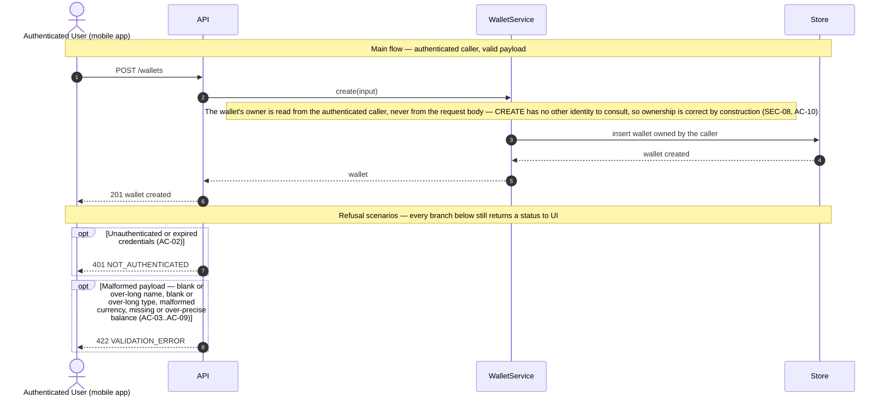
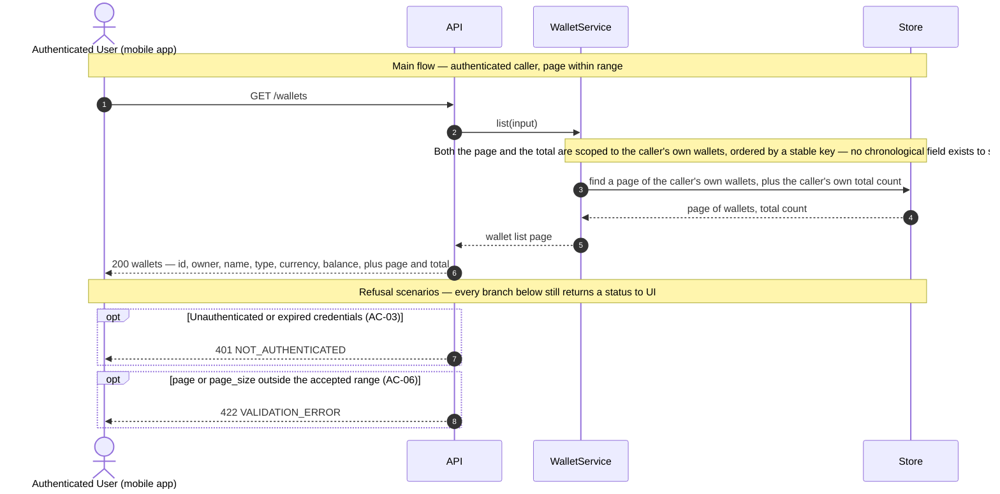

# Technical Plan: Wallet Management (WM)

> **Feature:** SRS §6 Feature-03 · SDS §5.3 (WM)
> **Spec:** [spec.md](spec.md)
> **Stories in this file:** WM-US-01 *(implemented, verified — 198 passed, 98% coverage)* · WM-US-02 *(planned)*

---

## WM-US-01: Create a Wallet

### Gaps & Decisions (Resolved)

Code and architecture decisions settled during design. Spec-level findings were folded back into `spec.md` before this step closed.

| ID | Area | Decision | Status |
|----|------|----------|--------|
| A1 | Domain | **`type` is a free-text bounded string, not a closed enum.** No SRS or SDS source names a fixed vocabulary — the Gherkin uses `"BANK"`, SDS §5.3.1's prose uses `"Checking, Cash, Credit Card"`, and the two are not even in the same casing convention. Inventing a closed enum (the way `UserStatus`/`UserRole`/`InvitationStatus` are modelled) would mean choosing the exact member set on the product owner's behalf, which is an extension, not an alignment (`CLAUDE.md` §1 "They are references, not contracts"). `WalletModel.type` is therefore `String(50)` with no `Enum`/`native_enum` column, and `WalletCreate.type` is a plain bounded `str` — no `native_enum=False` pattern applies because there is no enum to declare. Revisit if a future story specifies the real vocabulary. | ✅ Resolved |
| A2 | Domain | **`currency` is validated for ISO-4217 *shape* only — three uppercase letters — not against the real ISO-4217 list.** The only example either document gives is `"USD"`, which is consistent with the shape rule but does not by itself justify building or maintaining a currency table this story never asked for. `WalletCreate.currency: str = Field(pattern=r"^[A-Z]{3}$")`. No case-folding is applied (unlike `users.email`'s `normalize_email` — an email's casing is not part of its identity, but `"usd"` is not a currency code at all under this shape rule, so folding it would silently accept something that was never valid). | ✅ Resolved |
| A3 | Money | **`initial_balance` is a Pydantic `Decimal` field with `max_digits=15, decimal_places=2`, accepting either a JSON number or a JSON string** (Pydantic v2's default "smart" `Decimal` handling, which converts a JSON number via `Decimal(str(value))` rather than `Decimal(float_value)` — the step that would otherwise reintroduce binary floating-point artifacts). `decimal_places=2` is enforced by Pydantic's own constraint, which **rejects** an over-precise value (`decimal_max_places`) rather than rounding it — matching this codebase's standing precedent of reject-don't-truncate for every other bounded field (UM-US-01 EC-04, UM-US-02 EC-03, UM-US-03 A2). `max_digits=15` mirrors constitution VL-07's `DECIMAL(15,2)` exactly, so the DTO bound and the column bound cannot silently drift apart. | ✅ Resolved |
| A4 | Domain | **No sign constraint on `initial_balance`.** Neither the SRS Gherkin nor SDS §5.3.1 requires a positive balance, and a `"CREDIT"`-type wallet (A1 — type is free text, so nothing stops a User naming one this way) legitimately starts already in debt. Adding a `> 0` or `>= 0` check would be inventing a business rule no source states. Recorded rather than assumed, because every other bounded field in this story *does* reject out-of-range input, and a reader could otherwise wonder whether the omission here was intentional. | ✅ Resolved |
| A5 | Domain / ERD | **No `created_at` column is added to `wallets`.** SDS §4.3.3's ERD lists `wallets` with exactly `id`, `user_id`, `name`, `type`, `balance`, `currency` — no timestamp, unlike `users` and `invitations`, which both have one. This reads as a plausible oversight, but adding a column the ERD does not list is a domain-model change, which `CLAUDE.md` §1 requires stopping to ask about rather than deciding unilaterally ("changes the domain model or ERD" is one of the named break conditions). This story therefore ships **without** `created_at`: `WalletModel` has no such column, `WalletRead` has no such field, and there is no ordering guarantee for a future list story to rely on. If WM-US-02 (List Wallets) needs creation-order pagination, adding the column is that story's own decision to raise — not something inherited silently from here. | ✅ Resolved *(flagged, not closed — see spec.md Assumptions)* |
| A6 | Domain | **No uniqueness constraint on `wallets.name`**, not even scoped to one User. No AC, EC, or BR requires it (spec EC-07), so no unique index and no service-layer duplicate check are added — unlike `users.email` (UM-US-01 VL-05), which has an explicit uniqueness requirement this story's wallet name does not share. | ✅ Resolved |
| A7 | Security | **A client-supplied `user_id` in the request body is structurally impossible, not merely rejected.** `WalletCreate` declares no `user_id` field at all — the wallet's owner comes only from `CurrentUserDep`, resolved by the router exactly as every other protected route already does. An extra `user_id` key in the submitted JSON is silently ignored by Pydantic's default `BaseModel` behaviour (no `model_config = {"extra": "forbid"}` is set here, matching every existing schema in this codebase, none of which sets it either) — ownership is enforced by the DTO's shape, not by a validation rule that could be forgotten (constitution SEC-08, spec AC-10, BR-01). | ✅ Resolved |
| A8 | Security | **No role restriction.** `CurrentUserDep` — not `AdminDep` — guards this route. SRS §6 US-03-01 names the actor "Authenticated User" with no role qualifier, and SDS §5.3.1 tags the story "(USER)", meaning any authenticated account, not an ADMIN-only action the way UM-US-01/UM-US-03 are. An ADMIN account may also create its own wallet through this route; nothing in either reference document forbids it, and inventing a restriction would itself be scope creep. | ✅ Resolved |
| A9 | Architecture | **No audit event.** Constitution LA-04 enumerates exactly three audited event families — invitations sent, activations completed, logins — and wallet creation is not among them. No AC or FR in `spec.md` asks for one either. Adding a fourth audited event type here would be extending constitution LA-04 on this story's own authority, which is out of scope; a future story that wants wallet-creation auditing should amend LA-04 explicitly rather than inherit a precedent nobody asked for. | ✅ Resolved |

---

### Architecture

**Package layout** (additions only — every foundation module below already exists and is reused unchanged).

```text
backend/app/
├── models/
│   └── wallet.py                     # NEW  WalletModel (SDS §2.1, §2.2, §4.3.3)
├── schemas/
│   └── wallet.py                     # NEW  WalletCreate, WalletRead
├── repositories/
│   └── wallet_repo.py                # NEW  add_wallet()
├── services/
│   └── wallet_service.py             # NEW  create_wallet()
└── api/v1/
    ├── wallets.py                    # NEW  POST /wallets
    └── router.py                     # update: mount wallets.router

backend/migrations/versions/
└── <rev>_create_wallets.py           # NEW  wallets table (DOD-02)

backend/tests/
└── integration/test_wm_us_01_create_wallet.py   # NEW  written at the Implement step from test_cases.md
```

No change to `core/deps.py` — `CurrentUserDep` (`get_current_user`) already resolves any authenticated `ACTIVE` User of either role and is reused exactly as-is (A8).

**Domain objects**

| Entity | Table | Key Fields | Notes |
|--------|-------|------------|-------|
| `WalletModel` | `wallets` | `id` PK, `user_id` FK→`users.id` (indexed), `name`, `type`, `currency`, `balance` | No `created_at` (A5). `id` is `String(36)` UUID text, matching `UserModel`/`InvitationModel` (constitution ENV-03). `user_id` carries an index — every future query on this table filters by owner (constitution SEC-08, PF-02), even though this story only ever writes one row per request. |
| — | — | *(no new enum)* | `type` and `currency` are plain bounded strings, not `Enum` columns (A1, A2) — the first Wallet-adjacent field in this codebase with no closed vocabulary behind it. |

**DTOs** (`app/schemas/wallet.py`)

```python
class WalletCreate(BaseModel):
    # Trimmed and required non-empty after trimming (spec AC-03, EC-04);
    # bounded at the column width (spec AC-04).
    name: str = Field(min_length=1, max_length=100)

    # Free text, no enum (A1); bounded the same way as name (spec AC-05, AC-06).
    type: str = Field(min_length=1, max_length=50)

    # ISO-4217 shape only, no case-folding (A2; spec AC-07, EC-03).
    currency: str = Field(pattern=r"^[A-Z]{3}$")

    # Decimal(15,2), reject-don't-round (A3; spec AC-08, AC-09, constitution VL-07).
    initial_balance: Decimal = Field(max_digits=15, decimal_places=2)

class WalletRead(BaseModel):
    id: str
    user_id: str
    name: str
    type: str
    currency: str
    balance: Decimal
```

`name`'s trim is a `field_validator`, the same opt-in-per-field technique UM-US-02's `ActivateRequest.full_name` used — no model-wide `str_strip_whitespace`, so a future field that must **not** be trimmed (none exists yet in this story) stays safe by default. A trimmed-to-empty name still fails `min_length=1` inside the same validator, matching spec AC-03's "empty or only whitespace" wording.

**Business rules enforced in service layer**

| Rule | Source | Enforcement |
|------|--------|--------------|
| Authenticated User of any role may create a wallet | AC-01, FR-01, A8 | `POST /api/v1/wallets` accepting `WalletCreate`, guarded by `CurrentUserDep` — not `AdminDep` |
| Unauthenticated caller denied before the payload is evaluated | AC-02, FR-02 | `CurrentUserDep` resolves before FastAPI validates the body — identical ordering to every existing protected route |
| Name required, trimmed, bounded | AC-03, AC-04, EC-04, FR-03 | `WalletCreate` field validator: strip, reject empty, `max_length=100` |
| Type required, bounded, no enum | AC-05, AC-06, EC-05, FR-04, A1 | `Field(min_length=1, max_length=50)` — no `Enum`, so any non-empty value within the bound passes |
| Currency shape validated, no folding | AC-07, EC-03, FR-05, A2 | `Field(pattern=r"^[A-Z]{3}$")` — a lowercase or wrong-length value is a `422` before the service runs |
| Balance required, `Decimal(15,2)`, reject not round | AC-08, AC-09, EC-08, FR-06, A3, constitution VL-07 | `Field(max_digits=15, decimal_places=2)` — Pydantic's own constraint rejects both over-precise and over-wide input |
| No sign constraint | EC-01, EC-02, FR-07, A4 | No `gt=0` / `ge=0` on `initial_balance` — zero and negative values pass validation unchanged |
| Owner is always the caller, never client input | AC-10, FR-08, A7, constitution SEC-08 | `wallet_service.create_wallet(db, owner=current_user, ...)` reads `owner.id`; `WalletCreate` has no `user_id` field to read from instead |
| `initial_balance` maps to the stored `balance` column | FR-09 | `wallet_repo.add_wallet(..., balance=initial_balance)` — the DTO field and the column are different names for the same value, by design (SDS §6.2.1 vs §2.2) |
| Response exposes exactly six fields | AC-11, FR-10, constitution PF-03 | `WalletRead` — no ORM graph, no extra field |
| Every validation failure reported together | EC-06, FR-11, constitution VL-02 | Reuses the existing `RequestValidationError` handler in `main.py` — unchanged, no new wiring |
| No uniqueness constraint on name | EC-07, FR-12, A6 | No unique index on `wallets.name`; no service-layer duplicate check |
| No audit event | A9 | `wallet_service.create_wallet()` calls no `audit.record()` |

**Sequence diagram — Create a Wallet**

Drawn to `constitution.md` DG-01…DG-07: four lanes only, no SQL, no parameter lists, every request into `API` answered back to `UI` with a status code.



Only one workflow is drawn (DG-07) — there is no recovery path, supersession, or background step analogous to UM-US-01's re-invite or delivery-failure branches, because creating a wallet has no prior state to reconcile against.

**Error flows**

| Scenario | HTTP | Error Code |
|----------|------|------------|
| No or invalid bearer credentials (AC-02) | 401 | `NOT_AUTHENTICATED` |
| Blank or over-long name, blank or over-long type, malformed currency, missing or over-precise initial balance (AC-03..AC-09) | 422 | `VALIDATION_ERROR` |
| Unexpected server error | 500 | `INTERNAL_ERROR` |

All in the flat envelope `{"error_code", "message", "details"}` (SDS §6.6, constitution API-02) — reused unchanged from `main.py`. No `403` (A8: no role restriction) and no `409` (A6: no uniqueness to conflict on).

**Constitution notes**

| Rule | Status | Note |
|------|--------|------|
| AR-01 Service owns business rules | Required | `wallet_service.create_wallet()` is the only place that decides the owner and assembles the persisted row |
| AR-02 Thin router | Required | Router binds the payload, resolves `CurrentUserDep`, calls the service, commits, formats the response — no branching on business state |
| AR-03 Repository isolation | Required | `wallet_repo.add_wallet()` persists only; every validation rule already ran in the Pydantic layer or the service before it is called |
| AR-04 DTO ↔ model mapping outside routers/repos | Required | Field mapping (`initial_balance` → `balance`) happens in the service, not the router |
| AR-05 No framework objects in services | Required | `create_wallet()` takes plain values (`owner: UserModel`, `name`, `type`, `currency`, `initial_balance`); no `Request`/`Response` |
| AR-06 One transaction per request | Required | Service flushes; the router commits once — a single-row insert, but the same shape as every other story for consistency |
| AR-08 Module layout | Required | `backend/app/{models,schemas,repositories,services,api}` — no new top-level package |
| API-01 Versioned plural path | Required | `POST /api/v1/wallets` |
| API-02 Flat error envelope | Required | Reused from `main.py`, unchanged |
| API-03 Status codes | Required | `201` create · `401` · `422` validation |
| API-04 Prefixed error codes | N/A | This story introduces no new error code — `NOT_AUTHENTICATED` and `VALIDATION_ERROR` already exist |
| API-05 No generic status endpoint | Required | `/wallets` is a plain resource-creation `POST`, not a status-transition endpoint |
| API-06 Pagination | N/A | Single-resource creation; no list in this story |
| API-07 Explicit response_model | Required | `response_model=WalletRead`, `status_code=201` |
| API-08 Public endpoint list | Required | This route is **protected** — not added to the public list |
| NC-01 Module naming | Required | `wallet_repo.py`, `wallet_service.py` — singular, matching `user_repo.py`/`invitation_service.py` |
| NC-02 Naming | Required | `WalletModel`; `WalletCreate` / `WalletRead` (SDS §2.1); table `wallets` |
| NC-04 Column naming | Required | snake_case; `user_id` FK. No `created_at`/`updated_at` this story (A5) |
| NC-05 Enum serialisation | N/A | `type` and `currency` are plain strings, not enum columns (A1, A2) — there is no enum literal to serialise |
| NC-06 Concise service methods | Required | `WalletService.create`, matching `InvitationService.create_invitation`'s concision within its own module |
| VL-01 Pydantic is the source of truth | Required | Every bound (length, pattern, decimal shape) lives on `WalletCreate` |
| VL-02 Errors grouped | Required | Reused `RequestValidationError` handler (EC-06) |
| VL-07 Decimal money | Required | `Decimal`, `max_digits=15, decimal_places=2` on the DTO; `Numeric(15, 2)` on the column — first story in this codebase to touch money |
| SEC-06 JWT parameters | N/A | Consumed via `CurrentUserDep`, not defined here — reused unchanged from SS-US-01 |
| SEC-07 Authz proven by test | Required (partial) | `401` gets a dedicated test; there is no `403` case to test (A8) |
| SEC-08 Ownership filter | Required | The one row this story ever writes is scoped to the caller by construction (A7) — the read-side half of SEC-08 (filtering a *query* by `user_id`) has no query to filter yet and becomes real only with WM-US-02 |
| SEC-09 Secrets from .env | N/A | No secret is introduced by this story |
| SEC-10 No enumeration | N/A | No existence check against another User's data occurs here |
| SEC-11 Rate limiting | N/A | Scoped by its own text to the invitation and activation endpoints; nothing here brings this route into that scope |
| LA-01 No secrets in logs | N/A | No credential or token is handled by this story |
| LA-02 / LA-04 Audit | N/A (by decision) | Wallet creation is not one of LA-04's three named audited events, and no AC/FR asks for a fourth (A9) |
| PF-01 300 ms p95 | Required | No I/O off the request path is needed — a single insert, no SMTP, no `BackgroundTasks` |
| PF-02 Indexed lookups | Required | `wallets.user_id` indexed now, ahead of WM-US-02's need for it (PF-02's "columns used in WHERE… carry an index") |
| PF-03 DTO projection | Required | `WalletRead` — six fields, no ORM graph |
| TST-01/02 AC→TC coverage | Required | Every AC and EC mapped in `test_cases.md` before any test code |
| DOD-02 Migration | Required | One Alembic revision creating `wallets` |
| DOD-03 Coverage > 80% | Required | Measured at the Implement step |

**Element IDs**

| Element | ID | Status | File |
|---------|----|--------|------|
| — | — | **N/A (mobile deferred)** | No wallet-creation screen exists this round. `mobile/`'s fixture-driven prototype covers only UM-US-01's invite screen (`CLAUDE.md` §5); a wallet-creation screen is not part of Round 1's mobile scope and no SRS UXR names one. |

**Open tasks**

| ID | Task | File | Status |
|----|------|------|--------|
| T-01 | `WalletModel` (`id`, `user_id` FK indexed, `name`, `type`, `currency`, `balance` — no `created_at`, A5) | `backend/app/models/wallet.py` | Open |
| T-02 | Alembic revision creating `wallets` with its FK and index | `backend/migrations/versions/` | Open |
| T-03 | Schemas `WalletCreate`, `WalletRead` | `backend/app/schemas/wallet.py` | Open |
| T-04 | `wallet_repo.add_wallet(db, *, user_id, name, wallet_type, currency, balance)` | `backend/app/repositories/wallet_repo.py` | Open |
| T-05 | `wallet_service.create_wallet(db, *, owner, name, wallet_type, currency, initial_balance)` | `backend/app/services/wallet_service.py` | Open |
| T-06 | `POST /api/v1/wallets` router; mount `wallets.router` in `api/v1/router.py` | `backend/app/api/v1/wallets.py`, `backend/app/api/v1/router.py` | Open |
| T-07 | Integration tests written from `test_cases.md` | `backend/tests/integration/test_wm_us_01_create_wallet.py` | Open |

---

## WM-US-02: List Wallets

> **IDs in this section are local to WM-US-02** (`A*`/`T-NN`), matching `spec.md`'s convention. Only
> `TC-NN` and `QF-NN` in `test_cases.md` run continuously across **this epic file** — this story
> continues from `TC-22`/`QF-04`. (Note: `specs/001-user-onboarding/test_cases.md` resets `QF-NN`
> per story instead; each epic file's own header states which convention it uses — see
> `test_cases.md`'s note for why this file continues it.)

### Gaps & Decisions (Resolved)

| ID | Area | Decision | Status |
|----|------|----------|--------|
| A1 | Domain / ERD | **Ordering with no `created_at`: order by the primary key `id` ascending (`ORDER BY id ASC`), no schema change.** SDS §4.3.3's ERD lists `wallets` with exactly `id`, `user_id`, `name`, `type`, `balance`, `currency` — WM-US-01 `plan.md` A5 already flagged the missing timestamp and left it unfixed, since adding a column the ERD does not list is a domain-model change reserved for the user's own decision (`CLAUDE.md` §1). That still holds here, and unlike UM-US-03 (which reused a `created_at` column that already existed for unrelated reasons), no AC in either reference document asks for chronological order — only *a* list. Ordering by `id` gives a total, stable, gap-free, duplicate-free order across pages at zero schema cost, at the accepted cost of carrying no chronological meaning (full rationale: `spec.md` Assumptions; risk of a false impression of meaningful order: `test_cases.md` QF-06). A future story wanting creation-order is where `created_at` (or another explicit sort key) gets raised, per WM-US-01 A5's own anticipation. | ✅ Resolved |
| A2 | API | **New envelope `WalletListRead { items, total, page, page_size }`**, mirroring `UserListRead` (UM-US-03 A6) exactly. `WalletRead` itself is reused unchanged as the per-item shape — SDS §6.2.1 never enumerated its fields directly, but §2.1's traceability row already names it as Wallet's read DTO, and WM-US-01 is where its six fields were actually settled. | ✅ Resolved |
| A3 | Security / Architecture | **Pagination and ownership filtering combined for the first time in this codebase.** Both the bounded page query and the total-count query in `wallet_repo.list_owned()` carry the identical `WHERE user_id = :owner_id` predicate — copying UM-US-03's two-query shape (one count, one bounded select) but adding the ownership predicate WM-US-01's single-row lookup already established (`get_owned_by_id`). Scoping only one of the two queries would either leak a system-wide count next to a caller-scoped list, or scope the count but not the items — both wrong in different ways, which is why this is recorded as its own decision rather than assumed obvious (`test_cases.md` QF-05). | ✅ Resolved |
| A4 | Architecture | **The router issues no `db.commit()`.** Pure read, nothing to commit — mirrors `GET /users` (UM-US-03 A4) and `GET /users/activate`. | ✅ Resolved |
| A5 | Logging | **No new audit event for a list view.** Constitution LA-04 names exactly three audited event families (invitations sent, activations completed, logins); wallet creation itself was already excluded by WM-US-01 A9, and reading a list is further still from anything LA-04 enumerates. No AC or FR here asks for one. | ✅ Resolved |
| A6 | Security | **No role restriction — `CurrentUserDep` guards the route, not `AdminDep`.** SDS §5.3.2 tags this story "(USER)", identical to WM-US-01's own "(USER)" tag: any authenticated account, scoped to what it owns — not an ADMIN-wide view the way UM-US-03 is. An ADMIN caller who also owns wallets sees, through this route, only their own (spec EC-04, BR-01; `test_cases.md` QF-07); nothing elevates an ADMIN's visibility here, and inventing such an elevation would itself be scope creep no source document asks for. | ✅ Resolved |

---

### Architecture

**Package layout** (additions/updates only — WM-US-01's foundation is reused as-is unless noted;
**no new Alembic migration this story** — see note below).

```text
backend/app/
├── schemas/
│   └── wallet.py                     # update: add WalletListRead (A2)
├── repositories/
│   └── wallet_repo.py                # update: add list_owned(db, *, user_id, page, page_size)
└── services/
    └── wallet_service.py             # update: add list_wallets()

backend/app/api/v1/
└── wallets.py                        # update: add GET /wallets (list)

backend/tests/
└── integration/test_wm_us_02_list_wallets.py   # NEW  written at the Implement step from test_cases.md
```

No change to `core/deps.py` — `CurrentUserDep` is reused exactly as WM-US-01 already established
(A6). **No new Alembic revision**: this story adds no column and needs no new index —
`wallets.user_id` already carries one (WM-US-01 T-01/T-02), and ordering by the primary key `id`
needs nothing beyond what every table already has (constitution PF-02 — a primary key is indexed by
construction on both SQLite and PostgreSQL).

**Domain objects**

| Entity | Table | Fields touched | Notes |
|--------|-------|-----------------|-------|
| `WalletModel` | `wallets` | none (read-only) | This story only reads. No new column — ordering uses the existing `id` primary key (A1), not a new `created_at`. |
| `WalletRead` (DTO) | — | `id`, `user_id`, `name`, `type`, `currency`, `balance` | Reused unchanged from WM-US-01 — the same six fields; no list-specific per-item variant (A2). |
| `WalletListRead` (DTO) | — | `items: WalletRead[]`, `total`, `page`, `page_size` | New envelope (A2), mirrors `UserListRead` (UM-US-03 A6) — not in SDS's registry. |

**DTOs** (`app/schemas/wallet.py`, addition)

```python
class WalletListRead(BaseModel):
    """New envelope (A2) — mirrors UserListRead (UM-US-03 plan.md A6). Not in
    SDS's DTO registry, which names only WalletCreate directly in §6.2.1;
    WalletRead's own six fields were settled in WM-US-01, reused unchanged here.
    """

    items: list[WalletRead]
    total: int
    page: int
    page_size: int
```

**Business rules enforced in service layer**

| Rule | Source | Enforcement |
|------|--------|--------------|
| Any authenticated User of any role may list their own wallets | AC-01, FR-01, A6 | `GET /api/v1/wallets` guarded by `CurrentUserDep` — not `AdminDep`, mirrors WM-US-01's own route guard |
| Unauthenticated caller denied before any query parameter is evaluated | AC-03, FR-03 | `CurrentUserDep` resolves before FastAPI validates `page`/`page_size` — identical ordering to `GET /users` (UM-US-03 TC-61) |
| Every wallet query scoped to the caller — items and total alike | AC-07, FR-07, FR-10, A3, constitution SEC-08 | `wallet_repo.list_owned()` — both queries carry `WHERE user_id = :owner_id` |
| Bounded, paginated results | AC-04, AC-05, AC-06, API-06, PF-04 | Router declares `Query(page, ge=1)` / `Query(page_size, ge=1, le=100)` — out-of-range is `422`, not clamped, matching UM-US-03 A2's precedent |
| Stable, deterministic order | AC-08, EC-03, BR-03, A1 | `ORDER BY id ASC` in `wallet_repo.list_owned()` — the one column guaranteed unique and present without a schema change |
| Accurate, caller-scoped total | AC-01, AC-02, AC-04, AC-05, EC-01, A3, BR-04 | `wallet_repo.list_owned()` computes the count under the identical `user_id` predicate as the page query |
| Projection reused unchanged | AC-09, FR-02, PF-03 | `WalletRead` — the same six fields WM-US-01 defined, no new or missing field |
| Pure read, no commit | A4 | Router issues no `db.commit()` — mirrors `GET /users` |

**Repository** (`app/repositories/wallet_repo.py`, addition)

```python
def list_owned(
    db: Session, *, user_id: str, page: int, page_size: int
) -> tuple[Sequence[WalletModel], int]:
    """A page of wallets owned by `user_id`, plus that owner's own total count
    (spec AC-01, AC-04, AC-05, AC-07; plan.md A1, A3).

    Both queries carry the identical `user_id` predicate (constitution SEC-08)
    — the total is the caller's own wallet count, never the system-wide row
    count (test_cases.md QF-05). Ordered by `id`, the one column guaranteed to
    exist and be unique without a schema change (A1); this order carries no
    chronological meaning.
    """
    total = db.scalar(
        select(func.count())
        .select_from(WalletModel)
        .where(WalletModel.user_id == user_id)
    ) or 0
    items = db.scalars(
        select(WalletModel)
        .where(WalletModel.user_id == user_id)
        .order_by(WalletModel.id.asc())
        .offset((page - 1) * page_size)
        .limit(page_size)
    ).all()
    return items, total
```

**Service** (`app/services/wallet_service.py`, addition)

```python
def list_wallets(db: Session, *, owner: UserModel, page: int, page_size: int) -> WalletListRead:
    """Assemble a page of the caller's own wallets into the WalletListRead
    envelope (A2, A3).

    Unlike `user_service.list_users`, this calls no `clock.ensure_aware()` —
    `WalletRead` carries no datetime field to normalise (WM-US-01 A5).
    """
    items, total = wallet_repo.list_owned(db, user_id=owner.id, page=page, page_size=page_size)
    return WalletListRead(
        items=[
            WalletRead(
                id=w.id,
                user_id=w.user_id,
                name=w.name,
                type=w.type,
                currency=w.currency,
                balance=w.balance,
            )
            for w in items
        ],
        total=total,
        page=page,
        page_size=page_size,
    )
```

**Router** (`app/api/v1/wallets.py`, addition)

```python
@router.get(
    "",
    response_model=WalletListRead,
    status_code=status.HTTP_200_OK,
    summary="List the caller's wallets",
    description=(
        "Returns every wallet owned by the authenticated caller, paginated, "
        "with an accurate total scoped to that caller."
    ),
    responses={
        401: {"description": "NOT_AUTHENTICATED"},
        422: {"description": "VALIDATION_ERROR"},
    },
)
def list_wallets(
    db: DbDep,
    current_user: CurrentUserDep,
    page: int = Query(1, ge=1),
    page_size: int = Query(25, ge=1, le=100),
) -> WalletListRead:
    """Pure read — no `db.commit()` (A4)."""
    return wallet_service.list_wallets(db, owner=current_user, page=page, page_size=page_size)
```

**Sequence diagram — List Wallets**

Drawn to `constitution.md` DG-01…DG-07: four lanes only, no SQL, no parameter lists, every request
into `API` answered back to `UI` with a status code.



Only one workflow is drawn (DG-07) — there is no recovery path or background step, the same shape
WM-US-01's own diagram already established for a story with no prior state to reconcile against.

**Error flows**

| Scenario | HTTP | Error Code |
|----------|------|------------|
| No or invalid bearer credentials (AC-03) | 401 | `NOT_AUTHENTICATED` |
| `page` or `page_size` not a positive integer, or `page_size` > 100 (AC-06) | 422 | `VALIDATION_ERROR` |
| Unexpected server error | 500 | `INTERNAL_ERROR` |

No new error class this story — all three codes already exist in `core/errors.py`, reused as-is. All
in the flat envelope `{"error_code", "message", "details"}` (SDS §6.6, constitution API-02). No `403`
(A6: no role restriction) and no `409` (a read has nothing to conflict on).

**Constitution notes**

| Rule | Status | Note |
|------|--------|------|
| AR-01 Service owns business rules | Required | `wallet_service.list_wallets()` assembles the DTO; the repository does not decide *what* to enforce |
| AR-02 Thin router | Required | Router binds `page`/`page_size`, resolves `CurrentUserDep`, delegates, formats the response — no branching on business state |
| AR-03 Repository isolation | Required | `wallet_repo.list_owned()` is a query only — filtering, ordering, and limiting, no business rule |
| AR-04 DTO ↔ model mapping outside routers/repos | Required | `WalletModel` → `WalletRead` mapping happens in `wallet_service.list_wallets()`, not the router or `wallet_repo.list_owned()` |
| AR-05 No framework objects in services | Required | `list_wallets()` takes plain `owner: UserModel`, `page`, `page_size`; no `Request`/`Response` |
| AR-06 One transaction per request | N/A | Pure read, nothing to commit (A4) |
| AR-07 router → service → repository | Required | Router never calls `wallet_repo` directly |
| AR-08 Module layout | Required | No new top-level package; additions only to existing modules |
| API-01 Versioned plural path | Required | `GET /api/v1/wallets` |
| API-02 Flat error envelope | Required | Reused from `main.py`, unchanged |
| API-03 Status codes | Required | `200` read · `401` · `422` validation |
| API-04 Prefixed error codes | N/A | No new error code — `NOT_AUTHENTICATED` and `VALIDATION_ERROR` already catalogued |
| API-05 No generic status endpoint | Required | `GET /wallets` is a plain resource-listing route, not a status-transition endpoint |
| API-06 Pagination | Required | `page`/`page_size`, default 25, max 100, total count in `WalletListRead` — this story's central constitution citation |
| API-07 Explicit response_model | Required | `response_model=WalletListRead`, `status_code=200` |
| API-08 Public endpoint list | Required | This route is **protected** — not added to the public list |
| NC-01 Module naming | Required | No new module; additions to `wallet_repo.py`/`wallet_service.py`/`wallets.py` |
| NC-02 Naming | Required | `WalletListRead` (SDS §2.1 names `WalletRead`; the envelope is new, A2) |
| NC-04 Column naming | N/A | No column change this story |
| NC-06 Concise service methods | Required | `wallet_service.list_wallets`, matching this codebase's own already-established style (`wallet_service.create_wallet`, `user_service.list_users`) rather than the fully class-concise `WalletService.list` the rule's own illustration would suggest — consistent with how WM-US-01's own plan.md already resolved this same tension |
| VL-01 Pydantic is the source of truth | Required | `Query(ge=1, le=100)` constraints are the validation, not a service-layer clamp |
| VL-02 Errors grouped | Required | Reused `RequestValidationError` handler |
| SEC-07 Authz proven by test | Required (partial) | `401` gets a dedicated test; there is no `403` case in this story (A6 — no role restriction) |
| SEC-08 Ownership filter | Required | First story to combine this with pagination (A3) — both the page query and the total-count query carry the `user_id` predicate |
| SEC-10 No enumeration | N/A | This endpoint takes no email or identifying parameter to probe |
| SEC-11 Rate limiting | N/A | Scoped by its own text to the invitation and activation endpoints |
| LA-01 No secrets in logs | N/A | No credential or token is handled by this story |
| LA-02 / LA-04 Audit | N/A (by decision) | Listing is not one of LA-04's three named audited events (A5) |
| PF-01 300 ms p95 | Required | No slow I/O in this path; a two-query read, both indexed |
| PF-02 Indexed lookups | Required | `wallets.user_id` already indexed (WM-US-01); `id` (the sort key) is the primary key, indexed by construction — no new migration |
| PF-03 DTO projection | Required | `WalletRead` — six fields, no ORM graph |
| PF-04 Bounded lists | Required | Enforced by API-06's cap — this story's other central citation |
| TST-01/02 AC→TC coverage | Required | Every AC and EC mapped in `test_cases.md` before any test code |
| TST-05 Boundaries | Required | EC-02 covers the exact `page_size=100` boundary; AC-06 covers zero/negative |
| DOD-02 Migration | N/A | No column or index change this story (see Architecture note) |
| DOD-03 Coverage > 80% | Required | Measured at the Implement step |

**Element IDs**

| Element | ID | Status | File |
|---------|----|--------|------|
| — | — | **N/A (mobile deferred)** | No wallet-list screen exists this round, the same treatment WM-US-01 gave wallet creation — `mobile/`'s fixture-driven prototype covers only UM-US-01's invite screen (`CLAUDE.md` §5). |

**Open tasks**

| ID | Task | File | Status |
|----|------|------|--------|
| T-01 | `WalletListRead` envelope (A2) | `backend/app/schemas/wallet.py` | Open |
| T-02 | `wallet_repo.list_owned(db, *, user_id, page, page_size)` — ownership-scoped page + total (A1, A3) | `backend/app/repositories/wallet_repo.py` | Open |
| T-03 | `wallet_service.list_wallets(db, *, owner, page, page_size) -> WalletListRead` (A2, A3) | `backend/app/services/wallet_service.py` | Open |
| T-04 | `GET /api/v1/wallets` router — `Query(page, ge=1)` / `Query(page_size, ge=1, le=100)`, guarded by `CurrentUserDep`, no `db.commit()` (A4, A6) | `backend/app/api/v1/wallets.py` | Open |
| T-05 | Integration tests written from `test_cases.md` | `backend/tests/integration/test_wm_us_02_list_wallets.py` | Open |
