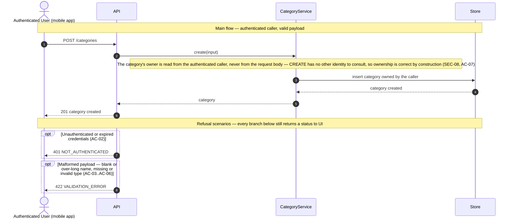

# Technical Plan: Category Management (CM)

> **Feature:** SRS §6 Feature-04 · SDS §5.4 (CM)
> **Spec:** [spec.md](spec.md)
> **Stories in this file:** CM-US-01 *(planned)*

---

## CM-US-01: Create a Category

### Gaps & Decisions (Resolved)

Code and architecture decisions settled during design. Spec-level findings were folded back into `spec.md` before this step closed.

| ID | Area | Decision | Status |
|----|------|----------|--------|
| G1 | Reference docs | **SDS §2.2 / §4.3.3 `icon` contradiction, aligned at the document.** §2.2's Category domain object lists `(id, user_id, name, type, icon)`; §4.3.3's `CATEGORIES` ERD block listed only `id, user_id, name, type` — no `icon`. §5.4.4's CM-US-04 goal ("Modify category name, type, or icon") is a third, independent SDS passage that already assumes `icon` is real, which tips the disagreement: the ERD is the more likely slip, the same class of gap WM-US-01's `plan.md` A5 found in `wallets.created_at`. Unlike A5's treatment, this is a genuine *internal* SDS contradiction (both sides are the same document, not SDS vs. reality), so `CLAUDE.md`'s "aligning is routine" applies directly — `SDS.md` §4.3.3 was corrected to add a nullable `string icon` to the `CATEGORIES` block, logged in §1.6 as v1.4.0. This is a document fix only: it does not obligate CM-US-01 to build the column — see A4. | ✅ Resolved |
| A1 | Domain | **`name` is bounded at 100 characters.** No SRS or SDS source states a length rule for category name. WM-US-01's own `name` field (also a short free-text label with no stated bound) settled on 100 characters (`plan.md` A-equivalent DTO block); reusing that exact number keeps one convention for "a short free-text label" in this codebase rather than inventing an unrelated bound with no textual support either way. `CategoryCreate.name: str = Field(min_length=1, max_length=100)`. | ✅ Resolved |
| A2 | Domain | **`type` is a closed enum, `CategoryType` — unlike Wallet's free-text `type` (WM-US-01 A1).** SRS FR-04 names a real, closed vocabulary: "classified as either `INCOME` or `EXPENSE`" — two named literals, not an open set of illustrative examples the way Wallet's `type` was. Modelled exactly like `UserStatus`/`UserRole` (`backend/app/models/user.py`): `class CategoryType(enum.StrEnum): INCOME = "INCOME"; EXPENSE = "EXPENSE"`, column `Enum(CategoryType, native_enum=False, length=10)` (constitution NC-05). `CategoryCreate.type: CategoryType` — Pydantic validates against the enum's exact literal members, so no case-folding or trimming happens anywhere in the chain (spec AC-06, EC-01, EC-06), matching this codebase's reject-don't-normalise precedent for every other closed-vocabulary or shape-validated field. | ✅ Resolved |
| A3 | Domain | **No uniqueness constraint on `categories.name`**, not even scoped to one User. No AC, EC, or BR requires it (spec EC-03), so no unique index and no service-layer duplicate check are added — directly following WM-US-01's own `plan.md` A6 for `wallets.name`. | ✅ Resolved |
| A4 | Domain / ERD | **`icon` is not created or populated by this story**, even though G1 aligned the *document* to say it belongs on Category. CM-US-01's own AC set (SRS Gherkin, FR-04, SDS §5.4.1's goal) never mentions `icon` — inventing create-time support for a field no AC here asks for would be extending the story past what it was specified to do (`CLAUDE.md` "extending is not aligning"). The `categories` table this story's migration creates therefore carries exactly `id`, `user_id`, `name`, `type` — no `icon` column yet. Adding it is CM-US-04's own decision to make, since CM-US-04 (`SDS §5.4.4`) is the story whose goal actually names icon-editing. This mirrors WM-US-01 A5's shape (flag a gap, defer the column to the story that needs it) with one difference: there, the *source document* was left with the gap still open; here, G1 closes the document-level gap now, while the *column* still waits for CM-US-04. | ✅ Resolved *(flagged, not closed — see spec.md Assumptions)* |
| A5 | Domain | **No `is_system` flag or nullable owner — the "system vs. user-defined category" concept is deferred entirely, not decided here.** CM-US-02's own goal (SDS §5.4.2, out of scope for this story) mentions "system and user-defined transaction categories," which could imply a category with no owning User. Nothing in CM-US-01's own AC set requires that distinction: every category *this* story creates is made by an authenticated User, for themselves. `categories.user_id` is therefore `NOT NULL`, FK to `users.id`, exactly like `wallets.user_id`. If CM-US-02 (List Categories) needs to surface shared or ownerless categories, raising and designing that is CM-US-02's own decision — not something CM-US-01 may pre-empt by guessing at a flag or a nullable column no AC here justifies. | ✅ Resolved |
| A6 | Security | **A client-supplied `user_id` (or `icon`, or any other unrecognised key) in the request body is structurally impossible to honour, not merely rejected.** `CategoryCreate` declares exactly two fields, `name` and `type` — no `user_id`, no `icon`. An extra key in the submitted JSON is silently ignored by Pydantic's default `BaseModel` behaviour (no `model_config = {"extra": "forbid"}`, matching every existing schema in this codebase, none of which sets it) — ownership is enforced by the DTO's shape (constitution SEC-08, spec AC-07, BR-01), and `icon`'s absence from the DTO is what makes spec EC-05/FR-09 true by construction rather than by a check that could be forgotten. Directly mirrors WM-US-01 A7. | ✅ Resolved |
| A7 | Security | **No role restriction.** `CurrentUserDep` — not `AdminDep` — guards this route. SRS §6 US-04-01 names the actor "Authenticated User" with no role qualifier, and SDS §5.4.1 tags the story "(USER)", meaning any authenticated account, not an ADMIN-only action. Directly mirrors WM-US-01 A8. | ✅ Resolved |
| A8 | Architecture | **No audit event.** Constitution LA-04 enumerates exactly three audited event families — invitations sent, activations completed, logins — and category creation is not among them. No AC or FR in `spec.md` asks for one either. Directly mirrors WM-US-01 A9. | ✅ Resolved |

---

### Architecture

**Package layout** (additions only — every foundation module below already exists and is reused unchanged; `WalletModel`'s sibling files are the closest precedent throughout).

```text
backend/app/
├── models/
│   └── category.py                   # NEW  CategoryType, CategoryModel (SDS §2.1, §2.2, §4.3.3)
├── schemas/
│   └── category.py                   # NEW  CategoryCreate, CategoryRead
├── repositories/
│   └── category_repo.py              # NEW  add_category()
├── services/
│   └── category_service.py           # NEW  create_category()
└── api/v1/
    ├── categories.py                 # NEW  POST /categories
    └── router.py                     # update: mount categories.router

backend/migrations/versions/
└── <rev>_create_categories.py        # NEW  categories table (DOD-02), down_revision = 022fc9649eb5 (current head)

backend/tests/
└── integration/test_cm_us_01_create_category.py   # NEW  written at the Implement step from test_cases.md
```

No change to `core/deps.py` — `CurrentUserDep` (`get_current_user`) already resolves any authenticated `ACTIVE` User of either role and is reused exactly as-is (A7).

**Domain objects**

| Entity | Table | Key Fields | Notes |
|--------|-------|------------|-------|
| `CategoryModel` | `categories` | `id` PK, `user_id` FK→`users.id` (indexed), `name`, `type` | No `icon` this story (A4). `id` is `String(36)` UUID text, matching `UserModel`/`WalletModel` (constitution ENV-03). `user_id` carries an index — every future query on this table filters by owner (constitution SEC-08, PF-02), the same forward-looking index WM-US-01 added for `wallets.user_id`. |
| `CategoryType` | — | `INCOME`, `EXPENSE` | New `enum.StrEnum` (A2) — the first Category-adjacent field with a real closed vocabulary in this codebase's second story to define one (after `UserStatus`/`UserRole`). |

**DTOs** (`app/schemas/category.py`)

```python
class CategoryCreate(BaseModel):
    # Trimmed and required non-empty after trimming (spec AC-03, EC-02);
    # bounded at the column width (spec AC-04; plan.md A1).
    name: str = Field(min_length=1, max_length=100)

    # Closed enum, no case-folding, no trimming (plan.md A2;
    # spec AC-05, AC-06, EC-01, EC-06).
    type: CategoryType

class CategoryRead(BaseModel):
    id: str
    user_id: str
    name: str
    type: CategoryType
```

`name`'s trim is a `field_validator`, the same opt-in-per-field technique `WalletCreate.name` uses — no model-wide `str_strip_whitespace`. A trimmed-to-empty name still fails `min_length=1` inside the same validator (spec AC-03). `CategoryCreate` declares no `user_id` and no `icon` field at all (A6) — an extra key of either name in the submitted JSON is silently ignored by Pydantic's default behaviour, never read.

**Business rules enforced in service layer**

| Rule | Source | Enforcement |
|------|--------|--------------|
| Authenticated User of any role may create a category | AC-01, FR-01, A7 | `POST /api/v1/categories` accepting `CategoryCreate`, guarded by `CurrentUserDep` — not `AdminDep` |
| Unauthenticated caller denied before the payload is evaluated | AC-02, FR-02 | `CurrentUserDep` resolves before FastAPI validates the body — identical ordering to WM-US-01 |
| Name required, trimmed, bounded | AC-03, AC-04, EC-02, FR-03, A1 | `CategoryCreate` field validator: strip, reject empty, `max_length=100` |
| Type required, exactly `INCOME`/`EXPENSE`, no folding or trimming | AC-05, AC-06, EC-01, EC-06, FR-04, A2 | `type: CategoryType` — Pydantic's enum validation rejects any value that is not one of the two exact literal members, a `422` before the service runs |
| Owner is always the caller, never client input | AC-07, FR-05, A6, constitution SEC-08 | `category_service.create_category(db, owner=current_user, ...)` reads `owner.id`; `CategoryCreate` has no `user_id` field to read from instead |
| Response exposes exactly four fields, no `icon` | AC-08, FR-06, A4, constitution PF-03 | `CategoryRead` — no ORM graph, no extra field |
| Extra `icon` (or other unrecognised) key ignored | EC-05, FR-09, A6 | `CategoryCreate` has no such field to bind to; nothing reads it |
| Every validation failure reported together | EC-04, FR-07, constitution VL-02 | Reuses the existing `RequestValidationError` handler in `main.py` — unchanged, no new wiring |
| No uniqueness constraint on name | EC-03, FR-08, A3 | No unique index on `categories.name`; no service-layer duplicate check |
| No audit event | A8 | `category_service.create_category()` calls no `audit.record()` |

**Sequence diagram — Create a Category**

Drawn to `constitution.md` DG-01…DG-07: four lanes only, no SQL, no parameter lists, every request into `API` answered back to `UI` with a status code.



Only one workflow is drawn (DG-07) — no recovery path or background step exists for category creation, the same shape as WM-US-01's diagram.

**Error flows**

| Scenario | HTTP | Error Code |
|----------|------|------------|
| No or invalid bearer credentials (AC-02) | 401 | `NOT_AUTHENTICATED` |
| Blank or over-long name, missing or invalid type (AC-03..AC-06) | 422 | `VALIDATION_ERROR` |
| Unexpected server error | 500 | `INTERNAL_ERROR` |

All in the flat envelope `{"error_code", "message", "details"}` (SDS §6.6, constitution API-02) — reused unchanged from `main.py`. No `403` (A7: no role restriction) and no `409` (A3: no uniqueness to conflict on).

**Constitution notes**

| Rule | Status | Note |
|------|--------|------|
| AR-01 Service owns business rules | Required | `category_service.create_category()` is the only place that decides the owner and assembles the persisted row |
| AR-02 Thin router | Required | Router binds the payload, resolves `CurrentUserDep`, calls the service, commits, formats the response — no branching on business state |
| AR-03 Repository isolation | Required | `category_repo.add_category()` persists only; every validation rule already ran in the Pydantic layer or the service before it is called |
| AR-04 DTO ↔ model mapping outside routers/repos | Required | No field-name mapping is needed this story (`name`/`type` are identical on DTO and column), but the service, not the router, is still the boundary that would carry it |
| AR-05 No framework objects in services | Required | `create_category()` takes plain values (`owner: UserModel`, `name`, `category_type`); no `Request`/`Response` |
| AR-06 One transaction per request | Required | Service flushes; the router commits once |
| AR-08 Module layout | Required | `backend/app/{models,schemas,repositories,services,api}` — no new top-level package |
| API-01 Versioned plural path | Required | `POST /api/v1/categories` |
| API-02 Flat error envelope | Required | Reused from `main.py`, unchanged |
| API-03 Status codes | Required | `201` create · `401` · `422` validation |
| API-04 Prefixed error codes | N/A | This story introduces no new error code — `NOT_AUTHENTICATED` and `VALIDATION_ERROR` already exist |
| API-05 No generic status endpoint | Required | `/categories` is a plain resource-creation `POST`, not a status-transition endpoint |
| API-06 Pagination | N/A | Single-resource creation; no list in this story |
| API-07 Explicit response_model | Required | `response_model=CategoryRead`, `status_code=201` |
| API-08 Public endpoint list | Required | This route is **protected** — not added to the public list |
| NC-01 Module naming | Required | `category_repo.py`, `category_service.py` — singular, matching `wallet_repo.py`/`wallet_service.py` |
| NC-02 Naming | Required | `CategoryModel`; `CategoryCreate` / `CategoryRead` (SDS §2.1); table `categories` |
| NC-04 Column naming | Required | snake_case; `user_id` FK |
| NC-05 Enum serialisation | Required | `type` is `CategoryType`, an `Enum(..., native_enum=False, length=10)` column serialising as `"INCOME"`/`"EXPENSE"` — unlike Wallet's `type`/`currency` (A2), this is the first Category-story field this codebase gives a real enum column since `UserStatus`/`UserRole` |
| NC-06 Concise service methods | Required | `CategoryService.create`, matching `WalletService.create` |
| VL-01 Pydantic is the source of truth | Required | Every bound (length, enum membership) lives on `CategoryCreate` |
| VL-02 Errors grouped | Required | Reused `RequestValidationError` handler (EC-04) |
| VL-07 Decimal money | N/A | Category carries no monetary field |
| SEC-06 JWT parameters | N/A | Consumed via `CurrentUserDep`, not defined here |
| SEC-07 Authz proven by test | Required (partial) | `401` gets a dedicated test; there is no `403` case to test (A7) |
| SEC-08 Ownership filter | Required | The one row this story ever writes is scoped to the caller by construction (A6) — the read-side half of SEC-08 has no query to filter yet and becomes real only with CM-US-02 |
| SEC-09 Secrets from .env | N/A | No secret is introduced by this story |
| SEC-10 No enumeration | N/A | No existence check against another User's data occurs here |
| SEC-11 Rate limiting | N/A | Scoped by its own text to the invitation and activation endpoints |
| LA-01 No secrets in logs | N/A | No credential or token is handled by this story |
| LA-02 / LA-04 Audit | N/A (by decision) | Category creation is not one of LA-04's three named audited events, and no AC/FR asks for a fourth (A8) |
| PF-01 300 ms p95 | Required | No I/O off the request path is needed — a single insert |
| PF-02 Indexed lookups | Required | `categories.user_id` indexed now, ahead of CM-US-02's need for it |
| PF-03 DTO projection | Required | `CategoryRead` — four fields, no ORM graph |
| TST-01/02 AC→TC coverage | Required | Every AC and EC mapped in `test_cases.md` before any test code |
| DOD-02 Migration | Required | One Alembic revision creating `categories`, `down_revision = 022fc9649eb5` (current head) |
| DOD-03 Coverage > 80% | Required | Measured at the Implement step |

**Element IDs**

| Element | ID | Status | File |
|---------|----|--------|------|
| — | — | **N/A (mobile deferred)** | No category-creation screen exists this round. `mobile/`'s fixture-driven prototype covers only UM-US-01's invite screen (`CLAUDE.md` §5); a category-creation screen is not part of Round 1's mobile scope and no SRS UXR names one. |

**Open tasks**

| ID | Task | File | Status |
|----|------|------|--------|
| T-01 | `CategoryType` enum + `CategoryModel` (`id`, `user_id` FK indexed, `name`, `type` — no `icon`, A4) | `backend/app/models/category.py` | Open |
| T-02 | Alembic revision creating `categories` with its FK and index, `down_revision = 022fc9649eb5` | `backend/migrations/versions/` | Open |
| T-03 | Schemas `CategoryCreate`, `CategoryRead` | `backend/app/schemas/category.py` | Open |
| T-04 | `category_repo.add_category(db, *, user_id, name, category_type)` | `backend/app/repositories/category_repo.py` | Open |
| T-05 | `category_service.create_category(db, *, owner, name, category_type)` | `backend/app/services/category_service.py` | Open |
| T-06 | `POST /api/v1/categories` router; mount `categories.router` in `api/v1/router.py` | `backend/app/api/v1/categories.py`, `backend/app/api/v1/router.py` | Open |
| T-07 | Integration tests written from `test_cases.md` | `backend/tests/integration/test_cm_us_01_create_category.py` | Open |
