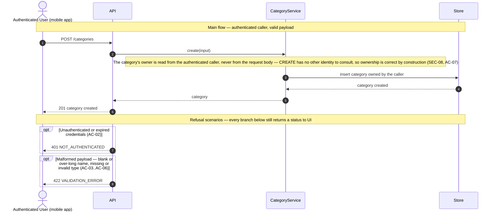
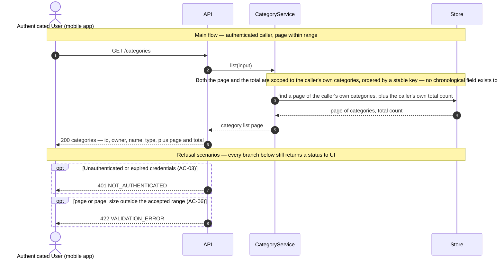

# Technical Plan: Category Management (CM)

> **Feature:** SRS §6 Feature-04 · SDS §5.4 (CM)
> **Spec:** [spec.md](spec.md)
> **Stories in this file:** CM-US-01 *(implemented, verified — 219 passed, 99% coverage)* · CM-US-02 *(planned)*

---

## CM-US-01: Create a Category

### Gaps & Decisions (Resolved)

Code and architecture decisions settled during design. Spec-level findings were folded back into `spec.md` before this step closed.

| ID | Area | Decision | Status |
|----|------|----------|--------|
| G1 | Reference docs | **SDS §2.2 / §4.3.3 `icon` contradiction, aligned at the document.** §2.2's Category domain object lists `(id, user_id, name, type, icon)`; §4.3.3's `CATEGORIES` ERD block listed only `id, user_id, name, type` — no `icon`. §5.4.4's CM-US-04 goal ("Modify category name, type, or icon") is a third, independent SDS passage that already assumes `icon` is real, which tips the disagreement: the ERD is the more likely slip, the same class of gap WM-US-01's `plan.md` A5 found in `wallets.created_at`. Unlike A5's treatment, this is a genuine *internal* SDS contradiction (both sides are the same document, not SDS vs. reality), so `CLAUDE.md`'s "aligning is routine" applies directly — `SDS.md` §4.3.3 was corrected to add a nullable `string icon` to the `CATEGORIES` block, logged in §1.6 as v1.4.0. This is a document fix only: it does not obligate CM-US-01 to build the column — see A4. | ✅ Resolved |
| A1 | Domain | **`name` is bounded at 100 characters.** No SRS or SDS source states a length rule for category name. WM-US-01's own `name` field (also a short free-text label with no stated bound) settled on 100 characters (`plan.md` A-equivalent DTO block); reusing that exact number keeps one convention for "a short free-text label" in this codebase rather than inventing an unrelated bound with no textual support either way. `CategoryCreate.name: str = Field(min_length=1, max_length=100)`. | ✅ Resolved |
| A2 | Domain | **`type` is a closed enum, `CategoryType` — unlike Wallet's free-text `type` (WM-US-01 A1).** SRS FR-04 names a real, closed vocabulary: "classified as either `INCOME` or `EXPENSE`" — two named literals, not an open set of illustrative examples the way Wallet's `type` was. Modelled exactly like `UserStatus`/`UserRole` (`backend/app/models/user.py`): `class CategoryType(enum.StrEnum): INCOME = "INCOME"; EXPENSE = "EXPENSE"`, column `Enum(CategoryType, native_enum=False, length=10)` (constitution NC-05). `CategoryCreate.type: CategoryType` — Pydantic validates against the enum's exact literal members, so no case-folding or trimming happens anywhere in the chain (spec AC-06, EC-01, EC-06), matching this codebase's reject-don't-normalise precedent for every other closed-vocabulary or shape-validated field. | ✅ Resolved |
| A3 | Domain | **No uniqueness constraint on `categories.name`**, not even scoped to one User. No AC, EC, or BR requires it (spec EC-03), so no unique index and no service-layer duplicate check are added — directly following WM-US-01's own `plan.md` A6 for `wallets.name`. | ✅ Resolved |
| A4 | Domain / ERD | **`icon` is not created or populated by this story**, even though G1 aligned the *document* to say it belongs on Category. CM-US-01's own AC set (SRS Gherkin, FR-04, SDS §5.4.1's goal) never mentions `icon` — inventing create-time support for a field no AC here asks for would be extending the story past what it was specified to do (`CLAUDE.md` "extending is not aligning"). The `categories` table this story's migration creates therefore carries exactly `id`, `user_id`, `name`, `type` — no `icon` column yet. Adding it is CM-US-04's own decision to make, since CM-US-04 (`SDS §5.4.4`) is the story whose goal actually names icon-editing. This mirrors WM-US-01 A5's shape (flag a gap, defer the column to the story that needs it) with one difference: there, the *source document* was left with the gap still open; here, G1 closes the document-level gap now, while the *column* still waits for CM-US-04. | ✅ Resolved *(flagged, not closed — see spec.md Assumptions)* |
| A5 | Domain | **No `is_system` flag or nullable owner — the "system vs. user-defined category" concept is deferred entirely, not decided here.** CM-US-02's own goal (SDS §5.4.2, out of scope for this story) mentions "system and user-defined transaction categories," which could imply a category with no owning User. Nothing in CM-US-01's own AC set requires that distinction: every category *this* story creates is made by an authenticated User, for themselves. `categories.user_id` is therefore `NOT NULL`, FK to `users.id`, exactly like `wallets.user_id`. If CM-US-02 (List Categories) needs to surface shared or ownerless categories, raising and designing that is CM-US-02's own decision — not something CM-US-01 may pre-empt by guessing at a flag or a nullable column no AC here justifies. | ✅ Resolved |
| A6 | Security | **A client-supplied `user_id` (or `icon`, or any other unrecognised key) in the request body is structurally impossible to honour, not merely rejected.** `CategoryCreate` declares exactly two fields, `name` and `type` — no `user_id`, no `icon`. An extra key in the submitted JSON is silently ignored by Pydantic's default `BaseModel` behaviour (no `model_config = {"extra": "forbid"}`, matching every existing schema in this codebase, none of which sets it) — ownership is enforced by the DTO's shape (constitution SEC-08, spec AC-07, BR-01), and `icon`'s absence from the DTO is what makes spec EC-05/FR-09 true by construction rather than by a check that could be forgotten. Directly mirrors WM-US-01 A7. | ✅ Resolved |
| A7 | Security | **No role restriction.** `CurrentUserDep` — not `AdminDep` — guards this route. SRS §6 US-04-01 names the actor "Authenticated User" with no role qualifier, and SDS §5.4.1 tags the story "(USER)", meaning any authenticated account, not an ADMIN-only action. Directly mirrors WM-US-01 A8. | ✅ Resolved |
| A8 | Architecture | **No audit event.** Constitution LA-04 enumerates exactly three audited event families — invitations sent, activations completed, logins — and category creation is not among them. No AC or FR in `spec.md` asks for one either. Directly mirrors WM-US-01 A9. | ✅ Resolved |

---

### Architecture

**Package layout** (additions only — every foundation module below already exists and is reused unchanged; `WalletModel`'s sibling files are the closest precedent throughout).

```text
backend/app/
├── models/
│   └── category.py                   # NEW  CategoryType, CategoryModel (SDS §2.1, §2.2, §4.3.3)
├── schemas/
│   └── category.py                   # NEW  CategoryCreate, CategoryRead
├── repositories/
│   └── category_repo.py              # NEW  add_category()
├── services/
│   └── category_service.py           # NEW  create_category()
└── api/v1/
    ├── categories.py                 # NEW  POST /categories
    └── router.py                     # update: mount categories.router

backend/migrations/versions/
└── <rev>_create_categories.py        # NEW  categories table (DOD-02), down_revision = 022fc9649eb5 (current head)

backend/tests/
└── integration/test_cm_us_01_create_category.py   # NEW  written at the Implement step from test_cases.md
```

No change to `core/deps.py` — `CurrentUserDep` (`get_current_user`) already resolves any authenticated `ACTIVE` User of either role and is reused exactly as-is (A7).

**Domain objects**

| Entity | Table | Key Fields | Notes |
|--------|-------|------------|-------|
| `CategoryModel` | `categories` | `id` PK, `user_id` FK→`users.id` (indexed), `name`, `type` | No `icon` this story (A4). `id` is `String(36)` UUID text, matching `UserModel`/`WalletModel` (constitution ENV-03). `user_id` carries an index — every future query on this table filters by owner (constitution SEC-08, PF-02), the same forward-looking index WM-US-01 added for `wallets.user_id`. |
| `CategoryType` | — | `INCOME`, `EXPENSE` | New `enum.StrEnum` (A2) — the first Category-adjacent field with a real closed vocabulary in this codebase's second story to define one (after `UserStatus`/`UserRole`). |

**DTOs** (`app/schemas/category.py`)

```python
class CategoryCreate(BaseModel):
    # Trimmed and required non-empty after trimming (spec AC-03, EC-02);
    # bounded at the column width (spec AC-04; plan.md A1).
    name: str = Field(min_length=1, max_length=100)

    # Closed enum, no case-folding, no trimming (plan.md A2;
    # spec AC-05, AC-06, EC-01, EC-06).
    type: CategoryType

class CategoryRead(BaseModel):
    id: str
    user_id: str
    name: str
    type: CategoryType
```

`name`'s trim is a `field_validator`, the same opt-in-per-field technique `WalletCreate.name` uses — no model-wide `str_strip_whitespace`. A trimmed-to-empty name still fails `min_length=1` inside the same validator (spec AC-03). `CategoryCreate` declares no `user_id` and no `icon` field at all (A6) — an extra key of either name in the submitted JSON is silently ignored by Pydantic's default behaviour, never read.

**Business rules enforced in service layer**

| Rule | Source | Enforcement |
|------|--------|--------------|
| Authenticated User of any role may create a category | AC-01, FR-01, A7 | `POST /api/v1/categories` accepting `CategoryCreate`, guarded by `CurrentUserDep` — not `AdminDep` |
| Unauthenticated caller denied before the payload is evaluated | AC-02, FR-02 | `CurrentUserDep` resolves before FastAPI validates the body — identical ordering to WM-US-01 |
| Name required, trimmed, bounded | AC-03, AC-04, EC-02, FR-03, A1 | `CategoryCreate` field validator: strip, reject empty, `max_length=100` |
| Type required, exactly `INCOME`/`EXPENSE`, no folding or trimming | AC-05, AC-06, EC-01, EC-06, FR-04, A2 | `type: CategoryType` — Pydantic's enum validation rejects any value that is not one of the two exact literal members, a `422` before the service runs |
| Owner is always the caller, never client input | AC-07, FR-05, A6, constitution SEC-08 | `category_service.create_category(db, owner=current_user, ...)` reads `owner.id`; `CategoryCreate` has no `user_id` field to read from instead |
| Response exposes exactly four fields, no `icon` | AC-08, FR-06, A4, constitution PF-03 | `CategoryRead` — no ORM graph, no extra field |
| Extra `icon` (or other unrecognised) key ignored | EC-05, FR-09, A6 | `CategoryCreate` has no such field to bind to; nothing reads it |
| Every validation failure reported together | EC-04, FR-07, constitution VL-02 | Reuses the existing `RequestValidationError` handler in `main.py` — unchanged, no new wiring |
| No uniqueness constraint on name | EC-03, FR-08, A3 | No unique index on `categories.name`; no service-layer duplicate check |
| No audit event | A8 | `category_service.create_category()` calls no `audit.record()` |

**Sequence diagram — Create a Category**

Drawn to `constitution.md` DG-01…DG-07: four lanes only, no SQL, no parameter lists, every request into `API` answered back to `UI` with a status code.



Only one workflow is drawn (DG-07) — no recovery path or background step exists for category creation, the same shape as WM-US-01's diagram.

**Error flows**

| Scenario | HTTP | Error Code |
|----------|------|------------|
| No or invalid bearer credentials (AC-02) | 401 | `NOT_AUTHENTICATED` |
| Blank or over-long name, missing or invalid type (AC-03..AC-06) | 422 | `VALIDATION_ERROR` |
| Unexpected server error | 500 | `INTERNAL_ERROR` |

All in the flat envelope `{"error_code", "message", "details"}` (SDS §6.6, constitution API-02) — reused unchanged from `main.py`. No `403` (A7: no role restriction) and no `409` (A3: no uniqueness to conflict on).

**Constitution notes**

| Rule | Status | Note |
|------|--------|------|
| AR-01 Service owns business rules | Required | `category_service.create_category()` is the only place that decides the owner and assembles the persisted row |
| AR-02 Thin router | Required | Router binds the payload, resolves `CurrentUserDep`, calls the service, commits, formats the response — no branching on business state |
| AR-03 Repository isolation | Required | `category_repo.add_category()` persists only; every validation rule already ran in the Pydantic layer or the service before it is called |
| AR-04 DTO ↔ model mapping outside routers/repos | Required | No field-name mapping is needed this story (`name`/`type` are identical on DTO and column), but the service, not the router, is still the boundary that would carry it |
| AR-05 No framework objects in services | Required | `create_category()` takes plain values (`owner: UserModel`, `name`, `category_type`); no `Request`/`Response` |
| AR-06 One transaction per request | Required | Service flushes; the router commits once |
| AR-08 Module layout | Required | `backend/app/{models,schemas,repositories,services,api}` — no new top-level package |
| API-01 Versioned plural path | Required | `POST /api/v1/categories` |
| API-02 Flat error envelope | Required | Reused from `main.py`, unchanged |
| API-03 Status codes | Required | `201` create · `401` · `422` validation |
| API-04 Prefixed error codes | N/A | This story introduces no new error code — `NOT_AUTHENTICATED` and `VALIDATION_ERROR` already exist |
| API-05 No generic status endpoint | Required | `/categories` is a plain resource-creation `POST`, not a status-transition endpoint |
| API-06 Pagination | N/A | Single-resource creation; no list in this story |
| API-07 Explicit response_model | Required | `response_model=CategoryRead`, `status_code=201` |
| API-08 Public endpoint list | Required | This route is **protected** — not added to the public list |
| NC-01 Module naming | Required | `category_repo.py`, `category_service.py` — singular, matching `wallet_repo.py`/`wallet_service.py` |
| NC-02 Naming | Required | `CategoryModel`; `CategoryCreate` / `CategoryRead` (SDS §2.1); table `categories` |
| NC-04 Column naming | Required | snake_case; `user_id` FK |
| NC-05 Enum serialisation | Required | `type` is `CategoryType`, an `Enum(..., native_enum=False, length=10)` column serialising as `"INCOME"`/`"EXPENSE"` — unlike Wallet's `type`/`currency` (A2), this is the first Category-story field this codebase gives a real enum column since `UserStatus`/`UserRole` |
| NC-06 Concise service methods | Required | `CategoryService.create`, matching `WalletService.create` |
| VL-01 Pydantic is the source of truth | Required | Every bound (length, enum membership) lives on `CategoryCreate` |
| VL-02 Errors grouped | Required | Reused `RequestValidationError` handler (EC-04) |
| VL-07 Decimal money | N/A | Category carries no monetary field |
| SEC-06 JWT parameters | N/A | Consumed via `CurrentUserDep`, not defined here |
| SEC-07 Authz proven by test | Required (partial) | `401` gets a dedicated test; there is no `403` case to test (A7) |
| SEC-08 Ownership filter | Required | The one row this story ever writes is scoped to the caller by construction (A6) — the read-side half of SEC-08 has no query to filter yet and becomes real only with CM-US-02 |
| SEC-09 Secrets from .env | N/A | No secret is introduced by this story |
| SEC-10 No enumeration | N/A | No existence check against another User's data occurs here |
| SEC-11 Rate limiting | N/A | Scoped by its own text to the invitation and activation endpoints |
| LA-01 No secrets in logs | N/A | No credential or token is handled by this story |
| LA-02 / LA-04 Audit | N/A (by decision) | Category creation is not one of LA-04's three named audited events, and no AC/FR asks for a fourth (A8) |
| PF-01 300 ms p95 | Required | No I/O off the request path is needed — a single insert |
| PF-02 Indexed lookups | Required | `categories.user_id` indexed now, ahead of CM-US-02's need for it |
| PF-03 DTO projection | Required | `CategoryRead` — four fields, no ORM graph |
| TST-01/02 AC→TC coverage | Required | Every AC and EC mapped in `test_cases.md` before any test code |
| DOD-02 Migration | Required | One Alembic revision creating `categories`, `down_revision = 022fc9649eb5` (current head) |
| DOD-03 Coverage > 80% | Required | Measured at the Implement step |

**Element IDs**

| Element | ID | Status | File |
|---------|----|--------|------|
| — | — | **N/A (mobile deferred)** | No category-creation screen exists this round. `mobile/`'s fixture-driven prototype covers only UM-US-01's invite screen (`CLAUDE.md` §5); a category-creation screen is not part of Round 1's mobile scope and no SRS UXR names one. |

**Open tasks**

| ID | Task | File | Status |
|----|------|------|--------|
| T-01 | `CategoryType` enum + `CategoryModel` (`id`, `user_id` FK indexed, `name`, `type` — no `icon`, A4) | `backend/app/models/category.py` | Open |
| T-02 | Alembic revision creating `categories` with its FK and index, `down_revision = 022fc9649eb5` | `backend/migrations/versions/` | Open |
| T-03 | Schemas `CategoryCreate`, `CategoryRead` | `backend/app/schemas/category.py` | Open |
| T-04 | `category_repo.add_category(db, *, user_id, name, category_type)` | `backend/app/repositories/category_repo.py` | Open |
| T-05 | `category_service.create_category(db, *, owner, name, category_type)` | `backend/app/services/category_service.py` | Open |
| T-06 | `POST /api/v1/categories` router; mount `categories.router` in `api/v1/router.py` | `backend/app/api/v1/categories.py`, `backend/app/api/v1/router.py` | Open |
| T-07 | Integration tests written from `test_cases.md` | `backend/tests/integration/test_cm_us_01_create_category.py` | Open |

---

## CM-US-02: List Categories

> **IDs in this section are local to CM-US-02** (`A*`/`T-NN`), matching `spec.md`'s convention. Only
> `TC-NN` in `test_cases.md` continues across this epic file — this story continues from `TC-18`.
> **`QF-NN` also continues here**, from `QF-05` (CM-US-01 used `QF-01`…`QF-04`) — matching the
> continuing convention `specs/003-wallet-management/test_cases.md` (WM-US-02) and
> `specs/006-transaction-management/test_cases.md` (TM-US-02) both already adopted and reasoned
> through in detail, over `specs/001-user-onboarding/test_cases.md`'s per-story reset. This is the
> first point in this epic file where the choice actually has to be made explicit — CM-US-01 was the
> file's first story, so nothing distinguished "reset" from "continue" for it — and it is decided the
> same way the majority, more-recently-established precedent in this codebase already decided it.

### Gaps & Decisions (Resolved)

| ID | Area | Decision | Status |
|----|------|----------|--------|
| A1 | Domain / ERD | **Ordering with no `created_at`: order by the primary key `id` ascending (`ORDER BY id ASC`), no schema change.** `backend/app/models/category.py` carries no `created_at` column, and SDS §4.3.3's `CATEGORIES` ERD (as aligned by CM-US-01 G1 to add `icon`) still lists only `id`, `user_id`, `name`, `type`, `icon` — no timestamp. This is the identical gap WM-US-01 A5 found for `wallets` and WM-US-02 A1 designed around; the same reasoning transfers directly — adding a column the ERD does not list is a domain-model change reserved for the user's own decision (`CLAUDE.md` §1), and no AC in either reference document asks for chronological order, only *a* list. Ordering by `id` gives a total, stable, gap-free, duplicate-free order across pages at zero schema cost, at the accepted cost of carrying no chronological meaning (full rationale: `spec.md` Assumptions; risk of a false impression of meaningful order: `test_cases.md` QF-06). | ✅ Resolved |
| A2 | API | **New envelope `CategoryListRead { items, total, page, page_size }`**, mirroring `WalletListRead` (WM-US-02 A2) and `TransactionListRead` (TM-US-02 A8) exactly. `CategoryRead` itself is reused unchanged as the per-item shape (four fields — `id`, `user_id`, `name`, `type`; no `icon`, CM-US-01 A4) — SDS §2.1's traceability row already names it as Category's read DTO. | ✅ Resolved |
| A3 | Security / Architecture | **Pagination and ownership filtering combined, single-table `WHERE`.** Both the bounded page query and the total-count query in `category_repo.list_owned()` carry the identical `WHERE user_id = :owner_id` predicate — copying WM-US-02 A3's own single-table shape exactly (this story has no join to a second table the way TM-US-02 A2 does). Scoping only one of the two queries would either leak a system-wide count next to a caller-scoped list, or scope the count but not the items — both wrong in different ways (`test_cases.md` QF-05). | ✅ Resolved |
| A4 | Architecture | **The router issues no `db.commit()`.** Pure read, nothing to commit — mirrors `GET /wallets` (WM-US-02 A4) and `GET /transactions` (TM-US-02 A9). | ✅ Resolved |
| A5 | Logging | **No new audit event for a list view.** Constitution LA-04 names exactly three audited event families (invitations sent, activations completed, logins); category creation itself was already excluded by CM-US-01 A8, and reading a list is further still from anything LA-04 enumerates. No AC or FR here asks for one. | ✅ Resolved |
| A6 | Security | **No role restriction — `CurrentUserDep` guards the route, not `AdminDep`.** SDS §5.4.2 tags this story "(USER)", identical to CM-US-01's own "(USER)" tag: any authenticated account, scoped to what it owns. An ADMIN caller who also owns categories sees, through this route, only their own (spec EC-04, BR-01; `test_cases.md` QF-07); nothing elevates an ADMIN's visibility here. | ✅ Resolved |
| A7 | Domain / Scope | **No "system category" concept is built.** SDS §5.4.2's goal text — "system **and** user-defined transaction categories" — is the only source anywhere that implies a category with no owning User. CM-US-01 A5 explicitly deferred this exact question to this story rather than guessing. It is resolved here, not deferred again: SRS §1.5 states plainly that categories "belong to the User who created them, not to a shared list," SDS §2.1/§2.2/§2.3's own domain model draws exactly one relationship for Category (`User "1" -- "*" Category : defines`, no second ownerless class), and the schema CM-US-01 built has `categories.user_id NOT NULL` with no `is_system` column and no seed migration anywhere under `backend/migrations/versions/` creating an ownerless row. `CLAUDE.md`'s precedence rule gives SRS the win over SDS, and here SRS is explicit while SDS is one under-supported phrase contradicted by its own document's domain model — the same class of internal-SDS gap CM-US-01 G1 fixed for `icon`, except by phrase rather than by missing ERD column, and reaching into SRS too. Inventing nullable ownership or an `is_system` flag now, on the strength of one phrase with no seed data or ERD support anywhere, would be exactly the domain-model extension `CLAUDE.md` §1 reserves for a stop-and-ask decision. **Recommended, not performed in this dispatch:** a future SDS alignment pass reword §5.4.2's goal to drop "system and" — parallel to how v1.2.0 already removed the never-implemented `UserActivate`/`ActivateUser` name from §6.2.1 — left undone here because this dispatch's file scope is limited to `specs/004-category-management/`. | ✅ Resolved |
| A8 | Domain / API | **No `type` filter.** SDS §5.4.2's goal sentence names no filter dimension, unlike TM-US-02's own SDS §5.6.2 goal ("Query and filter logged transactions by wallet, category, or date range"), which is precisely why that story built three filters unprompted by SRS. No equivalent sentence exists for this story. Declining mirrors WM-US-02's own declination to filter by wallet `type`/`currency`/`balance` when nothing asked for it. | ✅ Resolved |

---

### Architecture

**Package layout** (additions/updates only — CM-US-01's foundation is reused as-is unless noted;
**no new Alembic migration this story** — see note below).

```text
backend/app/
├── schemas/
│   └── category.py                   # update: add CategoryListRead (A2)
├── repositories/
│   └── category_repo.py              # update: add list_owned(db, *, user_id, page, page_size)
└── services/
    └── category_service.py           # update: add list_categories()

backend/app/api/v1/
└── categories.py                     # update: add GET /categories (list)

backend/tests/
└── integration/test_cm_us_02_list_categories.py   # NEW  written at the Implement step from test_cases.md
```

No change to `core/deps.py` — `CurrentUserDep` is reused exactly as CM-US-01 already established
(A6). **No new Alembic revision**: this story adds no column and needs no new index —
`categories.user_id` already carries one (CM-US-01 T-01/T-02, `ix_categories_user_id`), and ordering
by the primary key `id` needs nothing beyond what every table already has (constitution PF-02 — a
primary key is indexed by construction on both SQLite and PostgreSQL). The current migration head
(`2187429f50ce`) is unaffected.

**Domain objects**

| Entity | Table | Fields touched | Notes |
|--------|-------|-----------------|-------|
| `CategoryModel` | `categories` | none (read-only) | This story only reads. No new column — ordering uses the existing `id` primary key (A1), not a new `created_at`. No `is_system`/nullable-owner column either (A7). |
| `CategoryRead` (DTO) | — | `id`, `user_id`, `name`, `type` | Reused unchanged from CM-US-01 — the same four fields; no list-specific per-item variant (A2). |
| `CategoryListRead` (DTO) | — | `items: CategoryRead[]`, `total`, `page`, `page_size` | New envelope (A2), mirrors `WalletListRead`/`TransactionListRead` — not in SDS's registry. |

**DTOs** (`app/schemas/category.py`, addition)

```python
class CategoryListRead(BaseModel):
    """New envelope (A2) — mirrors WalletListRead (WM-US-02 plan.md A2) and
    TransactionListRead (TM-US-02 plan.md A8). CategoryRead's own four
    fields are reused unchanged as the per-item shape (CM-US-01, this
    story's A2) — no icon, no other entity's data folded in.
    """

    items: list[CategoryRead]
    total: int
    page: int
    page_size: int
```

**Business rules enforced in service layer**

| Rule | Source | Enforcement |
|------|--------|--------------|
| Any authenticated User of any role may list their own categories | AC-01, FR-01, A6 | `GET /api/v1/categories` guarded by `CurrentUserDep` — not `AdminDep`, mirrors CM-US-01's own route guard |
| Unauthenticated caller denied before any query parameter is evaluated | AC-03, FR-03 | `CurrentUserDep` resolves before FastAPI validates `page`/`page_size` — identical ordering to `GET /wallets` (WM-US-02 TC-27) |
| Every category query scoped to the caller — items and total alike | AC-07, FR-07, FR-10, A3, constitution SEC-08 | `category_repo.list_owned()` — both queries carry `WHERE user_id = :owner_id` |
| Bounded, paginated results | AC-04, AC-05, AC-06, API-06, PF-04 | Router declares `Query(page, ge=1)` / `Query(page_size, ge=1, le=100)` — out-of-range is `422`, not clamped |
| Stable, deterministic order | AC-08, EC-03, BR-03, A1 | `ORDER BY id ASC` in `category_repo.list_owned()` — the one column guaranteed unique and present without a schema change |
| Accurate, caller-scoped total | AC-01, AC-02, AC-04, AC-05, EC-01, A3, BR-04 | `category_repo.list_owned()` computes the count under the identical `user_id` predicate as the page query |
| Projection reused unchanged, no filter, no system-category | AC-09, FR-02, FR-09, FR-10, PF-03, A7, A8 | `CategoryRead` — the same four fields CM-US-01 defined; no `type` query parameter declared on the route; no query capable of returning an ownerless row |
| Pure read, no commit | A4 | Router issues no `db.commit()` — mirrors `GET /wallets` |

**Repository** (`app/repositories/category_repo.py`, addition)

```python
def list_owned(
    db: Session, *, user_id: str, page: int, page_size: int
) -> tuple[Sequence[CategoryModel], int]:
    """A page of categories owned by `user_id`, plus that owner's own total
    count (spec AC-01, AC-04, AC-05, AC-07; plan.md A1, A3).

    Both queries carry the identical `user_id` predicate (constitution
    SEC-08) — the total is the caller's own category count, never the
    system-wide row count (test_cases.md QF-05). Ordered by `id`, the one
    column guaranteed to exist and be unique without a schema change (A1);
    this order carries no chronological meaning. Mirrors
    `wallet_repo.list_owned()` exactly (WM-US-02) — the same single-table
    shape, no join.
    """
    total = (
        db.scalar(
            select(func.count()).select_from(CategoryModel).where(CategoryModel.user_id == user_id)
        )
        or 0
    )
    items = db.scalars(
        select(CategoryModel)
        .where(CategoryModel.user_id == user_id)
        .order_by(CategoryModel.id.asc())
        .offset((page - 1) * page_size)
        .limit(page_size)
    ).all()
    return items, total
```

**Service** (`app/services/category_service.py`, addition)

```python
def list_categories(
    db: Session, *, owner: UserModel, page: int, page_size: int
) -> CategoryListRead:
    """Assemble a page of the caller's own categories into the
    `CategoryListRead` envelope (A2, A3).

    Unlike `user_service.list_users`, this calls no `clock.ensure_aware()` —
    `CategoryRead` carries no datetime field to normalise (mirrors
    `wallet_service.list_wallets`, WM-US-02).
    """
    items, total = category_repo.list_owned(db, user_id=owner.id, page=page, page_size=page_size)
    return CategoryListRead(
        items=[
            CategoryRead(
                id=c.id,
                user_id=c.user_id,
                name=c.name,
                type=c.type,
            )
            for c in items
        ],
        total=total,
        page=page,
        page_size=page_size,
    )
```

**Router** (`app/api/v1/categories.py`, addition)

```python
@router.get(
    "",
    response_model=CategoryListRead,
    status_code=status.HTTP_200_OK,
    summary="List the caller's categories",
    description=(
        "Returns every category owned by the authenticated caller, paginated, "
        "with an accurate total scoped to that caller."
    ),
    responses={
        401: {"description": "NOT_AUTHENTICATED"},
        422: {"description": "VALIDATION_ERROR"},
    },
)
def list_categories(
    db: DbDep,
    current_user: CurrentUserDep,
    page: int = Query(1, ge=1),
    page_size: int = Query(25, ge=1, le=100),
) -> CategoryListRead:
    """Pure read — no `db.commit()` (A4)."""
    return category_service.list_categories(db, owner=current_user, page=page, page_size=page_size)
```

**Sequence diagram — List Categories**

Drawn to `constitution.md` DG-01…DG-07: four lanes only, no SQL, no parameter lists, every request
into `API` answered back to `UI` with a status code.



Only one workflow is drawn (DG-07) — there is no recovery path or background step, the same shape
CM-US-01's own diagram already established for a story with no prior state to reconcile against.

**Error flows**

| Scenario | HTTP | Error Code |
|----------|------|------------|
| No or invalid bearer credentials (AC-03) | 401 | `NOT_AUTHENTICATED` |
| `page` or `page_size` not a positive integer, or `page_size` > 100 (AC-06) | 422 | `VALIDATION_ERROR` |
| Unexpected server error | 500 | `INTERNAL_ERROR` |

No new error class this story — all three codes already exist in `core/errors.py`, reused as-is. All
in the flat envelope `{"error_code", "message", "details"}` (SDS §6.6, constitution API-02). No `403`
(A6: no role restriction) and no `409` (a read has nothing to conflict on).

**Constitution notes**

| Rule | Status | Note |
|------|--------|------|
| AR-01 Service owns business rules | Required | `category_service.list_categories()` assembles the DTO; the repository does not decide *what* to enforce |
| AR-02 Thin router | Required | Router binds `page`/`page_size`, resolves `CurrentUserDep`, delegates, formats the response — no branching on business state |
| AR-03 Repository isolation | Required | `category_repo.list_owned()` is a query only — filtering, ordering, and limiting, no business rule |
| AR-04 DTO ↔ model mapping outside routers/repos | Required | `CategoryModel` → `CategoryRead` mapping happens in `category_service.list_categories()`, not the router or `category_repo.list_owned()` |
| AR-05 No framework objects in services | Required | `list_categories()` takes plain `owner: UserModel`, `page`, `page_size`; no `Request`/`Response` |
| AR-06 One transaction per request | N/A | Pure read, nothing to commit (A4) |
| AR-07 router → service → repository | Required | Router never calls `category_repo` directly |
| AR-08 Module layout | Required | No new top-level package; additions only to existing modules |
| API-01 Versioned plural path | Required | `GET /api/v1/categories` |
| API-02 Flat error envelope | Required | Reused from `main.py`, unchanged |
| API-03 Status codes | Required | `200` read · `401` · `422` validation |
| API-04 Prefixed error codes | N/A | No new error code — `NOT_AUTHENTICATED` and `VALIDATION_ERROR` already catalogued |
| API-05 No generic status endpoint | Required | `GET /categories` is a plain resource-listing route, not a status-transition endpoint |
| API-06 Pagination | Required | `page`/`page_size`, default 25, max 100, total count in `CategoryListRead` — this story's central constitution citation |
| API-07 Explicit response_model | Required | `response_model=CategoryListRead`, `status_code=200` |
| API-08 Public endpoint list | Required | This route is **protected** — not added to the public list |
| NC-01 Module naming | Required | No new module; additions to `category_repo.py`/`category_service.py`/`categories.py` |
| NC-02 Naming | Required | `CategoryListRead` (SDS §2.1 names `CategoryRead`; the envelope is new, A2) |
| NC-04 Column naming | N/A | No column change this story |
| NC-05 Enum serialisation | Required | Inherited unchanged from CM-US-01 — `type` continues to serialise as the exact literal `"INCOME"`/`"EXPENSE"`; this story adds no new enum |
| NC-06 Concise service methods | Required | `category_service.list_categories`, matching this codebase's own established style (`wallet_service.list_wallets`, `user_service.list_users`) |
| VL-01 Pydantic is the source of truth | Required | `Query(ge=1, le=100)` constraints are the validation, not a service-layer clamp |
| VL-02 Errors grouped | Required | Reused `RequestValidationError` handler |
| SEC-07 Authz proven by test | Required (partial) | `401` gets a dedicated test; there is no `403` case in this story (A6 — no role restriction) |
| SEC-08 Ownership filter | Required | Both the page query and the total-count query carry the `user_id` predicate (A3) |
| SEC-10 No enumeration | N/A | This endpoint takes no email or identifying parameter to probe |
| SEC-11 Rate limiting | N/A | Scoped by its own text to the invitation and activation endpoints |
| LA-01 No secrets in logs | N/A | No credential or token is handled by this story |
| LA-02 / LA-04 Audit | N/A (by decision) | Listing is not one of LA-04's three named audited events (A5) |
| PF-01 300 ms p95 | Required | No slow I/O in this path; a two-query read, both indexed |
| PF-02 Indexed lookups | Required | `categories.user_id` already indexed (CM-US-01); `id` (the sort key) is the primary key, indexed by construction — no new migration |
| PF-03 DTO projection | Required | `CategoryRead` — four fields, no ORM graph |
| PF-04 Bounded lists | Required | Enforced by API-06's cap — this story's other central citation |
| TST-01/02 AC→TC coverage | Required | Every AC and EC mapped in `test_cases.md` before any test code |
| TST-05 Boundaries | Required | EC-02 covers the exact `page_size=100` boundary; AC-06 covers zero/negative |
| DOD-02 Migration | N/A | No column or index change this story (see Architecture note) |
| DOD-03 Coverage > 80% | Required | Measured at the Implement step |

**Element IDs**

| Element | ID | Status | File |
|---------|----|--------|------|
| — | — | **N/A (mobile deferred)** | No category-list screen exists this round, the same treatment CM-US-01 gave category creation — `mobile/`'s fixture-driven prototype covers only UM-US-01's invite screen (`CLAUDE.md` §5). |

**Open tasks**

| ID | Task | File | Status |
|----|------|------|--------|
| T-01 | `CategoryListRead` envelope (A2) | `backend/app/schemas/category.py` | Open |
| T-02 | `category_repo.list_owned(db, *, user_id, page, page_size)` — ownership-scoped page + total (A1, A3) | `backend/app/repositories/category_repo.py` | Open |
| T-03 | `category_service.list_categories(db, *, owner, page, page_size) -> CategoryListRead` (A2, A3) | `backend/app/services/category_service.py` | Open |
| T-04 | `GET /api/v1/categories` router — `Query(page, ge=1)` / `Query(page_size, ge=1, le=100)`, guarded by `CurrentUserDep`, no `db.commit()` (A4, A6) | `backend/app/api/v1/categories.py` | Open |
| T-05 | Integration tests written from `test_cases.md` | `backend/tests/integration/test_cm_us_02_list_categories.py` | Open |
