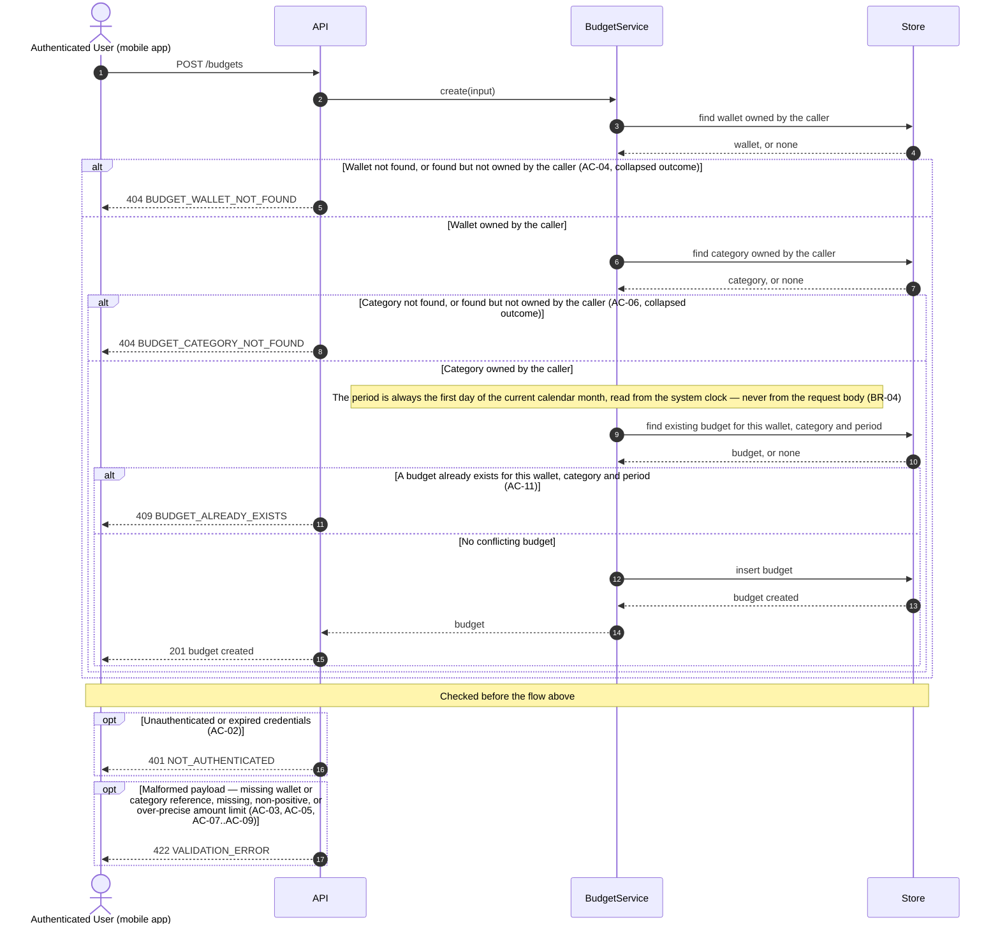

# Technical Plan: Budget Management (BM)

> **Feature:** SRS §6 Feature-05 · SDS §5.5 (BM)
> **Spec:** [spec.md](spec.md)
> **Stories in this file:** BM-US-01 *(planned)*

---

## BM-US-01: Create a Budget

### Gaps & Decisions (Resolved)

Code and architecture decisions settled during design. Spec-level findings were folded back into `spec.md` before this step closed.

| ID | Area | Decision | Status |
|----|------|----------|--------|
| A1 | Domain | **`BudgetCreate` requires both `wallet_id` and `category_id`**, even though the SRS Gherkin scenario names only a category. The Gherkin is read as an abbreviated illustrative example, not a complete field list (the same treatment WM-US-01's `plan.md` A1 gave its own Gherkin's `type` examples) — SRS §1.5 itself draws both `Wallet scoped_to Budget` and `Category applies_to Budget` as required relationships, and SDS §2.2 (domain object), §2.3 (class diagram), and §4.3.3 (ERD) unanimously list `wallet_id` and `category_id` as required columns with no nullability hint anywhere. There is no genuine cross-document conflict here — the fuller sources all agree, and only the shorthand Gherkin omits a field, exactly as it omits an explicit period. Not escalated as `[NEEDS RULING]` because nothing actually disagrees. | ✅ Resolved |
| A2 | Domain | **`BudgetCreate` has no `period` field at all; `period` is computed server-side as the first day of the current calendar month**, read from `app.core.clock.utcnow()` (never `datetime.now()` — CLAUDE.md §4). No source shows a person choosing a period: the SRS Gherkin has the User enter only a category and a limit before clicking Save, and SDS §5.5.1's goal describes "a monthly period" as a property the budget carries, not an input field. Accepting an explicit `period` would require inventing validation rules no source states — how far into the past or future a period may be, what happens to a non-first-of-month value, whether multiple formats are accepted — while defaulting to "the current month" requires inventing nothing. This is the same "decide, document, keep moving" discipline WM-US-01/CM-US-01 used for their own undictated fields, applied here to prefer the interpretation that invents the fewest additional rules. `BudgetCreate` therefore declares no `period` field; any `period`-shaped key a caller submits anyway is silently ignored by Pydantic's default `BaseModel` behaviour, the same "structurally impossible to honour" pattern as WM-US-01 A7 and CM-US-01 A6 (spec EC-04). | ✅ Resolved |
| A3 | Domain | **A duplicate budget for the same `wallet_id` + `category_id` + `period` is refused — a deliberate departure from WM-US-01 A6 / CM-US-01 A3's "no uniqueness constraint" precedent for wallet and category names.** Reasoned independently rather than pattern-matched: a duplicate wallet or category *name* is cosmetic — two wallets named "Savings" are simply two different accounts with no functional ambiguity. Two budgets covering the same wallet, category, and month are different in kind: FR-05's own text ("track spending against **this** limit" and threshold percentages at 75%/100%) presupposes exactly one limit governs a given wallet+category+period, and BM-US-03 (out of scope here, but already named by the SDS §2.4.3 state machine this story's data feeds) has no well-defined "spending / limit" ratio to compute if two limits exist for the same period. This mirrors why `users.email` (UM-US-01 VL-05), unlike a wallet name, carries a uniqueness constraint — because a collision would break a real downstream lookup, not merely look confusing. Enforced at both levels constitution VL-05 requires: a service-layer check returning `409 BUDGET_ALREADY_EXISTS`, and a database unique index (`uq_budgets_wallet_category_period`) as the backstop. | ✅ Resolved |
| A4 | Domain / Money | **`amount_limit` must be strictly greater than zero — a departure from WM-US-01 A4's "no sign constraint" precedent for `wallets.balance`.** A wallet balance is a *state* that can legitimately go negative (a credit-type wallet already in debt); a budget's `amount_limit` is a *cap* a person deliberately sets, and the SRS's own and only example is positive (`200.00`). FR-05's threshold language ("75%, 100%") is meaningless against a zero or negative limit — there is no sensible "75% of a zero cap." `BudgetCreate.amount_limit` therefore adds `gt=0` alongside the `Decimal(15,2)` bound WM-US-01 A3 already established and this story reuses unchanged. | ✅ Resolved |
| A5 | Domain | **`wallet_id` and `category_id` are plain non-empty strings with no UUID-shape validation** (`Field(min_length=1)`), not a regex-constrained or native UUID type. This codebase's own `id` columns are `String(36)` free text (constitution ENV-03), and no existing DTO in this codebase validates an incoming foreign-key-shaped string against a UUID pattern. A malformed reference (`"not-a-real-id"`) and a well-formed but non-existent one both fail the same ownership-scoped lookup (A6) and so already produce the identical `404` outcome without any extra rule — adding shape validation would only create a *second*, `422`-flavoured error class for what is functionally the same caller mistake ("this does not name a wallet/category you own"), which nothing in the requirements asks for. Recorded as spec EC-07. | ✅ Resolved |
| A6 | Architecture | **Layering split for the two ownership checks, per constitution AR-01/AR-03.** The *query* — "does a wallet with this id, owned by this user, exist" — is data access with no business decision in it, so it lives in the repository layer as a new `get_owned_by_id()` function added to the existing `wallet_repo.py` and `category_repo.py` (not a new module — these two files already exist from WM-US-01/CM-US-01 and simply gain a second function each, the same way `user_repo.py` accumulated functions across UM-US-01/02/03). The *decision* — "a `None` result means refuse the whole request, and with which error" — is a business rule, so it lives in the new `budget_service.py` (AR-01), which calls the repository function and raises `BudgetWalletNotFoundError`/`BudgetCategoryNotFoundError` on `None`. The duplicate-budget check follows the identical split: the existence query is a new `budget_repo.get_by_wallet_category_period()`, the refusal decision is `budget_service`'s. | ✅ Resolved |
| A7 | Security | **`BudgetCreate` declares no field a client could use to name a budget's "owner"**, because there is no owner column to spoof in the first place — SDS §4.3.3's `BUDGETS` ERD has no `user_id` at all, unlike `wallets`/`categories`. Ownership is proven entirely by the two ownership-scoped lookups in A6: a `wallet_id`/`category_id` the caller does not own is refused before a `BudgetModel` row is even considered, so there is no separate "assign the owner" step analogous to WM-US-01 A7 / CM-US-01 A6 for this story to get wrong. | ✅ Resolved |
| A8 | Domain / State | **The SDS §2.4.3 Budget Monitoring State machine (`DRAFT → NORMAL → WARNING → EXCEEDED → ARCHIVED`) is not implemented by this story, and `budgets` gets no `status` column.** The §4.3.3 ERD lists exactly `id`, `wallet_id`, `category_id`, `amount_limit`, `period` for `BUDGETS` — no status field — and no AC in this story's own set asks for one. The Gherkin's "creates an **active** budget" is read as describing the fact that the row now exists and will be monitored going forward, not a value this story stores; deriving and persisting real progress against that state machine needs spending data this story never reads, which is BM-US-03's job. Flagged here rather than silently building toward it, the same "flag a gap, defer the column to the story that needs it" shape as WM-US-01 A5 and CM-US-01 A4. | ✅ Resolved *(flagged, not closed — see spec.md Assumptions)* |
| A9 | Security | **No role restriction.** `CurrentUserDep` — not `AdminDep` — guards this route. SRS §6 US-05-01 names the actor "Authenticated User" with no role qualifier, and SDS §5.5.1 tags the story "(USER)". Directly mirrors WM-US-01 A8 / CM-US-01 A7. | ✅ Resolved |
| A10 | Architecture | **No audit event.** Constitution LA-04 enumerates exactly three audited event families — invitations sent, activations completed, logins — and budget creation is not among them. No AC or FR in `spec.md` asks for one either. Directly mirrors WM-US-01 A9 / CM-US-01 A8. | ✅ Resolved |
| A11 | Domain / ERD | **No `created_at` column on `budgets`.** SDS §4.3.3's ERD lists `budgets` with exactly the five columns named in A8 — no timestamp, the same gap WM-US-01 A5 found in `wallets`. Not added here for the same reason: a column the ERD does not list is a domain-model change outside this story's authority to make unilaterally. | ✅ Resolved *(flagged, not closed — see spec.md Assumptions)* |

---

### Architecture

**Package layout** (additions only; `WalletModel`/`CategoryModel`'s sibling files are the closest precedent throughout — this is the first story to *modify* two existing repository modules rather than only adding new ones).

```text
backend/app/
├── models/
│   └── budget.py                     # NEW  BudgetModel (SDS §2.1, §2.2, §4.3.3)
├── schemas/
│   └── budget.py                     # NEW  BudgetCreate, BudgetRead
├── repositories/
│   ├── wallet_repo.py                # MODIFIED  add get_owned_by_id()
│   ├── category_repo.py              # MODIFIED  add get_owned_by_id()
│   └── budget_repo.py                # NEW  add_budget(), get_by_wallet_category_period()
├── services/
│   └── budget_service.py             # NEW  create_budget()
├── core/
│   └── errors.py                     # MODIFIED  add BudgetWalletNotFoundError, BudgetCategoryNotFoundError, BudgetAlreadyExistsError
└── api/v1/
    ├── budgets.py                    # NEW  POST /budgets
    └── router.py                     # MODIFIED  mount budgets.router

backend/migrations/versions/
└── <rev>_create_budgets.py           # NEW  budgets table, down_revision = 81bfb85427ed (current head)

backend/tests/
└── integration/test_bm_us_01_create_budget.py   # NEW  written at the Implement step from test_cases.md
```

No change to `core/deps.py` — `CurrentUserDep` (`get_current_user`) already resolves any authenticated `ACTIVE` User of either role and is reused exactly as-is (A9).

**Domain objects**

| Entity | Table | Key Fields | Notes |
|--------|-------|------------|-------|
| `BudgetModel` | `budgets` | `id` PK, `wallet_id` FK→`wallets.id` (indexed), `category_id` FK→`categories.id` (indexed), `amount_limit`, `period` | No `user_id` (A7), no `status` (A8), no `created_at` (A11) — exactly the five ERD columns. Both FKs carry an index: every query this story or a future one runs against `budgets` filters by one or both (constitution PF-02), and the ownership lookups in A6 are themselves indexed lookups on `wallets.id`/`categories.id`, already primary-keyed. |
| — | — | `uq_budgets_wallet_category_period` | Composite unique constraint on `(wallet_id, category_id, period)` — the database backstop half of VL-05's two-level uniqueness (A3). |

**Model** (`app/models/budget.py`)

```python
class BudgetModel(Base):
    __tablename__ = "budgets"

    id: Mapped[str] = mapped_column(String(36), primary_key=True, default=new_uuid)

    # spec BR-01: ownership is entirely transitive through this FK — no
    # user_id column exists on this table at all (A7).
    wallet_id: Mapped[str] = mapped_column(
        String(36), ForeignKey("wallets.id"), nullable=False, index=True
    )
    category_id: Mapped[str] = mapped_column(
        String(36), ForeignKey("categories.id"), nullable=False, index=True
    )

    # spec BR-03, constitution VL-07: Decimal(15,2), strictly positive (A4).
    amount_limit: Mapped[Decimal] = mapped_column(Numeric(15, 2), nullable=False)

    # spec BR-04: always the 1st of the current month at creation (A2).
    period: Mapped[date] = mapped_column(Date, nullable=False)

    __table_args__ = (
        # spec BR-05, plan.md A3: at most one budget per wallet+category+period.
        UniqueConstraint(
            "wallet_id", "category_id", "period", name="uq_budgets_wallet_category_period"
        ),
    )

    def __repr__(self) -> str:  # pragma: no cover - debugging aid
        return f"<BudgetModel id={self.id} wallet_id={self.wallet_id} category_id={self.category_id}>"
```

**DTOs** (`app/schemas/budget.py`)

```python
class BudgetCreate(BaseModel):
    """No `period` field (A2, spec EC-04) — a submitted one is silently
    ignored, the same "structurally impossible to honour" pattern as
    WalletCreate/CategoryCreate's absent `user_id` field. No UUID-shape
    validation on the two references (A5) — an unresolvable value of any
    shape is refused identically by the ownership-scoped lookup (A6).
    """

    wallet_id: str = Field(min_length=1)
    category_id: str = Field(min_length=1)

    # Decimal(15,2), reject-don't-round (WM-US-01 A3 precedent, reused
    # unchanged) plus a strict positivity bound this story adds (A4).
    amount_limit: Decimal = Field(max_digits=15, decimal_places=2, gt=0)


class BudgetRead(BaseModel):
    """SDS §2.2. Exactly five fields (spec AC-12, FR-11, constitution
    PF-03) — no owner field of any kind (A7), no status (A8).
    """

    id: str
    wallet_id: str
    category_id: str
    amount_limit: Decimal
    period: date
```

**Repository additions**

```python
# wallet_repo.py — new function alongside the existing add_wallet()
def get_owned_by_id(db: Session, *, wallet_id: str, user_id: str) -> WalletModel | None:
    """spec FR-04, BR-01/BR-02, constitution SEC-08. Scoped by user_id in
    the query itself, so "does not exist" and "belongs to someone else"
    return the identical None — collapsed by construction, not by a
    check that could be forgotten (A6).
    """

# category_repo.py — new function alongside the existing add_category()
def get_owned_by_id(db: Session, *, category_id: str, user_id: str) -> CategoryModel | None:
    """spec FR-06, BR-01/BR-02, constitution SEC-08. Same shape as
    wallet_repo.get_owned_by_id().
    """
```

```python
# budget_repo.py — new module
def get_by_wallet_category_period(
    db: Session, *, wallet_id: str, category_id: str, period: date
) -> BudgetModel | None:
    """spec FR-10, BR-05, plan.md A3. The existence half of the
    two-level uniqueness check (constitution VL-05) — the refusal
    decision is the service's, not this query's (A6)."""

def add_budget(
    db: Session, *, wallet_id: str, category_id: str, amount_limit: Decimal, period: date
) -> BudgetModel:
    """spec AC-01, FR-09..FR-11, BR-01. Flushed, not committed (AR-06) —
    the router owns the transaction boundary."""
```

**Service** (`app/services/budget_service.py`)

```python
def create_budget(
    db: Session, *, owner: UserModel, wallet_id: str, category_id: str, amount_limit: Decimal
) -> BudgetRead:
    """spec AC-01, FR-13, BR-02. Fixed check order — wallet ownership,
    then category ownership, then the duplicate-budget check — so a
    request that fails more than one reports only the first (A6).
    """
    wallet = wallet_repo.get_owned_by_id(db, wallet_id=wallet_id, user_id=owner.id)
    if wallet is None:
        raise BudgetWalletNotFoundError()

    category = category_repo.get_owned_by_id(db, category_id=category_id, user_id=owner.id)
    if category is None:
        raise BudgetCategoryNotFoundError()

    # spec BR-04, plan.md A2: never from the request payload.
    period = clock.utcnow().date().replace(day=1)

    existing = budget_repo.get_by_wallet_category_period(
        db, wallet_id=wallet_id, category_id=category_id, period=period
    )
    if existing is not None:
        raise BudgetAlreadyExistsError()

    budget = budget_repo.add_budget(
        db, wallet_id=wallet_id, category_id=category_id, amount_limit=amount_limit, period=period
    )
    return BudgetRead(
        id=budget.id,
        wallet_id=budget.wallet_id,
        category_id=budget.category_id,
        amount_limit=budget.amount_limit,
        period=budget.period,
    )
```

**New errors** (`app/core/errors.py`, appended under a new `# --- BM-US-01: Create a Budget` section)

```python
class BudgetWalletNotFoundError(AppError):
    """spec AC-04 / FR-04. Identical for "no such wallet" and "not this
    caller's wallet" (constitution VL-06's `404 if absent` branch)."""
    status_code = 404
    error_code = "BUDGET_WALLET_NOT_FOUND"
    default_message = "The referenced wallet was not found."


class BudgetCategoryNotFoundError(AppError):
    """spec AC-06 / FR-06. Same collapsed shape as BudgetWalletNotFoundError."""
    status_code = 404
    error_code = "BUDGET_CATEGORY_NOT_FOUND"
    default_message = "The referenced category was not found."


class BudgetAlreadyExistsError(AppError):
    """spec AC-11 / FR-10 / BR-05, constitution VL-05."""
    status_code = 409
    error_code = "BUDGET_ALREADY_EXISTS"
    default_message = "A budget already exists for this wallet, category, and period."
```

**Business rules enforced in service layer**

| Rule | Source | Enforcement |
|------|--------|--------------|
| Authenticated User of any role may create a budget | AC-01, FR-01, A9 | `POST /api/v1/budgets` accepting `BudgetCreate`, guarded by `CurrentUserDep` — not `AdminDep` |
| Unauthenticated caller denied before the payload is evaluated | AC-02, FR-02 | `CurrentUserDep` resolves before FastAPI validates the body — identical ordering to WM-US-01/CM-US-01 |
| `wallet_id` required, non-empty | AC-03, FR-03 | `Field(min_length=1)` |
| `wallet_id` must resolve to the caller's own wallet; not-found and not-owned collapsed | AC-04, EC-05, EC-07, FR-04, A1, A5, A6 | `wallet_repo.get_owned_by_id()` returns `None` for both cases by construction; service raises `BudgetWalletNotFoundError` |
| `category_id` required, non-empty | AC-05, FR-05 | `Field(min_length=1)` |
| `category_id` must resolve to the caller's own category; not-found and not-owned collapsed | AC-06, EC-06, EC-07, FR-06, A1, A5, A6 | `category_repo.get_owned_by_id()` returns `None` for both cases by construction; service raises `BudgetCategoryNotFoundError` |
| `amount_limit` required, `Decimal(15,2)`, reject not round | AC-07, AC-09, EC-02, FR-07, constitution VL-07 | `Field(max_digits=15, decimal_places=2)` |
| `amount_limit` strictly positive | AC-08, EC-01, FR-08, A4 | `Field(..., gt=0)` |
| `period` always the 1st of the current month; client input ignored | AC-10, EC-04, FR-09, A2 | `BudgetCreate` declares no `period` field; service computes `clock.utcnow().date().replace(day=1)` |
| Duplicate `wallet_id`+`category_id`+`period` refused | AC-11, EC-08, EC-09, EC-10, FR-10, A3 | `budget_repo.get_by_wallet_category_period()`; service raises `BudgetAlreadyExistsError` if found |
| Fixed check order — wallet, then category, then uniqueness | FR-13, BR-02, A6 | `create_budget()`'s straight-line sequence; each check returns/raises before the next runs |
| Response exposes exactly five fields | AC-12, FR-11, constitution PF-03 | `BudgetRead` — no ORM graph, no extra field |
| Every validation failure reported together | EC-03, FR-12, constitution VL-02 | Reuses the existing `RequestValidationError` handler in `main.py` — unchanged, no new wiring |
| No audit event | A10 | `budget_service.create_budget()` calls no `audit.record()` |

**Sequence diagram — Create a Budget**

Drawn to `constitution.md` DG-01…DG-07: four lanes only, no SQL, no parameter lists, every request into `API` answered back to `UI` with a status code, one workflow.



Only one workflow is drawn (DG-07). The nested `alt`/`else` blocks are the one flow's own branches — not a second flow — mirroring how WM-US-01/CM-US-01 folded their refusal `opt`s into a single diagram.

**Error flows**

| Scenario | HTTP | Error Code |
|----------|------|------------|
| No or invalid bearer credentials (AC-02) | 401 | `NOT_AUTHENTICATED` |
| Missing wallet reference, missing category reference, missing/non-positive/over-precise amount limit (AC-03, AC-05, AC-07..AC-09) | 422 | `VALIDATION_ERROR` |
| Wallet not found, or found but not owned by the caller (AC-04) | 404 | `BUDGET_WALLET_NOT_FOUND` |
| Category not found, or found but not owned by the caller (AC-06) | 404 | `BUDGET_CATEGORY_NOT_FOUND` |
| A budget already exists for this wallet, category, and period (AC-11) | 409 | `BUDGET_ALREADY_EXISTS` |
| Unexpected server error | 500 | `INTERNAL_ERROR` |

All in the flat envelope `{"error_code", "message", "details"}` (SDS §6.6, constitution API-02) — reused unchanged from `main.py`. No `403` (A9: no role restriction).

**Constitution notes**

| Rule | Status | Note |
|------|--------|------|
| AR-01 Service owns business rules | Required | `budget_service.create_budget()` is the only place that decides what a failed lookup means and assembles the persisted row |
| AR-02 Thin router | Required | Router binds the payload, resolves `CurrentUserDep`, calls the service, commits, formats the response — no branching on business state |
| AR-03 Repository isolation | Required | `wallet_repo.get_owned_by_id()`, `category_repo.get_owned_by_id()`, and `budget_repo`'s two functions are queries and persistence only (A6) |
| AR-04 DTO ↔ model mapping outside routers/repos | Required | No field-name mapping needed (`wallet_id`/`category_id`/`amount_limit`/`period` are identical on DTO and column), but the service remains the boundary that would carry it |
| AR-05 No framework objects in services | Required | `create_budget()` takes plain values (`owner: UserModel`, `wallet_id`, `category_id`, `amount_limit`); no `Request`/`Response` |
| AR-06 One transaction per request | Required | Service flushes at most once (after all three checks pass); the router commits once |
| AR-07 Router → service → repository | Required | The router never calls `wallet_repo`/`category_repo`/`budget_repo` directly |
| AR-08 Module layout | Required | `backend/app/{models,schemas,repositories,services,api}` — no new top-level package; two existing repository files gain a function each (A6) |
| API-01 Versioned plural path | Required | `POST /api/v1/budgets` |
| API-02 Flat error envelope | Required | Reused from `main.py`, unchanged |
| API-03 Status codes | Required | `201` create · `401` · `404` (×2 codes) · `409` · `422` |
| API-04 Prefixed error codes | Required | `BUDGET_WALLET_NOT_FOUND`, `BUDGET_CATEGORY_NOT_FOUND`, `BUDGET_ALREADY_EXISTS` — all catalogued above |
| API-05 No generic status endpoint | Required | `/budgets` is a plain resource-creation `POST` |
| API-06 Pagination | N/A | Single-resource creation; no list in this story |
| API-07 Explicit response_model | Required | `response_model=BudgetRead`, `status_code=201` |
| API-08 Public endpoint list | Required | This route is **protected** — not added to the public list |
| NC-01 Module naming | Required | `budget_repo.py`, `budget_service.py` — singular, matching `wallet_repo.py`/`category_repo.py` |
| NC-02 Naming | Required | `BudgetModel`; `BudgetCreate` / `BudgetRead` (SDS §2.1); table `budgets` |
| NC-04 Column naming | Required | snake_case; `wallet_id`/`category_id` FKs. No `created_at` this story (A11) |
| NC-05 Enum serialisation | N/A | Budget introduces no enum column |
| NC-06 Concise service methods | Required | `BudgetService.create`, matching `WalletService.create`/`CategoryService.create` |
| VL-01 Pydantic is the source of truth | Required | Every payload-shape bound (presence, decimal shape, positivity) lives on `BudgetCreate` |
| VL-02 Errors grouped | Required | Reused `RequestValidationError` handler (EC-03) |
| VL-05 Two-level uniqueness | Required | Service check (`BudgetAlreadyExistsError`, 409) plus DB unique index `uq_budgets_wallet_category_period` (A3) — first story in this codebase to need this rule |
| VL-06 Referenced entities verified before use | Required | Both `wallet_id` and `category_id` resolved through an ownership-scoped lookup before a `BudgetModel` is built; absent → 404 (A6). No "wrong state" branch applies — neither Wallet nor Category has a status field to be in the wrong state of |
| VL-07 Decimal money | Required | `Decimal`, `max_digits=15, decimal_places=2` on the DTO (WM-US-01 A3 precedent) plus `gt=0` this story adds (A4); `Numeric(15, 2)` on the column |
| SEC-06 JWT parameters | N/A | Consumed via `CurrentUserDep`, not defined here |
| SEC-07 Authz proven by test | Required (partial) | `401` gets a dedicated test; there is no `403` case to test (A9) |
| SEC-08 Ownership filter | Required | Extended one hop past its usual shape (spec BR-01): the *referenced* rows, not the row being written, are what get filtered by `user_id` — the read-side half of SEC-08 this story's two `get_owned_by_id()` queries implement directly |
| SEC-09 Secrets from .env | N/A | No secret is introduced by this story |
| SEC-10 No enumeration | N/A (reasoning reused) | SEC-10 itself is about disclosing whether an *account* exists to an unauthenticated caller — not literally this story's situation, since the caller here is already authenticated and a wallet/category id is not a login credential. Its non-enumeration *discipline* is still applied, via VL-06's absent-vs-present collapse (A6): an authenticated caller who does not own a real wallet/category id learns nothing about who does, because the identical `404` covers both "never existed" and "exists, but not yours" |
| SEC-11 Rate limiting | N/A | Scoped by its own text to the invitation and activation endpoints |
| LA-01 No secrets in logs | N/A | No credential or token is handled by this story |
| LA-02 / LA-04 Audit | N/A (by decision) | Budget creation is not one of LA-04's three named audited events, and no AC/FR asks for a fourth (A10) |
| PF-01 300 ms p95 | Required | Three indexed lookups plus one insert, no I/O off the request path |
| PF-02 Indexed lookups | Required | `budgets.wallet_id`/`budgets.category_id` indexed now; the ownership lookups query `wallets`/`categories` by primary key, already indexed |
| PF-03 DTO projection | Required | `BudgetRead` — five fields, no ORM graph |
| PF-04 Bounded lists | N/A | No list endpoint in this story |
| TST-01/02 AC→TC coverage | Required | Every AC and EC mapped in `test_cases.md` before any test code |
| DOD-02 Migration | Required | One Alembic revision creating `budgets`, `down_revision = 81bfb85427ed` (current head) |
| DOD-03 Coverage > 80% | Required | Measured at the Implement step |

**Element IDs**

| Element | ID | Status | File |
|---------|----|--------|------|
| — | — | **N/A (mobile deferred)** | No budget-creation screen exists this round. `mobile/`'s fixture-driven prototype covers only UM-US-01's invite screen (`CLAUDE.md` §5); a budget-creation screen is not part of Round 1's mobile scope and no SRS UXR names one for creation (UXR-02 concerns *displaying* budget health, which belongs to BM-US-03). |

**Open tasks**

| ID | Task | File | Status |
|----|------|------|--------|
| T-01 | `BudgetModel` (`id`, `wallet_id` FK indexed, `category_id` FK indexed, `amount_limit`, `period` — no `user_id`/`status`/`created_at`, A7/A8/A11) plus `uq_budgets_wallet_category_period` | `backend/app/models/budget.py` | Open |
| T-02 | Alembic revision creating `budgets` with its two FKs, two indexes, and the composite unique constraint, `down_revision = 81bfb85427ed` | `backend/migrations/versions/` | Open |
| T-03 | Schemas `BudgetCreate`, `BudgetRead` | `backend/app/schemas/budget.py` | Open |
| T-04 | Add `wallet_repo.get_owned_by_id(db, *, wallet_id, user_id)` | `backend/app/repositories/wallet_repo.py` | Open |
| T-05 | Add `category_repo.get_owned_by_id(db, *, category_id, user_id)` | `backend/app/repositories/category_repo.py` | Open |
| T-06 | `budget_repo.get_by_wallet_category_period(...)`, `budget_repo.add_budget(...)` | `backend/app/repositories/budget_repo.py` | Open |
| T-07 | `budget_service.create_budget(db, *, owner, wallet_id, category_id, amount_limit)` — fixed check order (FR-13) | `backend/app/services/budget_service.py` | Open |
| T-08 | Add `BudgetWalletNotFoundError`, `BudgetCategoryNotFoundError`, `BudgetAlreadyExistsError` | `backend/app/core/errors.py` | Open |
| T-09 | `POST /api/v1/budgets` router; mount `budgets.router` in `api/v1/router.py` | `backend/app/api/v1/budgets.py`, `backend/app/api/v1/router.py` | Open |
| T-10 | Integration tests written from `test_cases.md` | `backend/tests/integration/test_bm_us_01_create_budget.py` | Open |
