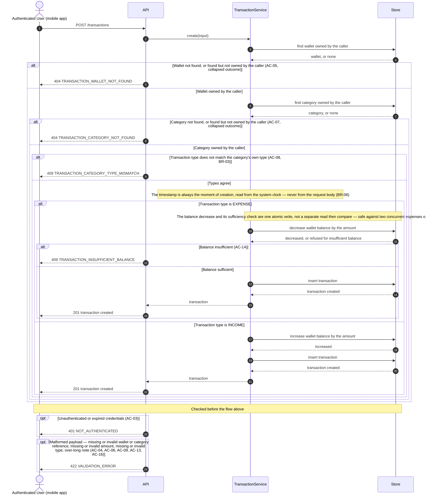

# Technical Plan: Transaction Management (TM)

> **Feature:** SRS §6 Feature-06 · SDS §5.6 (TM)
> **Spec:** [spec.md](spec.md)
> **Stories in this file:** TM-US-01 *(planned)*

---

## TM-US-01: Create a Transaction

### Gaps & Decisions (Resolved)

Code and architecture decisions settled during design. Spec-level findings were folded back into `spec.md` before this step closed.

| ID | Area | Decision | Status |
|----|------|----------|--------|
| A1 | Domain | **`TransactionCreate.type` accepts both `INCOME` and `EXPENSE`; the SRS Gherkin's illustrating only an EXPENSE scenario is not evidence that INCOME is out of scope.** FR-06's own first sentence is unqualified: "allow Users to log income **and** expense Transactions." The Gherkin Background sets up a wallet at 1000.00 and both of its own scenarios spend against it — one successfully, one rejected — because the *interesting* behaviour this story needs to specify precisely is the insufficient-balance rule, which only an EXPENSE can trigger; an INCOME scenario would have nothing distinctive to illustrate beyond "the balance goes up," so its absence from the Gherkin reads as economy of example, not a narrowed contract. This is the same treatment WM-US-01 A1 and BM-US-01 A1 each gave their own under-illustrated Gherkins. Not escalated as `[NEEDS RULING]`: FR-06 and the Gherkin do not disagree here — the Gherkin simply shows less than FR-06 already states. | ✅ Resolved |
| A2 | Domain | **The insufficient-balance rule applies to `EXPENSE` transactions only, and applies uniformly to every wallet regardless of how its current balance was reached — including a wallet WM-US-01 (EC-02) already permits to start negative.** Two sub-questions, both reasoned rather than assumed. *Scope to EXPENSE only:* the SRS Gherkin's rejected scenario is exclusively an EXPENSE ("Reject expense exceeding available balance (MVP Rule)"); no scenario anywhere shows an INCOME transaction being refused for any balance-related reason, and semantically an INCOME transaction only ever *adds* to a balance — there is no "current balance" value an addition could conflict with the way a subtraction can. Inventing an INCOME-side check would mean guarding against a condition that cannot arise from the operation itself, which no source asks for. *Uniform across every wallet, no type-based carve-out:* the SRS states the rule flatly, tagged "(MVP Rule)" with no qualifying clause naming a wallet type, currency, or history; WM-US-01 EC-02 already establishes that a wallet may legitimately start at a negative balance ("a wallet of type `CREDIT` ... legitimately begins already in debt"), which could suggest a credit-style wallet ought to be exempt from a balance floor — but nothing in FR-06, the Gherkin, or SDS §5.6.1 draws that distinction, and inventing an exemption by wallet `type` would mean inventing both a new closed vocabulary of "wallets exempt from this rule" *and* the criterion for membership in it, neither of which any source states. The flat reading is also the one that invents nothing: "the amount must not exceed the current balance" applies identically whether that balance is 1000.00 or −50.00. Recorded rather than silently assumed, because a reader could otherwise wonder whether the omission was deliberate. | ✅ Resolved |
| A3 | Domain | **A transaction's `type` must equal its referenced category's own `type`; a mismatch is refused with `409 TRANSACTION_CATEGORY_TYPE_MISMATCH`.** Nothing in SRS or SDS states this as an explicit rule in so many words — the Gherkin's own example already happens to agree (`"EXPENSE"` against `"Groceries"`, which SRS FR-04's own example list names as an expense-flavoured category alongside `"Rent"`, `"Salary"`, `"Utilities"`), so the Gherkin alone cannot prove the rule is *enforced* rather than merely *followed by example*. Reasoned instead from what the two entities are *for*: FR-04 defines a Category's `type` specifically so that Categories are "classified as either `INCOME` or `EXPENSE`" — that classification has no purpose at all unless something downstream reads and relies on it, and the only "downstream" FR-06 names is exactly this story, logging Transactions "against a designated Wallet and Category." FR-07 (Financial Reporting, out of scope but informative as context) aggregates "income and expense transactions" into summaries and "top category spending rankings" — arithmetic that silently breaks the moment one `EXPENSE` transaction is filed under an `INCOME`-typed category like "Salary," because the aggregation has no independent signal to fall back on once a transaction's own `type` and its category's `type` disagree. This is the same class of judgment WM-US-01/CM-US-01/BM-US-01 each made for their own undictated fields (CLAUDE.md's "decide, document, keep moving") — but reasoned toward *enforcing* a constraint rather than away from inventing one, specifically because leaving it unenforced would let one story's data silently corrupt a downstream feature's arithmetic rather than merely leave a field's shape looser than it could be. Enforced in the service layer (AR-01) after both ownership lookups succeed, comparing the two enums' underlying string values — never in the repository (no business rule there, AR-03) and never as a DTO-level Pydantic constraint (it depends on a row loaded from the database, which a DTO cannot see). Not escalated as `[NEEDS RULING]`: this is a real, answerable question about what FR-04 and FR-06 already imply together, not a case where two sources actually disagree. | ✅ Resolved |
| A4 | Architecture | **Fixed four-step check order: wallet ownership, then category ownership, then category-type consistency, then (EXPENSE only) balance sufficiency.** Extends BM-US-01 FR-13/BR-02's own two-step order (wallet, then category) by two more steps, reasoned the same way: each step can only run once the step before it has produced the data it needs. Category-type consistency needs a *resolved* category row (BR-03 compares the submitted `type` against `category.type`), so it cannot run before category ownership succeeds — there is no coherent way to ask "does the type match" about a category that was never found. Balance sufficiency needs to know the transaction is EXPENSE and needs a resolved wallet, and — by design (A9) — the check *is* the same database statement as the balance mutation itself, so it is necessarily the last step: nothing after it could still cause the request to fail once it has run. The two orderings this design makes genuinely *testable* by a single multi-failure request are wallet-before-category (`spec EC-14`, identical in shape to BM-US-01's own `EC-11`) and type-before-balance (`spec EC-11`: a category that is both wrongly typed and would separately fail the balance check reports only the type mismatch). The middle pairing — a category-ownership failure competing with a type mismatch — is not merely hard to construct, it is **structurally impossible**: a type mismatch cannot exist as a competing failure unless the category was already found, so the two conditions can never simultaneously hold. Recorded here rather than treated as an accidental testing gap, mirroring exactly how BM-US-01's own `test_cases.md` coverage matrix recorded its analogous category-versus-uniqueness gap. | ✅ Resolved |
| A5 | Domain | **`TransactionCreate` has no `timestamp` field at all; `timestamp` is computed server-side as `app.core.clock.utcnow()` at the moment the service runs**, read through the same clock seam every other TTL- and period-sensitive decision in this codebase already uses (constitution TST-06), never `datetime.now()` (CLAUDE.md §4). Directly mirrors BM-US-01 A2's treatment of `period`: no source shows a person choosing a timestamp anywhere in the SRS Gherkin's two scenarios — the User selects type, amount, category, and wallet, then clicks "Save Transaction," with no date or time control in the flow — and SDS §6.2.1's `TransactionCreate` registry entry itself lists exactly five fields (`wallet_id`, `category_id`, `amount`, `type`, `note`), with no sixth `timestamp` key. Accepting one anyway would mean inventing validation rules no source states (how far into the past or future a value may be, what timezone it is interpreted in, what happens to a value that collides with another transaction). `TransactionCreate` therefore declares no `timestamp` field; any `timestamp`-shaped key a caller submits anyway is silently ignored by Pydantic's default `BaseModel` behaviour, the same "structurally impossible to honour" pattern as `BudgetCreate`'s absent `period` (spec EC-04). | ✅ Resolved |
| A6 | Domain | **`note` is optional (`str \| None`, default `None`) and bounded at 500 characters — a materially larger bound than the 100-character convention WM-US-01/CM-US-01 established for `name` — and its column type is `Text`, not `String(n)`.** Two separate decisions, both grounded in what's actually declared. *Optional:* neither of the SRS Gherkin's two scenarios has the User enter a note at all ("selects transaction type," "enters amount," "selects category," "selects wallet," "clicks Save Transaction" — no note step in either scenario), and SDS §6.2.1's registry lists `note` as a plain `"string"` with nothing distinguishing it from the four fields this story's own AC-04/AC-06/AC-09/AC-12 already require. *500 characters, not 100:* SDS §4.3.3's `TRANSACTIONS` ERD types the column `text note`, not `string note` the way `wallets.name`/`categories.name` are each typed `string` in their own ERD blocks — a deliberate signal distinguishing a short label from free-form text, so this story does not reuse the 100-character label bound. 500 is still a real bound, not "no bound at all": VL-01 makes Pydantic the source of truth for request validation regardless of the column's own (here, unbounded) width, and an unbounded client-controlled string is a minor risk this codebase has not needed to accept anywhere else yet. No source names an exact figure, so 500 is this story's own reasoned choice, recorded rather than assumed. No trimming or blank-to-`null` normalisation is added either — nothing requires a note to be meaningful the way a `name` must identify something, so a blank note is left exactly as submitted rather than invented behaviour no AC asks for. | ✅ Resolved |
| A7 | Domain / Architecture | **`TransactionType` is declared as its own enum in `models/transaction.py`, with the identical two literal values as `CategoryType` (`INCOME`, `EXPENSE`), rather than importing and reusing `CategoryType` directly on `TransactionModel.type`.** Every enum this codebase has modelled so far belongs to, and lives beside, the one model whose column it types — `UserStatus`/`UserRole` in `user.py`, `InvitationStatus` in `invitation.py`, `CategoryType` in `category.py` — and no existing column reuses another model's enum class. A Transaction's `type` and a Category's `type` are two different attributes of two different entities that happen to share a vocabulary (BR-03 requires them to *agree in value*, not to *be the same field*), the same relationship `wallet_id`/`category_id` (a plain `str` FK, not a shared Python type) already have to the rows they reference. Cross-model type reuse would also create an import from `models/transaction.py` into `models/category.py` this codebase has no precedent for. BR-03's comparison is done by value (`category.type.value == type.value`), which needs no shared class — both are `StrEnum`s with identical literals. | ✅ Resolved |
| A8 | Domain | **`wallet_id` and `category_id` are plain non-empty strings with no UUID-shape validation** (`Field(min_length=1)`), directly reusing BM-US-01 A5's reasoning unchanged: this codebase's own `id` columns are `String(36)` free text (constitution ENV-03), a malformed reference and a well-formed-but-nonexistent one both fail the same ownership-scoped lookup and so already produce the identical `404` without any extra rule, and adding shape validation would only create a second, `422`-flavoured error class for the same caller mistake. Recorded as spec EC-07. | ✅ Resolved |
| A9 | Architecture / Concurrency | **The insufficient-balance check and the balance mutation are one atomic database statement — a conditional `UPDATE ... WHERE balance >= amount`, executed in the repository — not a read-the-balance-then-compare-in-Python-then-write sequence.** This is the first UPDATE `wallet_repo.py` has ever needed (its only two functions until now, `get_owned_by_id()` and `add_wallet()`, are a pure read and a pure insert) — but the *technique* itself is not new to this codebase: `invitation_repo.mark_accepted()` (UM-US-02) already uses a conditional `UPDATE ... WHERE status == PENDING` as an atomic mutex against two simultaneous activation attempts on the same invitation. What genuinely is new here is applying that same technique to a **numeric, arithmetic** column (`balance = balance ± amount`) rather than a status-enum transition, and doing so for money specifically — SRS NFR-05's own text ("Balance updates must execute inside ACID-compliant database transaction blocks") names exactly this operation. Two designs were weighed: **(a)** the service reads the wallet's current `balance` (already in hand from the ownership lookup), compares it to `amount` in Python, and only then calls a plain unconditional UPDATE if sufficient; or **(b)** the repository issues a single conditional UPDATE whose WHERE clause *is* the sufficiency check, and the service reads only the statement's rowcount. Design (a) has a real TOCTOU race: two simultaneous EXPENSE requests against the same wallet can each read the same pre-decrement balance, each independently conclude "sufficient" in Python, and each issue its own UPDATE — overwriting rather than compounding against each other, or both succeeding and leaving the balance permanently wrong, exactly the class of bug BR-05's "never below zero" guarantee exists to prevent. Design (b) closes that race by construction: the WHERE clause and the decrement happen as one statement the database evaluates against whatever row version is current at execution time, so a second concurrent UPDATE against the same row necessarily waits for the first's row lock and then re-evaluates its own WHERE clause against the *already-decremented* balance — the same reasoning `mark_accepted()` already relies on, returning a rowcount rather than a boolean the caller computed itself. `wallet_repo.decrement_balance()` is therefore design (b): `UPDATE wallets SET balance = balance - :amount WHERE id = :wallet_id AND balance >= :amount`, returning the affected row count; `rowcount == 0` is exactly the signal `TransactionInsufficientBalanceError` is raised from — there is no separate Python-level comparison to get out of sync with the database's own. `increment_balance()` (INCOME) has no sufficiency condition at all (BR-05), so it is a plain unconditional UPDATE. **Known testability limit, carried over rather than newly discovered:** UM-US-01/UM-US-02's own `test_cases.md` QF-02 already recorded that this codebase's test database (SQLite, `StaticPool`, single-threaded test execution — constitution ENV-03) serialises writers, so a literal "two requests race, only one wins" integration test cannot be constructed here; it would prove serialisation, not conflict-handling. This story's own `test_cases.md` QF-04 records the same limit and defers true concurrent verification to a PostgreSQL run, exactly as UM-US-01/02 already did — the single-request boundary (amount exactly equal to balance, spec `EC-08`) and refusal (spec `AC-14`) cases are what this suite can and does prove deterministically. | ✅ Resolved |
| A10 | Architecture | **The balance mutation and the transaction insert are two different tables written inside one request; atomicity comes from the transaction boundary, not from any explicit `BEGIN`/`COMMIT` this story writes.** `transaction_service.create_transaction()` calls `wallet_repo.decrement_balance()`/`increment_balance()` and then `transaction_repo.add_transaction()`; both repository calls `db.flush()` (send their SQL to the database within the session's already-open transaction) but neither calls `db.commit()` (constitution AR-06 — services never commit). The router's single `db.commit()`, issued only after `transaction_service.create_transaction()` returns successfully, is the one and only commit point for the whole request. Two failure paths both leave nothing persisted: **(1)** if `decrement_balance()`'s conditional UPDATE affects zero rows, the service raises `TransactionInsufficientBalanceError` *before* `transaction_repo.add_transaction()` is ever called, so no transaction row is even built; **(2)** if anything else raises after a flush has already sent SQL to the database, `app.db.session.get_db()`'s `except Exception: db.rollback()` catches it before the request handler's `db.commit()` is ever reached, discarding every flushed-but-uncommitted change in the session. AR-06 has real precedent for multi-row atomicity — UM-US-01 A1 already writes a `users` row and an `invitations` row inside one transaction ("neither may exist without the other"), and UM-US-02 atomically transitions both a user's `status` and an invitation's `status` together. What is new here is the shape of the failure this atomicity guards against: UM-US-01/02's paired writes are either two unconditional inserts, or two status-enum transitions gated by the same conditional-UPDATE-as-mutex technique A9 reuses — never a case where one write's *numeric outcome* (how much a balance actually decreased) determines whether the other write is even attempted. Here, a debited wallet with no matching transaction row (or vice versa) would not just be an inconsistent status — it would be money silently gained or lost, which is exactly what SRS FR-06's "atomically" and NFR-05's "ACID-compliant" language are about. | ✅ Resolved |
| A11 | Security | **`TransactionCreate` declares no field a client could use to name a transaction's "owner"**, because there is no owner column to spoof — SDS §4.3.3's `TRANSACTIONS` ERD has no `user_id` at all, the same shape as `BUDGETS` (BM-US-01 A7). Ownership is proven entirely by the two ownership-scoped lookups (A4's wallet/category checks): a `wallet_id`/`category_id` the caller does not own is refused before a `TransactionModel` row is even considered. | ✅ Resolved |
| A12 | Security | **No role restriction.** `CurrentUserDep` — not `AdminDep` — guards this route. SRS §6 US-06-01 names the actor "the User" with no role qualifier, and SDS §5.6.1 tags the story "(USER)". Directly mirrors WM-US-01 A8 / BM-US-01 A9. | ✅ Resolved |
| A13 | Architecture | **No audit event.** Constitution LA-04 enumerates exactly three audited event families — invitations sent, activations completed, logins — and transaction creation is not among them. No AC or FR in `spec.md` asks for one either. Directly mirrors WM-US-01 A9 / BM-US-01 A10. | ✅ Resolved |
| A14 | Domain / API | **`TransactionRead` carries exactly the Transaction's own seven fields (`id`, `wallet_id`, `category_id`, `amount`, `type`, `timestamp`, `note`) — no embedded wallet, no echoed new balance, and no `message` field.** The SRS Gherkin narrates the wallet's new balance ("the balance for 'Main Checking' decreases to 950.00") as an observable outcome of the scenario, and it is one — verified directly against the `wallets` row (spec AC-01/AC-02, *Assumptions*) — but it is the *Wallet's* field changing, not a new fact about the *Transaction*. Every existing Create-story response in this codebase (`WalletRead`, `CategoryRead`, `BudgetRead`) is scoped strictly to its own entity's own columns, with no other entity's data folded in — `BudgetRead` does not echo the wallet's balance either, even though a Budget is just as tightly coupled to a Wallet as a Transaction is. Matching that precedent keeps PF-03's "DTO projection, never an entity graph" true here too. No `message` field either (unlike `InvitationRead`): every other Create endpoint communicates success through its `201` status alone, and the SRS Gherkin's "shows message 'Transaction created successfully'" is UI-layer feedback — no screen exists yet for this story to build (*Element IDs*, mobile deferred). | ✅ Resolved |
| A15 | Domain | **No uniqueness constraint on a Transaction, in any respect.** No AC, EC, or BR requires it — unlike Budget's own deliberate per-period uniqueness (BM-US-01 A3/BR-05), which exists because two overlapping budget limits leave "the" limit undefined. Two transactions can legitimately be identical in every field (same wallet, category, amount, and type) and still both be real, independent events — two identical coffee purchases on the same day are not a data-integrity problem the way two competing spending caps would be. Recorded as spec EC-12, mirroring WM-US-01 A6's own "no uniqueness constraint" reasoning for wallet names, reasoned independently rather than pattern-matched (the same discipline BM-US-01 A3 itself used when it broke from that very precedent for Budget). | ✅ Resolved |

---

### Architecture

**Package layout** (additions only; `budget.py`'s siblings across every layer are the closest precedent — this is the first story to add a genuine `UPDATE` to `wallet_repo.py` specifically, which until now held only `get_owned_by_id()` (a read) and `add_wallet()` (an insert)).

```text
backend/app/
├── models/
│   └── transaction.py                # NEW  TransactionModel, TransactionType (SDS §2.1, §2.2, §4.3.3)
├── schemas/
│   └── transaction.py                # NEW  TransactionCreate, TransactionRead
├── repositories/
│   ├── wallet_repo.py                # MODIFIED  add decrement_balance(), increment_balance()
│   └── transaction_repo.py           # NEW  add_transaction()
├── services/
│   └── transaction_service.py        # NEW  create_transaction()
├── core/
│   └── errors.py                     # MODIFIED  add TransactionWalletNotFoundError, TransactionCategoryNotFoundError, TransactionCategoryTypeMismatchError, TransactionInsufficientBalanceError
└── api/v1/
    ├── transactions.py               # NEW  POST /transactions
    └── router.py                     # MODIFIED  mount transactions.router

backend/migrations/versions/
└── <rev>_create_transactions.py      # NEW  transactions table, down_revision = 003e5ae90a36 (current head)

backend/tests/
└── integration/test_tm_us_01_create_transaction.py   # NEW  written at the Implement step from test_cases.md
```

`category_repo.py` is **not** modified — `get_owned_by_id()` already exists there from BM-US-01 and is reused completely unchanged; this story only extends `wallet_repo.py`, and only because a *mutation*, not another read, is new territory for it. No change to `core/deps.py` — `CurrentUserDep` (`get_current_user`) already resolves any authenticated `ACTIVE` User of either role and is reused exactly as-is (A12).

**Domain objects**

| Entity | Table | Key Fields | Notes |
|--------|-------|------------|-------|
| `TransactionModel` | `transactions` | `id` PK, `wallet_id` FK→`wallets.id` (indexed), `category_id` FK→`categories.id` (indexed), `amount`, `type`, `timestamp`, `note` | No `user_id` (A11) — exactly the seven ERD columns. Both FKs carry an index, mirroring BM-US-01's own reasoning for `budgets`: every query this story or a future one runs against `transactions` filters by one or both (constitution PF-02). `timestamp` carries **no** index this story — TM-US-02 (list/filter, out of scope) is the story with an actual query to justify one; indexing it now would be speculative in a way `wallet_id`/`category_id` are not (those already have an established ownership-filtering precedent, SEC-08). |
| — | — | *(no new unique constraint)* | No uniqueness rule applies to a Transaction (A15) — the first money-bearing story in this codebase where VL-05 does not apply. |

**Model** (`app/models/transaction.py`)

```python
class TransactionType(enum.StrEnum):
    """SRS FR-06, SDS §6.2.1 TransactionCreate example. Same two literal
    values as CategoryType (spec BR-03 requires them to agree) — declared as
    its own enum rather than importing CategoryType, matching this
    codebase's one-enum-per-owning-model convention (A7)."""

    INCOME = "INCOME"
    EXPENSE = "EXPENSE"


class TransactionModel(Base):
    __tablename__ = "transactions"

    id: Mapped[str] = mapped_column(String(36), primary_key=True, default=new_uuid)

    # spec BR-01: ownership is entirely transitive through these two FKs — no
    # user_id column exists on this table at all, the same shape BM-US-01
    # established for budgets (A11).
    wallet_id: Mapped[str] = mapped_column(
        String(36), ForeignKey("wallets.id"), nullable=False, index=True
    )
    category_id: Mapped[str] = mapped_column(
        String(36), ForeignKey("categories.id"), nullable=False, index=True
    )

    # spec BR-04, constitution VL-07: Decimal(15,2), strictly positive — a
    # magnitude; direction is carried by `type`, not by the sign of `amount`.
    amount: Mapped[Decimal] = mapped_column(Numeric(15, 2), nullable=False)

    # spec BR-03, FR-10: closed enum, must agree with the referenced
    # category's own type (A3, A7).
    type: Mapped[TransactionType] = mapped_column(
        Enum(TransactionType, native_enum=False, length=10), nullable=False
    )

    # spec BR-06: always the moment of creation, from app.core.clock.utcnow()
    # — never client input (A5).
    timestamp: Mapped[datetime] = mapped_column(DateTime(timezone=True), nullable=False)

    # spec FR-15, A6: optional free text, bounded at the DTO layer only — the
    # column itself is unbounded, matching SDS §4.3.3's `text note` typing.
    note: Mapped[str | None] = mapped_column(Text, nullable=True)

    def __repr__(self) -> str:  # pragma: no cover - debugging aid
        return (
            f"<TransactionModel id={self.id} wallet_id={self.wallet_id} "
            f"category_id={self.category_id} type={self.type}>"
        )
```

**DTOs** (`app/schemas/transaction.py`)

```python
class TransactionCreate(BaseModel):
    """plan.md DTO block. No `timestamp` field at all (A5, spec AC-15) — the
    system always sets it to the moment of creation; a submitted
    timestamp-shaped value is silently ignored, the same "structurally
    impossible to honour" pattern as BudgetCreate's absent `period` field.
    No UUID-shape validation on the two references (A8) — an unresolvable
    value of any shape is refused identically by the ownership-scoped
    lookup.
    """

    wallet_id: str = Field(min_length=1)
    category_id: str = Field(min_length=1)

    # Decimal(15,2), reject-don't-round (WM-US-01 A3 precedent) plus a
    # strict positivity bound — amount is a magnitude, type carries
    # direction (spec BR-04).
    amount: Decimal = Field(max_digits=15, decimal_places=2, gt=0)

    # Closed enum — Pydantic's own enum-membership validation rejects
    # anything that is not exactly "INCOME" or "EXPENSE" (spec AC-13).
    type: TransactionType

    # Optional free text (A6, spec AC-17); bounded at 500 chars (A6).
    note: str | None = Field(default=None, max_length=500)


class TransactionRead(BaseModel):
    """SDS §2.2. Exactly seven fields (spec AC-18, FR-16, constitution
    PF-03) — no owner field of any kind (A11), no echoed wallet balance, no
    message (A14).
    """

    id: str
    wallet_id: str
    category_id: str
    amount: Decimal
    type: TransactionType
    timestamp: datetime
    note: str | None
```

**Repository additions**

```python
# wallet_repo.py — two new functions alongside the existing get_owned_by_id()/add_wallet()
def decrement_balance(db: Session, *, wallet_id: str, amount: Decimal) -> int:
    """spec FR-11, BR-05, plan.md A9. Conditional UPDATE — the sufficiency
    check *is* the WHERE clause, not a prior read-then-compare in Python.
    Returns the affected row count: 1 if the balance was sufficient and the
    decrement applied, 0 if not (the service raises
    TransactionInsufficientBalanceError on 0). Mirrors
    invitation_repo.mark_accepted()'s conditional-UPDATE-as-atomic-mutex
    technique (UM-US-02 EC-05). Flushed, not committed (AR-06)."""


def increment_balance(db: Session, *, wallet_id: str, amount: Decimal) -> None:
    """spec FR-12, BR-05, plan.md A9. Unconditional UPDATE — an INCOME
    transaction has no sufficiency condition to check. Flushed, not
    committed (AR-06)."""
```

```python
# transaction_repo.py — new module
def add_transaction(
    db: Session,
    *,
    wallet_id: str,
    category_id: str,
    amount: Decimal,
    type: TransactionType,
    timestamp: datetime,
    note: str | None,
) -> TransactionModel:
    """spec AC-01, AC-02, FR-16, BR-01. Flushed, not committed (AR-06) — the
    router owns the transaction boundary; this call and wallet_repo's
    balance mutation are flushed within the same request so both changes
    reach the database inside one commit (FR-13, BR-07, A10)."""
```

**Service** (`app/services/transaction_service.py`)

```python
def create_transaction(
    db: Session,
    *,
    owner: UserModel,
    wallet_id: str,
    category_id: str,
    amount: Decimal,
    type: TransactionType,
    note: str | None,
) -> TransactionRead:
    """spec AC-01, AC-02, FR-18, BR-02. Fixed check order — wallet
    ownership, then category ownership, then category-type consistency,
    then (EXPENSE only) balance sufficiency — so a request that fails more
    than one reports only the first (A4).
    """
    wallet = wallet_repo.get_owned_by_id(db, wallet_id=wallet_id, user_id=owner.id)
    if wallet is None:
        raise TransactionWalletNotFoundError()

    category = category_repo.get_owned_by_id(db, category_id=category_id, user_id=owner.id)
    if category is None:
        raise TransactionCategoryNotFoundError()

    # spec BR-03, A3, A7: compared by value — TransactionType and
    # CategoryType are deliberately separate enum classes with matching literals.
    if category.type.value != type.value:
        raise TransactionCategoryTypeMismatchError()

    # spec BR-05, A2, A9: the sufficiency check is the conditional UPDATE
    # itself for EXPENSE; INCOME never checks (A2).
    if type is TransactionType.EXPENSE:
        affected = wallet_repo.decrement_balance(db, wallet_id=wallet_id, amount=amount)
        if affected == 0:
            raise TransactionInsufficientBalanceError()
    else:
        wallet_repo.increment_balance(db, wallet_id=wallet_id, amount=amount)

    # spec BR-06, A5: never from the request payload.
    timestamp = clock.utcnow()

    transaction = transaction_repo.add_transaction(
        db,
        wallet_id=wallet_id,
        category_id=category_id,
        amount=amount,
        type=type,
        timestamp=timestamp,
        note=note,
    )
    return TransactionRead(
        id=transaction.id,
        wallet_id=transaction.wallet_id,
        category_id=transaction.category_id,
        amount=transaction.amount,
        type=transaction.type,
        timestamp=transaction.timestamp,
        note=transaction.note,
    )
```

**Router** (`app/api/v1/transactions.py`) — thin, mirrors `budgets.py` exactly:

```python
router = APIRouter(prefix="/transactions", tags=["transactions"])


@router.post(
    "",
    response_model=TransactionRead,
    status_code=status.HTTP_201_CREATED,
    responses={
        401: {"description": "NOT_AUTHENTICATED"},
        404: {"description": "TRANSACTION_WALLET_NOT_FOUND / TRANSACTION_CATEGORY_NOT_FOUND"},
        409: {"description": "TRANSACTION_CATEGORY_TYPE_MISMATCH / TRANSACTION_INSUFFICIENT_BALANCE"},
        422: {"description": "VALIDATION_ERROR"},
    },
)
def create_transaction(payload: TransactionCreate, db: DbDep, current_user: CurrentUserDep) -> TransactionRead:
    result = transaction_service.create_transaction(
        db,
        owner=current_user,
        wallet_id=payload.wallet_id,
        category_id=payload.category_id,
        amount=payload.amount,
        type=payload.type,
        note=payload.note,
    )
    db.commit()
    return result
```

**New errors** (`app/core/errors.py`, appended under a new `# --- TM-US-01: Create a Transaction` section)

```python
class TransactionWalletNotFoundError(AppError):
    """spec AC-05 / FR-04. Identical for "no such wallet" and "not this
    caller's wallet" (constitution VL-06's `404 if absent` branch)."""
    status_code = 404
    error_code = "TRANSACTION_WALLET_NOT_FOUND"
    default_message = "The referenced wallet was not found."


class TransactionCategoryNotFoundError(AppError):
    """spec AC-07 / FR-06. Same collapsed shape as TransactionWalletNotFoundError."""
    status_code = 404
    error_code = "TRANSACTION_CATEGORY_NOT_FOUND"
    default_message = "The referenced category was not found."


class TransactionCategoryTypeMismatchError(AppError):
    """spec AC-08 / FR-07 / BR-03. Constitution VL-06's "409 if present but
    in the wrong state" branch — the first story in this codebase to
    exercise it: the category exists and is owned by the caller, but its
    own type disagrees with the submitted transaction type."""
    status_code = 409
    error_code = "TRANSACTION_CATEGORY_TYPE_MISMATCH"
    default_message = "The transaction type does not match the referenced category's type."


class TransactionInsufficientBalanceError(AppError):
    """spec AC-14 / FR-11 / BR-05. The SRS's own "(MVP Rule)" scenario and
    its own literal message."""
    status_code = 409
    error_code = "TRANSACTION_INSUFFICIENT_BALANCE"
    default_message = "Insufficient balance."
```

**Business rules enforced in service layer**

| Rule | Source | Enforcement |
|------|--------|--------------|
| Authenticated User of any role may create a transaction | AC-01, AC-02, FR-01, A12 | `POST /api/v1/transactions` accepting `TransactionCreate`, guarded by `CurrentUserDep` — not `AdminDep` |
| Unauthenticated caller denied before the payload is evaluated | AC-03, FR-02 | `CurrentUserDep` resolves before FastAPI validates the body — identical ordering to every existing protected route |
| `wallet_id` required, non-empty | AC-04, FR-03 | `Field(min_length=1)` |
| `wallet_id` must resolve to the caller's own wallet; not-found and not-owned collapsed | AC-05, EC-05, EC-07, FR-04, A8 | `wallet_repo.get_owned_by_id()` returns `None` for both cases by construction (reused unchanged from BM-US-01 A6); service raises `TransactionWalletNotFoundError` |
| `category_id` required, non-empty | AC-06, FR-05 | `Field(min_length=1)` |
| `category_id` must resolve to the caller's own category; not-found and not-owned collapsed | AC-07, EC-06, EC-07, FR-06, A8 | `category_repo.get_owned_by_id()` returns `None` for both cases by construction (reused unchanged from BM-US-01 A6); service raises `TransactionCategoryNotFoundError` |
| Transaction `type` must equal the category's own `type` | AC-08, FR-07, A3, A7 | Service compares `category.type.value != type.value`; raises `TransactionCategoryTypeMismatchError` |
| `amount` required, `Decimal(15,2)`, reject not round | AC-09, AC-11, EC-02, FR-08, constitution VL-07 | `Field(max_digits=15, decimal_places=2)` |
| `amount` strictly positive | AC-10, EC-01, FR-09 | `Field(..., gt=0)` |
| `type` required, closed to INCOME/EXPENSE | AC-12, AC-13, FR-10 | `type: TransactionType` — Pydantic's own enum-membership validation |
| EXPENSE refused when amount exceeds current balance; balance unchanged on refusal | AC-14, EC-08, EC-10, FR-11, A2, A9 | `wallet_repo.decrement_balance()`'s conditional UPDATE; `rowcount == 0` → `TransactionInsufficientBalanceError`, nothing flushed for the transaction row |
| INCOME never balance-checked | AC-02, EC-09, FR-12, A2 | `wallet_repo.increment_balance()` — unconditional |
| `timestamp` always the moment of creation; client input ignored | AC-15, EC-04, FR-14, A5 | `TransactionCreate` declares no `timestamp` field; service computes `clock.utcnow()` |
| `note` optional, bounded at 500 chars | AC-16, AC-17, EC-13, FR-15, A6 | `Field(default=None, max_length=500)` |
| Response exposes exactly seven fields | AC-18, FR-16, constitution PF-03 | `TransactionRead` — no ORM graph, no extra field |
| Every validation failure reported together | EC-03, FR-17, constitution VL-02 | Reuses the existing `RequestValidationError` handler in `main.py` — unchanged, no new wiring |
| Fixed check order — wallet, category, type, then balance | FR-18, BR-02, A4 | `create_transaction()`'s straight-line sequence; each check returns/raises before the next runs |
| No uniqueness constraint | EC-12, FR-19, A15 | No unique index on `transactions`; no service-layer duplicate check |
| Transaction insert and balance update are one atomic unit | FR-13, BR-07, A10 | Both repository calls flush only; the router's single `db.commit()` is the only commit point |
| No audit event | A13 | `transaction_service.create_transaction()` calls no `audit.record()` |

**Sequence diagram — Create a Transaction**

Drawn to `constitution.md` DG-01…DG-07: four lanes only, no SQL, no parameter lists, every request into `API` answered back to `UI` with a status code, one workflow.



Only one workflow is drawn (DG-07). The nested `alt`/`else` blocks are the one flow's own branches — not a second flow — mirroring how WM-US-01/CM-US-01/BM-US-01 folded their refusal `opt`s into a single diagram. Verified with `check.mjs` (`mermaid.parse()`) — see *Verification note* below.

**Error flows**

| Scenario | HTTP | Error Code |
|----------|------|------------|
| No or invalid bearer credentials (AC-03) | 401 | `NOT_AUTHENTICATED` |
| Missing/invalid wallet or category reference shape, missing/invalid amount, missing/invalid type, over-long note (AC-04, AC-06, AC-09..AC-13, AC-16) | 422 | `VALIDATION_ERROR` |
| Wallet not found, or found but not owned by the caller (AC-05) | 404 | `TRANSACTION_WALLET_NOT_FOUND` |
| Category not found, or found but not owned by the caller (AC-07) | 404 | `TRANSACTION_CATEGORY_NOT_FOUND` |
| Transaction type disagrees with the category's own type (AC-08) | 409 | `TRANSACTION_CATEGORY_TYPE_MISMATCH` |
| EXPENSE amount exceeds the wallet's current balance (AC-14) | 409 | `TRANSACTION_INSUFFICIENT_BALANCE` |
| Unexpected server error | 500 | `INTERNAL_ERROR` |

All in the flat envelope `{"error_code", "message", "details"}` (SDS §6.6, constitution API-02) — reused unchanged from `main.py`. No `403` (A12: no role restriction).

**Constitution notes**

| Rule | Status | Note |
|------|--------|------|
| AR-01 Service owns business rules | Required | `transaction_service.create_transaction()` is the only place that decides what a failed lookup, a type mismatch, or an insufficient balance means, and assembles the persisted row |
| AR-02 Thin router | Required | Router binds the payload, resolves `CurrentUserDep`, calls the service, commits once, formats the response — no branching on business state |
| AR-03 Repository isolation | Required | `wallet_repo`'s two new balance functions and `transaction_repo.add_transaction()` are queries/persistence only — the sufficiency *decision* (raise on rowcount 0) is the service's, not the repository's |
| AR-04 DTO ↔ model mapping outside routers/repos | Required | No field-name mapping needed (every DTO field matches its column 1:1), but the service remains the boundary that would carry it |
| AR-05 No framework objects in services | Required | `create_transaction()` takes plain values (`owner: UserModel`, `wallet_id`, `category_id`, `amount`, `type`, `note`); no `Request`/`Response` |
| AR-06 One transaction per request | Required — same guarantee UM-US-01/02 already rely on, applied to a numeric balance for the first time (A10) | The balance mutation and the transaction insert are two different tables; both are flushed inside the service and neither is committed there — the router's single `db.commit()` is what makes them atomic. If the conditional UPDATE affects zero rows, the service raises before the transaction row is even built; if anything else raises between the two flushes, `get_db()`'s exception handler rolls back the whole session |
| AR-07 Router → service → repository | Required | The router never calls `wallet_repo`/`category_repo`/`transaction_repo` directly |
| AR-08 Module layout | Required | `backend/app/{models,schemas,repositories,services,api}` — no new top-level package; `wallet_repo.py` gains two functions, matching how BM-US-01 grew `wallet_repo.py`/`category_repo.py` by one function each |
| API-01 Versioned plural path | Required | `POST /api/v1/transactions` |
| API-02 Flat error envelope | Required | Reused from `main.py`, unchanged |
| API-03 Status codes | Required | `201` create · `401` · `404` (×2 codes) · `409` (×2 codes) · `422` |
| API-04 Prefixed error codes | Required | `TRANSACTION_WALLET_NOT_FOUND`, `TRANSACTION_CATEGORY_NOT_FOUND`, `TRANSACTION_CATEGORY_TYPE_MISMATCH`, `TRANSACTION_INSUFFICIENT_BALANCE` — all catalogued above |
| API-05 No generic status endpoint | Required | `/transactions` is a plain resource-creation `POST` |
| API-06 Pagination | N/A | Single-resource creation; no list in this story |
| API-07 Explicit response_model | Required | `response_model=TransactionRead`, `status_code=201` |
| API-08 Public endpoint list | Required | This route is **protected** — not added to the public list |
| NC-01 Module naming | Required | `transaction_repo.py`, `transaction_service.py` — singular, matching `budget_repo.py`/`budget_service.py` |
| NC-02 Naming | Required | `TransactionModel`; `TransactionCreate` / `TransactionRead` (SDS §2.1, §6.2.1); table `transactions` |
| NC-04 Column naming | Required | snake_case; `wallet_id`/`category_id` FKs |
| NC-05 Enum serialisation | Required | `TransactionType` literals `"INCOME"`/`"EXPENSE"` serialise unchanged, matching `CategoryType`'s precedent |
| NC-06 Concise service methods | Required | `TransactionService.create`, matching `BudgetService.create`/`WalletService.create` |
| VL-01 Pydantic is the source of truth | Required | Every payload-shape bound (presence, decimal shape, positivity, enum membership, note length) lives on `TransactionCreate` |
| VL-02 Errors grouped | Required | Reused `RequestValidationError` handler (EC-03) |
| VL-05 Two-level uniqueness | N/A | No uniqueness rule applies to a Transaction (A15) — the first money-bearing story in this codebase where VL-05 does not apply |
| VL-06 Referenced entities verified before use | Required | `wallet_id`/`category_id` resolved through ownership-scoped lookups before a `TransactionModel` is built (absent → 404); a category present but wrongly typed is VL-06's "409 if present but in the wrong state" branch — the first story to exercise that branch (BM-US-01 had none) |
| VL-07 Decimal money | Required | `Decimal`, `max_digits=15, decimal_places=2` on the DTO (WM-US-01 A3 precedent) plus `gt=0` (mirrors BM-US-01 A4); `Numeric(15, 2)` on the column |
| SEC-06 JWT parameters | N/A | Consumed via `CurrentUserDep`, not defined here |
| SEC-07 Authz proven by test | Required (partial) | `401` gets a dedicated test; there is no `403` case to test (A12: no role restriction) |
| SEC-08 Ownership filter | Required | Extended one hop past its usual shape (spec BR-01), the same way BM-US-01 first did it: the *referenced* wallet and category, not a row this story owns directly, are filtered by `user_id` |
| SEC-09 Secrets from .env | N/A | No secret is introduced by this story |
| SEC-10 No enumeration | N/A (reasoning reused) | Same reasoning as BM-US-01: an authenticated caller who does not own a real wallet/category id learns nothing about who does, because the identical `404` covers both cases (A8) |
| SEC-11 Rate limiting | N/A | Scoped by its own text to the invitation and activation endpoints |
| LA-01 No secrets in logs | N/A | No credential or token is handled by this story |
| LA-02 / LA-04 Audit | N/A (by decision) | Transaction creation is not one of LA-04's three named audited events, and no AC/FR asks for a fourth (A13) |
| PF-01 300 ms p95 | Required | Two ownership lookups, one conditional/unconditional balance UPDATE, one insert — no I/O off the request path |
| PF-02 Indexed lookups | Required | `transactions.wallet_id`/`transactions.category_id` indexed now; the ownership lookups query `wallets`/`categories` by primary key, already indexed |
| PF-03 DTO projection | Required | `TransactionRead` — seven fields, no ORM graph, no embedded Wallet/Category object (A14) |
| PF-04 Bounded lists | N/A | No list endpoint in this story |
| TST-01/02 AC→TC coverage | Required | Every AC and EC mapped in `test_cases.md` before any test code |
| TST-06 Deterministic time | Required | Every timestamp-sensitive test case monkeypatches `app.core.clock.utcnow` — no reliance on wall-clock time |
| DOD-02 Migration | Required | One Alembic revision creating `transactions`, `down_revision = 003e5ae90a36` (current head) |
| DOD-03 Coverage > 80% | Required | Measured at the Implement step |

**Element IDs**

| Element | ID | Status | File |
|---------|----|--------|------|
| — | — | **N/A (mobile deferred)** | No transaction-creation screen exists this round. `mobile/`'s fixture-driven prototype covers only UM-US-01's invite screen (`CLAUDE.md` §5); a transaction-creation screen is not part of Round 1's mobile scope. SRS UXR-01 names low-friction transaction entry as a future UI concern, but no UXR describes a creation *screen* this round is building against. |

**Open tasks**

| ID | Task | File | Status |
|----|------|------|--------|
| T-01 | `TransactionModel` (`id`, `wallet_id` FK indexed, `category_id` FK indexed, `amount`, `type`, `timestamp`, `note` — no `user_id`, A11) plus `TransactionType` enum | `backend/app/models/transaction.py` | Open |
| T-02 | Alembic revision creating `transactions` with its two FKs and two indexes, `down_revision = 003e5ae90a36` | `backend/migrations/versions/` | Open |
| T-03 | Schemas `TransactionCreate`, `TransactionRead` | `backend/app/schemas/transaction.py` | Open |
| T-04 | Add `wallet_repo.decrement_balance(db, *, wallet_id, amount)` (conditional UPDATE, A9) and `wallet_repo.increment_balance(db, *, wallet_id, amount)` (unconditional) | `backend/app/repositories/wallet_repo.py` | Open |
| T-05 | `transaction_repo.add_transaction(...)` | `backend/app/repositories/transaction_repo.py` | Open |
| T-06 | `transaction_service.create_transaction(db, *, owner, wallet_id, category_id, amount, type, note)` — fixed check order (FR-18, A4) | `backend/app/services/transaction_service.py` | Open |
| T-07 | Add `TransactionWalletNotFoundError`, `TransactionCategoryNotFoundError`, `TransactionCategoryTypeMismatchError`, `TransactionInsufficientBalanceError` | `backend/app/core/errors.py` | Open |
| T-08 | `POST /api/v1/transactions` router; mount `transactions.router` in `api/v1/router.py` | `backend/app/api/v1/transactions.py`, `backend/app/api/v1/router.py` | Open |
| T-09 | Integration tests written from `test_cases.md` | `backend/tests/integration/test_tm_us_01_create_transaction.py` | Open |

**Verification note (constitution `CLAUDE.md` §3, mermaid diagram check).** The sequence diagram above was extracted and run through `mermaid.parse()` (`mermaid@11` + `jsdom`, scratch install per `CLAUDE.md` §3) before this gate was claimed. It parses cleanly. By eye/grep: no `Repo`/`DB` lane (four lanes only — `UI`, `API`, `Svc`, `Store`), no `SELECT`/`INSERT`/`UPDATE … WHERE`/`rowcount`/table-and-column syntax in any arrow label (the conditional-UPDATE mechanism is described in prose in a `Note`, per DG-04's own allowance, not spelled out as SQL), and every `UI→API` request (there is exactly one: `POST /transactions`) is answered by exactly one of the eight terminal branches, each carrying an HTTP status back to `UI`.
