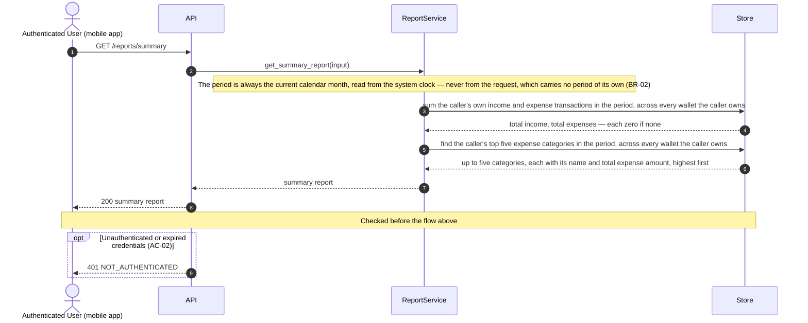

# Technical Plan: Financial Reporting (FR)

> **Feature:** SRS §6 Feature-07 · SDS §5.7 (FR)
> **Spec:** [spec.md](spec.md)
> **Stories in this file:** FR-US-01 *(planned)*

> **Naming note carried from `spec.md`:** this epic's code (`FR`) collides in spelling with `SRS
> FR-07` (the requirement) and with this file's own local `FR-NN` numbering in `spec.md`. This
> document never uses a bare `FR-NN` — every citation below is either `SRS FR-07`, `FR-US-01`/
> `FR-US-02`, or a spelled-out reference to `spec.md`'s own `FR-01`…`FR-11`.

---

## FR-US-01: View Summary Report

### Gaps & Decisions (Resolved)

Code and architecture decisions settled during design. Spec-level findings were folded back into
`spec.md` before this step closed.

| ID | Area | Decision | Status |
|----|------|----------|--------|
| A1 | Domain / Scope | **This story implements a single-period (current calendar month) snapshot only — no historical or multi-period "trend" data, no list of periods, no date-range input anywhere in the API contract.** `spec.md`'s *Assumptions & Dependencies* reasons through this in full against `SRS FR-07`'s "net savings trends" language; the short version, restated here for its architectural consequence: `SDS §5.7.1`'s own goal sentence for *this* story names four single-period figures and no trend language, `SDS §1.5.1` marks `FR-US-01…02` together **"✔ (partial)"** against `SRS US-07-01` — a documented acknowledgement that the trend portion is deliberately left to a future, unnumbered story — and `FR-US-02` (the other SDS story sharing this requirement) is itself also single-period by its own goal text. Consequence for this design: `GET /reports/summary` (A11) takes no `date_from`/`date_to`/`month`/`year` parameter of any kind, and `SummaryReportRead` (A6) carries one `period` field, not a list of periods. Not escalated as `[NEEDS RULING]` — `SRS.md` and `SDS.md` do not disagree once `SDS §5.7.1`'s and `SDS §1.5.1`'s own texts are read together; `SDS.md` narrows `SRS FR-07`'s bundle across two stories and says so explicitly. | ✅ Resolved |
| A2 | Domain | **No caller-supplied period; the period is always the current calendar month, computed server-side as `clock.utcnow().date().replace(day=1)` — identical mechanism to `BM-US-01` A2 — extended with an explicit half-open datetime interval `[period_start, period_end)` because, unlike `Budget.period` (a bare `Date` column needing no range comparison), `Transaction.timestamp` is a full timezone-aware `datetime`, so the query needs both ends of the interval, not one equality-comparable value.** Weighed against `TM-US-02` A1/A6's own precedent of accepting a caller-supplied `date_from`/`date_to`: that story built its filter because `SDS §5.6.2`'s own goal sentence explicitly names "date range" as one of three filter dimensions for *that* story; `SDS §5.7.1`'s goal sentence for *this* story names no filter or period-selection language at all, only "monthly" as a description of the figures shown — the same absence that led `BM-US-01` A2 to reject an explicit `period` input. `SRS.md`'s own text reinforces this: `US-07-01` has no Gherkin at all (not even BM-US-01's minimal one), so there is no walkthrough anywhere showing a person choosing a month. `period_end` is computed by rolling `period_start` forward one calendar month, handling the December→January year rollover explicitly (`start_date.month == 12` → `end_date = start_date.replace(year=+1, month=1)`, else `end_date = start_date.replace(month=+1)`) rather than a day-arithmetic shortcut, so the boundary is exact regardless of which month the report runs in. Both ends are then attached to UTC via the same `datetime.combine(..., time.min, tzinfo=UTC)` construction — never `datetime.now()` (`CLAUDE.md` §4). | ✅ Resolved |
| A3 | Domain / Security | **The report aggregates across every wallet the authenticated caller owns — no `wallet_id` filter parameter exists on this endpoint at all.** Weighed against `TM-US-02` A1's own precedent of building a `wallet_id` filter: that story did so because `SDS §5.6.2`'s own goal sentence explicitly names "wallet" as one of three filter dimensions; `SDS §5.7.1`'s goal sentence names no wallet-scoping language whatsoever, and the SRS's own framing ("my savings rate") is a whole-of-self figure with no source suggesting a per-wallet report. Ownership is enforced by the identical join-based pattern `TM-US-02` A2 already established — `transactions JOIN wallets ON transactions.wallet_id = wallets.id WHERE wallets.user_id = :caller_id` — extended here from a list query to two aggregate queries (A4, A5), both carrying the identical join-plus-predicate so neither can drift from the other the same way `TM-US-02` A2/QF-10 already guard against for its own two queries. No join to `categories` is needed to *enforce* ownership (the same reasoning `TM-US-02` A2 gives: `TM-US-01` BR-01 already guarantees a transaction's category belongs to the same owner as its wallet) — the join to `categories` in A5 exists only to read `name`, not to scope ownership. | ✅ Resolved |
| A4 | Architecture | **Total income and total expenses are computed by one query — `SELECT type, SUM(amount) … GROUP BY type` — not two separate per-type `SUM` queries, and not a single-row query built from a `CASE` expression.** Three shapes were weighed. Two separate queries (`SUM(amount) WHERE type = 'INCOME'`, then again for `'EXPENSE'`) is the most literal mirror of this codebase's existing "total-plus-page" pattern (`wallet_repo.list_owned()`, `transaction_repo.list_owned()`) but costs two round trips for two numbers this story always needs together. A single `CASE`-conditional-aggregation query (`SUM(CASE WHEN type = 'INCOME' THEN amount ELSE 0 END)`, and similarly for expense, as two columns of one row) returns both in one round trip but is harder to read than a plain `GROUP BY`, and produces a row of `NULL`s (not a missing row) when there is no data at all, which is a *different* empty-case shape than A5's grouped query below now has to handle, adding needless inconsistency. `GROUP BY type`, chosen: one round trip, at most two rows back (`TransactionType` is a closed two-value enum — `TransactionModel`, TM-US-01 A7), and the **same** "a type with zero matching rows produces no row at all, not a null-valued row" empty-case shape that A5's `GROUP BY category_id` already has, so the service layer (A7) has exactly one coalesce-to-zero pattern to apply consistently across both queries rather than two different ones. | ✅ Resolved |
| A5 | Domain / Architecture | **Top spending categories: one query joining `transactions` → `wallets` (ownership, A3) and `transactions` → `categories` (name, A6), filtered to `type == EXPENSE` and the period, `GROUP BY categories.id, categories.name`, `ORDER BY SUM(amount) DESC, categories.id ASC`, `LIMIT 5`.** Three sub-decisions. **Scoped to `EXPENSE` only:** both `SRS.md` ("top spending categories") and `SDS §5.7.1` ("top spending categories") use "spending" specifically — an `INCOME`-typed category ranked by total is not what either source names, and FR-09's own scope framing (`SRS FR-07`: "top category spending rankings") agrees. **`GROUP BY` both `id` and `name`, not `id` alone:** PostgreSQL (the deployment target, `constitution.md` ENV-03) permits omitting functionally-dependent columns from `GROUP BY` when grouping by a primary key, but relying on that would be exactly the kind of engine-specific leniency ENV-03 forbids depending on ("nothing may depend on SQLite-only behaviour, and nothing may be *hidden* by it either") — grouping by both columns is portable and correct on both engines unconditionally. **Limit of 5, named `TOP_CATEGORIES_LIMIT`:** neither `SRS.md` nor `SDS.md` names a number (`spec.md` FR-08 records this directly). Five is chosen as a small, defensible, conventional "top N" size — enough to be useful without listing every category, and small enough that no pagination machinery (`constitution.md` API-06, which governs *list* endpoints) is warranted for what is a fixed-size ranking embedded in a single summary resource, not a standalone paginated collection. Declared as a named constant in `report_service.py`, not an inline literal (anticipates the Implementation-step review point `aif-review-checklist.md` already names for magic numbers). **Tie-break `category_id` ascending, not category name:** `category_name` was considered first, since it is the more human-meaningful secondary key for a *ranking a person reads* — but rejected because `CM-US-01` A3 (checked directly) established **no uniqueness constraint on `categories.name`, not even scoped to one User**, so two tied categories could also share a name, leaving the ordering non-deterministic again. `category_id` is the only field in this ranking guaranteed unique, and ascending is the same "otherwise arbitrary, pick one and be consistent" convention `WM-US-02` A1 and `TM-US-02` A4 each already established for their own tie-breaks. | ✅ Resolved |
| A6 | Domain / API | **Each top-category entry carries `category_name: str` alongside `category_id: str` — a single projected scalar field from `Category`, not a nested `CategoryRead` object — breaking, in this one narrow instance, from the "no embedded foreign entity data" precedent `TM-US-01` A14 and `TM-US-02` A8 each established.** Weighed explicitly rather than defaulted either way. Reasons to keep the precedent (reject the name): every prior list in this codebase (`TransactionListRead`, `WalletListRead`) reuses its item's own `Read` DTO unchanged, and `constitution.md` PF-03 says "DTO projection, never an entity graph." Reasons to depart (accept the name, decided): (1) `TM-US-01`/`TM-US-02`'s own situation is materially different — there, the *primary subject* of each list row is a **Transaction**, and `category_id` is one of seven fields the caller has plenty of other context (`amount`, `timestamp`, `note`) to identify the row by even without a name; here, the **category itself is the primary subject** of half this report — "top spending categories" names categories, not transactions, and a bare id is close to meaningless for exactly the thing the ranking exists to show. (2) Checked directly: **no `GET /categories` endpoint exists anywhere in this codebase** — `api/v1/categories.py` has only `POST`, and `category_repo.py` has no `list_owned()` at all — so unlike a transaction list (where a caller could at least imagine resolving a foreign id through some other existing endpoint), there is currently **no path through this API, at any cost, by which a caller could resolve a bare `category_id` to a display name.** (3) `TM-US-02` A8 itself left the door open for exactly this re-examination: "If a real screen later needs display names, that is a new, explicit design question for whichever story builds it — not a default this story should reach for." This is that story. `category_name` is obtained via the same join A5's query already performs to group by category — no second query, no nested object, one denormalised string field. Not a precedent for embedding entire entities elsewhere; scoped to this one field, this one reasoned exception. | ✅ Resolved |
| A7 | Domain / Data Integrity | **Empirically investigated: `func.sum()` over this codebase's `Numeric(15, 2)` columns preserves exact `Decimal` arithmetic on SQLite (this project's dev engine, `constitution.md` ENV-03) — including through a `GROUP BY` + `JOIN`, the exact shape A4/A5 use — but an aggregate over zero matching rows produces no row at all (not a null-valued row), so the service layer must explicitly default a missing key to `Decimal("0.00")`.** Two scratch scripts (not part of this deliverable) were run against this project's real `sqlalchemy==2.0.51` and an in-memory SQLite engine, using this codebase's exact column style (bare `Numeric(15, 2)`, default `asdecimal=True`, matching `wallet.py`/`transaction.py`). Findings: (1) `func.sum()` over classic float-trap values (`0.10 + 0.20`, a 15-row accumulation) returned a `Decimal` bit-for-bit equal to Python's own `Decimal` summation — no float drift, confirming `constitution.md` VL-07 holds through this codebase's first `SUM()`-style query without any extra cast or rounding step. (2) The identical exactness held for `SUM(amount) … JOIN wallets … GROUP BY category_id … ORDER BY SUM(amount) DESC` — the join-plus-aggregate shape A5 uses for ownership and grouping. (A5's query additionally joins to `categories` to select `name` alongside `id`; that join was not separately re-tested, but it adds only an unaggregated display column on an equi-join to a primary key — it cannot alter what `SUM()` computes, so the exactness result generalises to it without needing a third script.) (3) **A `GROUP BY` simply omits a group with zero matching rows** — confirmed with a category carrying zero transactions in the test period, which correctly did not appear in the result at all (this is also *why* A9/`spec.md` FR-09's "omit, don't zero-pad" behaviour needs no extra application logic for the top-categories case). (4) A flat, ungrouped `SELECT SUM(amount) WHERE …` over zero matching rows returns SQL `NULL` → Python `None`, not `Decimal("0")` — confirmed separately. Both (3) and (4) are the same underlying trap from two different query shapes, and both demand the same fix: `report_service.get_summary_report()` must default a `TransactionType` absent from A4's result dict to `Decimal("0.00")` (spec AC-06, EC-02, EC-03), never treat a missing key or a `None` as an error or leave it unhandled. **PostgreSQL (the deployment target) was not independently tested here — no Docker in this environment (`constitution.md` ENV-04)** — but is reasoned, from documented, standard behaviour rather than assumed: `NUMERIC`/`DECIMAL` is PostgreSQL's own arbitrary-precision **exact** type by definition (distinct from `float4`/`float8`), and `SUM()` over a `NUMERIC` column is specified to return `NUMERIC` — at least as exact as the SQLite result already measured. Flagged explicitly as reasoned-not-tested rather than silently assumed equal (`CLAUDE.md` §6 honesty rule). | ✅ Resolved |
| A8 | Architecture / Performance | **No new index and no new Alembic migration.** The existing composite index `ix_transactions_wallet_id_timestamp` (`TM-US-02` A5, on `(wallet_id, timestamp)`) already serves both of this story's queries' access pattern exactly: `wallet_id` is the leading column both A4 and A5 join and filter through (A3), and `timestamp` — the trailing column — is exactly what bounds every query to `[period_start, period_end)`. `transactions.category_id` (TM-US-01, plain index) is not the leading predicate of A5's query (the wallet-ownership join and period filter narrow the row set first; grouping by category happens over that already-narrowed set), so no new composite touching `category_id` is warranted by this story's own query shape. Current Alembic head is `2187429f50ce` — cited for completeness; this story adds no migration and does not move the head. | ✅ Resolved |
| A9 | Architecture | **The two new queries (A4, A5) are added to the existing `transaction_repo.py`, not a new `report_repo.py`.** This codebase's repository modules map one-to-one to a model so far (`wallet_repo.py`↔`WalletModel`, `category_repo.py`↔`CategoryModel`, `budget_repo.py`↔`BudgetModel`, `transaction_repo.py`↔`TransactionModel`) — and, confirmed directly against `SRS.md` §1.5 and `SDS.md` §2.1, **there is no `Report` model**; this story introduces no new domain entity (`spec.md` *Key Entities*). The data both new queries read is fundamentally `TransactionModel` rows, aggregated two different ways, through joins `transaction_repo.py` already knows how to build (A3, extending `TM-US-02` A2's join unchanged). `transaction_repo.py` already owns every transaction query this codebase has; a `report_repo.py` would front no model of its own and would only relocate code that already belongs where every other transaction query lives. | ✅ Resolved |
| A10 | Architecture | **`report_service.py`, `schemas/report.py`, and `api/v1/reports.py` are new modules despite no `ReportModel` existing** — precedented by this codebase's own service/schema/router modules that already name a *capability*, not a model: `auth_service.py` and `schemas/activation.py` correspond to no `AuthModel`/`ActivationModel` either, yet are named for the story area they serve. `report_service.py` follows the identical pattern for the Financial Reporting story area. | ✅ Resolved |
| A11 | API | **Endpoint invented as `GET /api/v1/reports/summary` (`FR-API-01`) — checked directly, `SDS.md` §6.3's API Index and §6.5's traceability table have no Financial Reporting row of any kind, not even a partial one.** This is one step further than `TM-US-02`'s own smaller version of this gap (which at least extended an existing `TM-API-01` row) — there is nothing to extend here at all, so the path is derived purely from `constitution.md` API-01 (versioned, lowercase, plural resource noun) and NC-03 (hyphenated nouns, no verb outside an explicit state transition — `summary` is a noun, so NC-03's verb restriction is not even implicated). Three shapes were considered. **`GET /api/v1/reports`** (bare collection noun) was rejected because every other bare plural `GET` in this codebase (`/wallets`, `/transactions`, `/users`) returns a **list**, paginated per API-06 — reusing that shape for a single computed object would be a misleading precedent-collision, not a genuine list of "report" rows. **`GET /api/v1/transactions/summary`** (nested under the entity being summarised) was rejected because the report also draws on `Wallet` and `Category`, not `Transaction` alone, and nesting under one contributing entity implies a narrower scope than the story actually has. **`GET /api/v1/reports/summary`, chosen:** `reports` is the plural resource-family noun this feature area owns (matching `SDS §5.7`'s own heading, "Financial Reporting"), and `summary` names this specific, singleton report within that family — leaving room for a sibling path (e.g. a future `FR-US-02` category-expense report) to live alongside it under the same collection without either colliding with or overloading the bare collection GET. This pattern is genuinely new to this codebase (no nested resource path exists yet — every other endpoint is a flat top-level noun), recorded here explicitly rather than silently invented. **This is a note for whoever next aligns `SDS.md`:** §6.3 and §6.5 should gain this row the same way `UM-API-04` was registered at `SDS.md` v1.2.0 — not done here, since this dispatch may not edit `SDS.md` (`CLAUDE.md` §1.1). | ✅ Resolved |
| A12 | API / Validation | **This endpoint accepts no input at all — no query parameter, no path parameter, no request body — a direct consequence of A2 (no caller-supplied period) and A3 (no wallet filter).** The error catalogue below is, as a result, the narrowest of any endpoint in this codebase so far: no `422` (nothing to validate — VL-01 has nothing to be the source of truth *for*), no `404` (nothing is referenced by id), no `409` (nothing is created or mutated), no `403` (A14: no role restriction). The only reachable error is `401`. Each absence is a consequence of a design choice already justified above (A2, A3, A14), not an oversight — recorded explicitly so a reviewer does not mistake a short error table for an incomplete one. | ✅ Resolved |
| A13 | Logging | **No new audit event.** `constitution.md` LA-04 names exactly three audited event families (invitations sent, activations completed, logins); a read-only summary view is further from any of them than the list endpoints that already declined one (`WM-US-02` A5, `TM-US-01` A13, `TM-US-02` A10) — no AC or FR in `spec.md` asks for one either. | ✅ Resolved |
| A14 | Security | **No role restriction — `CurrentUserDep`, not `AdminDep`, guards the route.** `SDS §5.7.1` tags this story "(USER)", identical to every other USER-tagged story in this codebase; any authenticated caller of either role may view their own report, scoped entirely by A3's ownership join. | ✅ Resolved |

---

### Architecture

**Package layout** (additions only — no new model, no migration; see A8, A9, A10).

```text
backend/app/
├── schemas/
│   └── report.py                     # NEW  CategorySpendingRead, SummaryReportRead
├── repositories/
│   └── transaction_repo.py           # MODIFIED  add get_summary_totals(), get_top_expense_categories()
└── services/
    └── report_service.py             # NEW  _month_bounds(), TOP_CATEGORIES_LIMIT, get_summary_report()

backend/app/api/v1/
├── reports.py                        # NEW  GET /reports/summary
└── router.py                         # MODIFIED  mount reports.router

backend/tests/
└── integration/test_fr_us_01_view_summary_report.py   # NEW  written at the Implement step from test_cases.md
```

No change to `core/deps.py` (`CurrentUserDep` reused exactly as-is, A14), no change to `core/errors.py`
(the only reachable error, `401`, already exists as `NotAuthenticatedError`, A12), no change to
`app/models/*.py` (no new domain entity, `spec.md` *Key Entities*), no new Alembic migration (A8).

**Domain objects**

| Entity | Table | Fields touched | Notes |
|--------|-------|-----------------|-------|
| `TransactionModel` | `transactions` | none (read-only) | Summed two ways (A4, A5). No new column, no new index (A8). |
| `WalletModel` | `wallets` | none (read-only, join only) | Joined for ownership only (A3) — never selected from directly, mirrors `TM-US-02` A2. |
| `CategoryModel` | `categories` | none (read-only, join only) | Joined for `id`/`name` only, in A5's query — the first place in this codebase a query joins to `categories` for anything beyond an ownership check. |
| `SummaryReportRead` (DTO) | — | `period`, `total_income`, `total_expenses`, `net_savings`, `top_categories` | New; not in `SDS.md`'s DTO registry (§6.2.1 names no Financial Reporting DTO at all) — designed from nothing but `SDS §5.7.1`'s goal sentence and constitution PF-03 (A11). |
| `CategorySpendingRead` (DTO) | — | `category_id`, `category_name`, `total_amount` | New; the embedded-name exception (A6). |

**DTOs** (`app/schemas/report.py`, new file)

```python
"""Financial Reporting DTOs (SDS §5.7.1 FR-US-01; spec FR-US-01).

Constitution: VL-01 (Pydantic is the source of truth), VL-07 (Decimal money),
PF-03 (DTO projection -- see plan.md A6 for CategorySpendingRead's one
deliberate, narrow exception).
"""

from decimal import Decimal
from datetime import date

from pydantic import BaseModel


class CategorySpendingRead(BaseModel):
    """One ranked entry in the top spending categories list (spec AC-10..AC-13;
    plan.md A5, A6). `category_name` is a single projected field from
    Category -- not a nested CategoryRead -- because no GET /categories
    endpoint exists anywhere in this codebase through which a caller could
    otherwise resolve a bare category_id to a display name (plan.md A6).
    """

    category_id: str
    category_name: str
    total_amount: Decimal


class SummaryReportRead(BaseModel):
    """SDS §5.7.1's four named figures, plus the period they apply to (spec
    AC-01, AC-15, FR-11). Not in SDS's DTO registry (§6.2.1) at all -- this
    story designs the response shape from nothing but the goal sentence and
    constitution PF-03 (plan.md A11). `net_savings` carries no positivity
    bound -- it may be negative (spec AC-09, BR-04).
    """

    period: date
    total_income: Decimal
    total_expenses: Decimal
    net_savings: Decimal
    top_categories: list[CategorySpendingRead]
```

**Repository additions** (`app/repositories/transaction_repo.py`)

```python
def get_summary_totals(
    db: Session, *, user_id: str, period_start: datetime, period_end: datetime
) -> dict[TransactionType, Decimal]:
    """Sum the caller's own transactions in [period_start, period_end), one
    entry per TransactionType actually present (spec AC-07, AC-08, BR-03;
    plan.md A4).

    A type with no qualifying transactions in the period produces no row at
    all -- GROUP BY omits empty groups (plan.md A7, empirically confirmed) --
    so the caller (report_service.get_summary_report) must default an absent
    key to Decimal("0.00"); a missing key is never an error.
    """
    conditions = [
        WalletModel.user_id == user_id,
        TransactionModel.timestamp >= period_start,
        TransactionModel.timestamp < period_end,
    ]
    rows = db.execute(
        select(TransactionModel.type, func.sum(TransactionModel.amount))
        .join(WalletModel, TransactionModel.wallet_id == WalletModel.id)
        .where(*conditions)
        .group_by(TransactionModel.type)
    ).all()
    return {row[0]: row[1] for row in rows}


def get_top_expense_categories(
    db: Session,
    *,
    user_id: str,
    period_start: datetime,
    period_end: datetime,
    limit: int,
) -> Sequence[tuple[str, str, Decimal]]:
    """The caller's own top `limit` expense categories in
    [period_start, period_end), highest total first, category_id ascending
    as a deterministic tie-break (spec AC-10, AC-12, BR-05; plan.md A5).

    Grouped by both categories.id and categories.name -- not id alone -- so
    this stays correct on PostgreSQL without relying on its primary-key
    functional-dependency allowance for GROUP BY (constitution ENV-03).
    """
    conditions = [
        WalletModel.user_id == user_id,
        TransactionModel.type == TransactionType.EXPENSE,
        TransactionModel.timestamp >= period_start,
        TransactionModel.timestamp < period_end,
    ]
    total = func.sum(TransactionModel.amount)
    rows = db.execute(
        select(CategoryModel.id, CategoryModel.name, total)
        .join(WalletModel, TransactionModel.wallet_id == WalletModel.id)
        .join(CategoryModel, TransactionModel.category_id == CategoryModel.id)
        .where(*conditions)
        .group_by(CategoryModel.id, CategoryModel.name)
        .order_by(total.desc(), CategoryModel.id.asc())
        .limit(limit)
    ).all()
    return [(row[0], row[1], row[2]) for row in rows]
```

`CategoryModel` becomes a new import into `transaction_repo.py` (alongside the existing
`TransactionModel`/`WalletModel` imports) — the first time this module reads from `categories` rather
than only filtering `transaction_id`/`category_id` as opaque foreign-key strings.

**Service** (`app/services/report_service.py`, new file)

```python
"""Financial Reporting service (spec FR-US-01; plan.md A1..A14).

Constitution AR-01: the only place that decides what "the current period"
means and assembles the response -- the repository only knows how to sum and
group rows (AR-03).
"""

from datetime import UTC, date, datetime, time
from decimal import Decimal

from sqlalchemy.orm import Session

from app.core import clock
from app.models.transaction import TransactionType
from app.models.user import UserModel
from app.repositories import transaction_repo
from app.schemas.report import CategorySpendingRead, SummaryReportRead

TOP_CATEGORIES_LIMIT = 5  # spec FR-08; plan.md A5 -- no source names a number


def _month_bounds(today: date) -> tuple[datetime, datetime]:
    """The current calendar month as a half-open UTC interval [start, end)
    (spec BR-02; plan.md A2). `today` is always clock.utcnow().date() --
    never client input; this endpoint accepts none (plan.md A12).
    """
    start_date = today.replace(day=1)
    if start_date.month == 12:
        end_date = start_date.replace(year=start_date.year + 1, month=1)
    else:
        end_date = start_date.replace(month=start_date.month + 1)
    return (
        datetime.combine(start_date, time.min, tzinfo=UTC),
        datetime.combine(end_date, time.min, tzinfo=UTC),
    )


def get_summary_report(db: Session, *, owner: UserModel) -> SummaryReportRead:
    """spec AC-01..AC-15. Period is always the current calendar month, read
    from the system clock (BR-02) -- never from the request, because this
    endpoint accepts no input at all (plan.md A12).
    """
    period_start, period_end = _month_bounds(clock.utcnow().date())

    totals = transaction_repo.get_summary_totals(
        db, user_id=owner.id, period_start=period_start, period_end=period_end
    )
    total_income = totals.get(TransactionType.INCOME, Decimal("0.00"))
    total_expenses = totals.get(TransactionType.EXPENSE, Decimal("0.00"))

    top = transaction_repo.get_top_expense_categories(
        db,
        user_id=owner.id,
        period_start=period_start,
        period_end=period_end,
        limit=TOP_CATEGORIES_LIMIT,
    )

    return SummaryReportRead(
        period=period_start.date(),
        total_income=total_income,
        total_expenses=total_expenses,
        net_savings=total_income - total_expenses,
        top_categories=[
            CategorySpendingRead(category_id=cid, category_name=name, total_amount=amount)
            for cid, name, amount in top
        ],
    )
```

**Router** (`app/api/v1/reports.py`, new file)

```python
"""Financial Reporting endpoints (SDS §5.7.1 FR-US-01)."""

from fastapi import APIRouter, status

from app.core.deps import CurrentUserDep, DbDep
from app.schemas.report import SummaryReportRead
from app.services import report_service

router = APIRouter(prefix="/reports", tags=["reports"])


@router.get(
    "/summary",
    response_model=SummaryReportRead,
    status_code=status.HTTP_200_OK,
    summary="View the caller's summary report",
    description=(
        "Returns the authenticated caller's total income, total expenses, net "
        "savings, and top spending categories for the current calendar month, "
        "aggregated across every wallet the caller owns."
    ),
    responses={401: {"description": "NOT_AUTHENTICATED"}},
)
def get_summary_report(db: DbDep, current_user: CurrentUserDep) -> SummaryReportRead:
    """Pure read -- no db.commit() (plan.md A13, mirrors WM-US-02 A4 / TM-US-02 A9)."""
    return report_service.get_summary_report(db, owner=current_user)
```

`api/v1/router.py` gains `reports` in its import line and one
`api_router.include_router(reports.router)` call, alongside the existing seven.

**Business rules enforced in service layer**

| Rule | Source | Enforcement |
|------|--------|--------------|
| Any authenticated User of any role may view their own summary report | AC-01, FR-01, A14 | `GET /api/v1/reports/summary` guarded by `CurrentUserDep` — not `AdminDep` |
| Unauthenticated caller denied, nothing computed | AC-02, FR-02 | `CurrentUserDep` resolves before the service runs — identical ordering to every other protected route |
| Period is always the current calendar month, server-computed | AC-05, FR-03, A2 | `report_service._month_bounds(clock.utcnow().date())`; no query parameter exists to override it (A12) |
| Aggregated across every wallet the caller owns | AC-03, FR-04, A3 | `transaction_repo`'s two new queries both `JOIN wallets` and filter `wallets.user_id = :owner_id` |
| Another User's data never included | AC-04, FR-04, A3, constitution SEC-08 | Same ownership join; no cross-user row can satisfy either query's `WHERE` |
| Total income / total expenses, zero if none | AC-06, AC-07, AC-08, EC-02, EC-03, FR-05, FR-06, BR-03, A4, A7 | `get_summary_totals()` + `.get(type, Decimal("0.00"))` in the service |
| Net savings = income − expenses, may be negative | AC-09, EC-10, EC-11, EC-12, FR-07, BR-04 | Plain `Decimal` subtraction in `get_summary_report()`; `SummaryReportRead.net_savings` carries no positivity bound |
| Top categories: EXPENSE only, ranked descending, capped at 5, deterministic tie-break | AC-10, AC-12, EC-04, EC-05, EC-06, FR-08, BR-05, A5 | `get_top_expense_categories()`: `type == EXPENSE`, `GROUP BY`, `ORDER BY total DESC, id ASC`, `LIMIT TOP_CATEGORIES_LIMIT` |
| Zero-total category omitted, never zero-padded | AC-11, FR-09, A5, A7 | `GROUP BY` naturally excludes a category with no matching rows — no filter-out step needed |
| Each ranked category carries a name | AC-13, FR-10, A6 | `CategorySpendingRead.category_name`, joined from `categories.name` in the same query |
| Transaction outside the period never counted | AC-14, A2 | `timestamp >= period_start AND timestamp < period_end` in both queries |
| Response exposes exactly the documented fields | AC-15, FR-11, constitution PF-03 | `SummaryReportRead` / `CategorySpendingRead` — no ORM graph, no extra field |
| Pure read, no commit | A13 | Router issues no `db.commit()` |
| No audit event | A13 | `report_service.get_summary_report()` calls no `audit.record()` |

**Sequence diagram — View Summary Report**

Drawn to `constitution.md` DG-01…DG-07: four lanes only, no SQL, no parameter lists, every request
into `API` answered back to `UI` with a status code, one workflow. The simplest diagram in this
codebase so far — this endpoint takes no input, so there is no business-state branching at all, only
the one always-checked-first auth failure every protected route shares.



Only one workflow is drawn (DG-07): the single `opt` is the one flow's own pre-check, not a second
flow, mirroring how `BM-US-01`/`TM-US-02` each folded their own auth check into one diagram.

**Error flows**

| Scenario | HTTP | Error Code |
|----------|------|------------|
| No or invalid bearer credentials (AC-02) | 401 | `NOT_AUTHENTICATED` |
| Unexpected server error | 500 | `INTERNAL_ERROR` |

All in the flat envelope `{"error_code", "message", "details"}` (SDS §6.6, constitution API-02) —
reused unchanged from `main.py`; no new error class (A12). No `422` (no input to validate), no `404`
(nothing referenced by id), no `409` (nothing mutated), no `403` (A14: no role restriction) — see A12
for why this catalogue is deliberately this short, not incomplete.

**Constitution notes**

| Rule | Status | Note |
|------|--------|------|
| AR-01 Service owns business rules | Required | `report_service.get_summary_report()` is the only place that decides what "the period" means and assembles the response |
| AR-02 Thin router | Required | Router resolves `CurrentUserDep`, calls the service, formats the response — no branching on business state |
| AR-03 Repository isolation | Required | `transaction_repo`'s two new functions are queries only — grouping and summing, no decision-making (A9) |
| AR-04 DTO ↔ model mapping outside routers/repos | Required | `report_service.get_summary_report()` maps repository tuples/dicts into `SummaryReportRead`/`CategorySpendingRead` |
| AR-05 No framework objects in services | Required | `get_summary_report(db, *, owner: UserModel)` takes plain values; no `Request`/`Response` |
| AR-06 One transaction per request | N/A | Pure read — no write, no commit at all (A13) |
| AR-07 Router → service → repository | Required | The router never calls `transaction_repo` directly |
| AR-08 Module layout | Required | `backend/app/{schemas,repositories,services,api}` — no new top-level package (A9, A10) |
| API-01 Versioned plural path | Required | `GET /api/v1/reports/summary` (A11) |
| API-02 Flat error envelope | Required | Reused from `main.py`, unchanged |
| API-03 Status codes | Required | `200` read · `401` (A12) |
| API-04 Prefixed error codes | N/A | No new error code — `NOT_AUTHENTICATED` is reused unchanged |
| API-05 No generic status endpoint | N/A | This is a plain resource read, not a state transition |
| API-06 Pagination | N/A | Not a list endpoint — a single, fixed-size (≤5) ranking embedded in one summary resource (A5) |
| API-07 Explicit response_model | Required | `response_model=SummaryReportRead`, `status_code=200` |
| API-08 Public endpoint list | Required | This route is **protected** — not added to the public list |
| NC-01 Module naming | Required | `report_service.py`, singular, matching `wallet_service.py`/`budget_service.py` (A10) |
| NC-02 Naming | Required | `SummaryReportRead`, `CategorySpendingRead` — no `ReportModel` exists to name (A9) |
| NC-03 API paths | Required | `reports/summary` — lowercase, no verb (A11) |
| NC-05 Enum serialisation | N/A | This story's response introduces no enum column of its own — `TransactionType` stays internal to the repository query (A4) |
| NC-06 Concise service methods | Required (as-implemented) | `report_service.get_summary_report`, matching this codebase's real (entity-suffixed) convention — `create_wallet`, `create_budget`, `list_transactions` — not the class-dotted `Service.method` shorthand constitution NC-06's own text illustrates |
| NC-07 Plural collection parameters | N/A | No collection-valued parameter in this story's functions |
| VL-01 Pydantic is the source of truth | N/A | No request payload exists for Pydantic to validate (A12) |
| VL-07 Decimal money | Required | `Decimal` throughout — DTO fields, repository return types, service arithmetic; investigated and confirmed exact through `SUM()`/`GROUP BY` (A7) |
| SEC-07 Authz proven by test | Required (partial) | `401` gets a dedicated test; there is no `403` case to test (A14) |
| SEC-08 Ownership filter | Required | Both new repository queries filter `wallets.user_id = :owner_id` (A3) |
| SEC-10 No enumeration | N/A | No reference id is ever submitted by the caller for this endpoint to confirm or deny the existence of (A12) |
| LA-02 / LA-04 Audit | N/A (by decision) | A summary view is not one of LA-04's three named audited events, and no AC/FR asks for a fourth (A13) |
| PF-01 300 ms p95 | Required | Two indexed aggregate queries (A8), no I/O off the request path |
| PF-02 Indexed queries | Required | Both queries' join-plus-range filter is served by the existing `ix_transactions_wallet_id_timestamp` composite — no new index needed (A8) |
| PF-03 DTO projection | Required (one scoped exception) | `SummaryReportRead`/`CategorySpendingRead` — five and three fields respectively; `category_name` is the one deliberate, reasoned departure from "no foreign entity data," recorded and justified in full at A6 |
| PF-04 Bounded lists | Required | `top_categories` is hard-capped at `TOP_CATEGORIES_LIMIT` (5) — never unbounded (A5) |
| TST-01/02 AC→TC coverage | Required | Every AC and EC mapped in `test_cases.md` before any test code |
| DOD-02 Migration | N/A | No model change, no migration (A8) |
| DOD-03 Coverage > 80% | Required | Measured at the Implement step |

**Element IDs**

| Element | ID | Status | File |
|---------|----|--------|------|
| — | — | **N/A (mobile deferred)** | No summary-report screen exists this round. `mobile/`'s fixture-driven prototype covers only UM-US-01's invite screen (`CLAUDE.md` §5); a report screen is not part of Round 1's mobile scope and no SRS UXR names one. |

**Open tasks**

| ID | Task | File | Status |
|----|------|------|--------|
| T-01 | `SummaryReportRead`, `CategorySpendingRead` | `backend/app/schemas/report.py` | Open |
| T-02 | `transaction_repo.get_summary_totals(...)`, `transaction_repo.get_top_expense_categories(...)` — import `CategoryModel` | `backend/app/repositories/transaction_repo.py` | Open |
| T-03 | `report_service._month_bounds(...)`, `TOP_CATEGORIES_LIMIT`, `report_service.get_summary_report(db, *, owner)` | `backend/app/services/report_service.py` | Open |
| T-04 | `GET /api/v1/reports/summary` router; mount `reports.router` in `api/v1/router.py` | `backend/app/api/v1/reports.py`, `backend/app/api/v1/router.py` | Open |
| T-05 | Integration tests written from `test_cases.md` | `backend/tests/integration/test_fr_us_01_view_summary_report.py` | Open |
